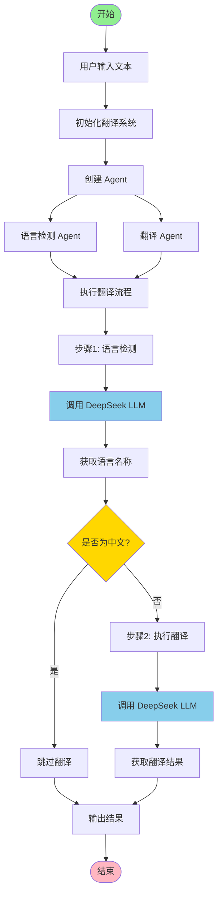
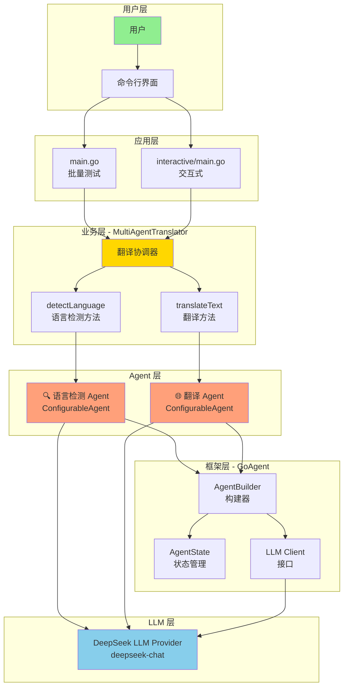
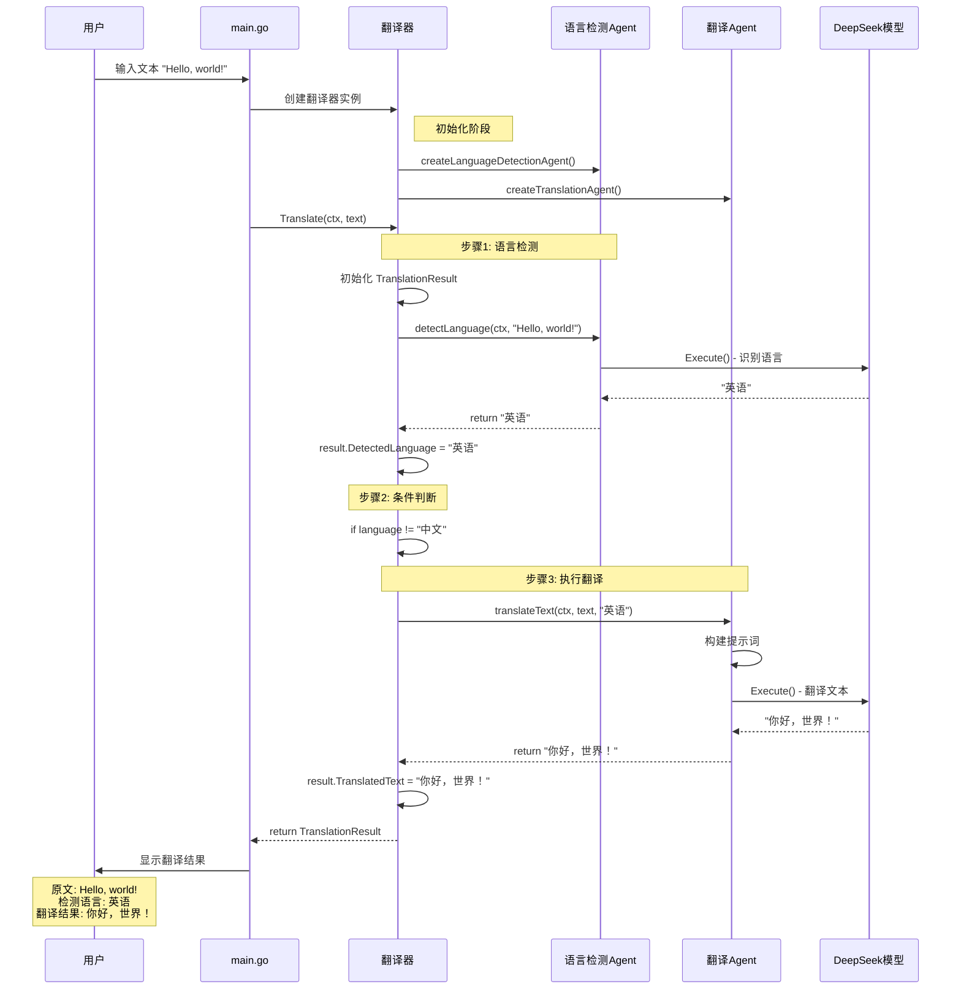

# 智能翻译系统 (Multi-Agent Translation System)

这是一个使用多个 AI Agent 协作的智能翻译系统，能够自动检测输入文本的语言并翻译成中文。

## 🎯 系统架构

该系统使用两个专门的 Agent 协作完成翻译任务：

### 1. 🔍 语言检测 Agent (Language Detection Agent)
- **职责**: 识别输入文本使用的语言
- **能力**: 支持多种语言识别（英语、法语、日语、西班牙语、德语、俄语、中文、韩语等）
- **输出**: 返回检测到的语言名称（中文）

### 2. 🌐 翻译 Agent (Translation Agent)
- **职责**: 将文本翻译成简体中文
- **能力**:
  - 保持原文语气和风格
  - 准确、自然、流畅的翻译
  - 保留专有名词和格式
- **优化**: 如果检测到输入已经是中文，则跳过翻译

## 🚀 特性

- **多 Agent 协作**: 两个专门的 Agent 分工合作
- **自动语言检测**: 无需手动指定源语言
- **高质量翻译**: 使用 DeepSeek Chat 模型确保翻译质量
- **智能优化**: 自动跳过中文到中文的翻译
- **多语言支持**: 支持英语、法语、日语、西班牙语、德语、俄语等主流语言
- **Token 使用追踪**: 实时显示每次操作的 token 消耗和成本
- **成本估算**: 基于 DeepSeek 官方定价自动计算使用成本

## 📦 依赖

- Go 1.25.0+
- GoAgent 框架
- DeepSeek API Key

## 🔧 配置

### 获取 DeepSeek API Key

1. 访问 [DeepSeek 官网](https://platform.deepseek.com/)
2. 注册账号并获取 API Key
3. 设置环境变量：

```bash
export DEEPSEEK_API_KEY="your-api-key-here"
```

## 🎮 使用方法

### 运行批量测试示例

```bash
cd examples/translate
go run main.go
```

### 运行交互式示例

```bash
cd examples/translate/interactive
go run main.go "Hello, world!"
# 或者不带参数，程序会提示输入
go run main.go
```

### 代码示例

```go
package main

import (
    "context"
    "fmt"
    "log"
    "os"

    "github.com/kart-io/goagent/builder"
    "github.com/kart-io/goagent/core/state"
    "github.com/kart-io/goagent/llm"
    "github.com/kart-io/goagent/llm/providers"
)

func main() {
    // 1. 初始化 DeepSeek 客户端
    apiKey := os.Getenv("DEEPSEEK_API_KEY")
    llmClient, err := providers.NewDeepSeek(&llm.Config{
        APIKey:      apiKey,
        Model:       "deepseek-chat",
        Temperature: 0.3,
        MaxTokens:   2000,
    })
    if err != nil {
        log.Fatal(err)
    }

    // 2. 创建翻译系统
    translator := NewMultiAgentTranslator(llmClient)

    // 3. 执行翻译
    ctx := context.Background()
    result, err := translator.Translate(ctx, "Hello, world!")
    if err != nil {
        log.Fatal(err)
    }

    // 4. 查看结果
    fmt.Printf("原文: %s\n", result.OriginalText)
    fmt.Printf("检测语言: %s\n", result.DetectedLanguage)
    fmt.Printf("翻译结果: %s\n", result.TranslatedText)
}

// 创建 Agent 时需要提供初始状态
func createAgent(llmClient llm.Client, systemPrompt string) *builder.ConfigurableAgent[any, core.State] {
    agent, err := builder.NewAgentBuilder[any, core.State](llmClient).
        WithSystemPrompt(systemPrompt).
        WithState(state.NewAgentState()).  // 必须提供初始状态
        Build()

    if err != nil {
        log.Fatal(err)
    }

    return agent
}
```

## 📊 系统流程图

### 整体执行流程



### 详细工作流程

```
┌─────────────────────────────────────────────────────────────┐
│                    用户输入文本                               │
│                 "Hello, how are you?"                        │
└──────────────────────┬──────────────────────────────────────┘
                       │
                       ▼
┌─────────────────────────────────────────────────────────────┐
│              MultiAgentTranslator.Translate()                │
│  ┌─────────────────────────────────────────────────────┐   │
│  │  初始化 TranslationResult                            │   │
│  │  result.OriginalText = "Hello, how are you?"        │   │
│  └─────────────────────────────────────────────────────┘   │
└──────────────────────┬──────────────────────────────────────┘
                       │
                       ▼
┌─────────────────────────────────────────────────────────────┐
│            步骤 1: 语言检测 (detectLanguage)                 │
│  ┌─────────────────────────────────────────────────────┐   │
│  │  🔍 语言检测 Agent                                   │   │
│  │  ├─ System Prompt: "你是语言检测专家..."            │   │
│  │  ├─ Input: "Hello, how are you?"                    │   │
│  │  ├─ DeepSeek LLM 处理                                │   │
│  │  └─ Output: "英语"                                   │   │
│  └─────────────────────────────────────────────────────┘   │
│                                                              │
│  result.DetectedLanguage = "英语"                            │
└──────────────────────┬──────────────────────────────────────┘
                       │
                       ▼
                  ┌─────────┐
                  │ 是中文? │
                  └────┬────┘
                 否 │        │ 是
         ┌─────────┴─┐      └──────────────┐
         │           │                     │
         ▼           ▼                     ▼
┌────────────────────────────┐    ┌──────────────────┐
│ 步骤 2: 翻译 (translateText)│    │  跳过翻译         │
│  ┌────────────────────────┐│    │  result.         │
│  │ 🌐 翻译 Agent           ││    │  TranslatedText  │
│  │ ├─ System Prompt:      ││    │  = 原文           │
│  │ │  "你是翻译专家..."    ││    └──────────────────┘
│  │ ├─ Input: "请将以下    ││             │
│  │ │  英语文本翻译成中文"  ││             │
│  │ ├─ DeepSeek LLM 处理   ││             │
│  │ └─ Output:             ││             │
│  │    "你好，你好吗？"    ││             │
│  └────────────────────────┘│             │
│                            │             │
│ result.TranslatedText =    │             │
│   "你好，你好吗？"          │             │
└─────────────┬──────────────┘             │
              │                            │
              └──────────┬─────────────────┘
                         │
                         ▼
         ┌───────────────────────────────┐
         │       返回 TranslationResult   │
         │  ┌──────────────────────────┐ │
         │  │ OriginalText: "Hello..." │ │
         │  │ DetectedLanguage: "英语" │ │
         │  │ TranslatedText:          │ │
         │  │   "你好，你好吗？"        │ │
         │  └──────────────────────────┘ │
         └───────────────────────────────┘
```

## 💡 示例输出

```
========================================
=== 智能翻译系统 (Multi-Agent) ===
========================================

使用 DeepSeek Chat 模型

【测试 1】
输入: Hello, how are you today?
------------------------------------------------------------
🔍 语言检测代理: 正在识别语言...
✓ 检测完成: 英语 (使用 245 tokens)
🌐 翻译代理: 正在翻译文本...
✓ 翻译完成 (使用 312 tokens)
检测语言: 英语
翻译结果: 你好，你今天好吗？
Token 使用情况:
  - 语言检测: 245 tokens
  - 翻译: 312 tokens
  - 总计: 557 tokens
============================================================

【测试 2】
输入: Bonjour, comment allez-vous?
------------------------------------------------------------
🔍 语言检测代理: 正在识别语言...
✓ 检测完成: 法语 (使用 238 tokens)
🌐 翻译代理: 正在翻译文本...
✓ 翻译完成 (使用 298 tokens)
检测语言: 法语
翻译结果: 你好，您好吗？
Token 使用情况:
  - 语言检测: 238 tokens
  - 翻译: 298 tokens
  - 总计: 536 tokens
============================================================

【测试 3】
输入: こんにちは、お元気ですか？
------------------------------------------------------------
🔍 语言检测代理: 正在识别语言...
✓ 检测完成: 日语 (使用 252 tokens)
🌐 翻译代理: 正在翻译文本...
✓ 翻译完成 (使用 305 tokens)
检测语言: 日语
翻译结果: 你好，您好吗？
Token 使用情况:
  - 语言检测: 252 tokens
  - 翻译: 305 tokens
  - 总计: 557 tokens
============================================================

【测试 4】
输入: 你好，今天天气怎么样？
------------------------------------------------------------
🔍 语言检测代理: 正在识别语言...
✓ 检测完成: 中文 (使用 235 tokens)
🌐 翻译代理: 正在翻译文本...
✓ 翻译完成 (使用 0 tokens)
检测语言: 中文
翻译结果: 你好，今天天气怎么样？
Token 使用情况:
  - 语言检测: 235 tokens
  - 翻译: 0 tokens
  - 总计: 235 tokens
============================================================

✨ 翻译系统测试完成!

📊 总体统计:
  - 总 Token 使用量: 3,850 tokens
  - 总成本: $0.000809
```

## 📊 Token 使用与成本

### Token 追踪机制

系统使用 GoAgent 的 `CostTrackingCallback` 实时追踪每次 LLM 调用的 token 使用情况：

```go
// 创建 token 追踪器
pricing := map[string]float64{
    "deepseek-chat": 0.21 / 1_000_000, // DeepSeek 平均价格：$0.21/M tokens
}
tokenTracker := core.NewCostTrackingCallback(pricing)

// 添加到 Agent 配置
agent, err := builder.NewAgentBuilder[any, core.State](llmClient).
    WithSystemPrompt(systemPrompt).
    WithState(state.NewAgentState()).
    WithCallbacks(tokenTracker). // 添加 token 追踪回调
    Build()
```

### DeepSeek 定价

根据 [DeepSeek 官方定价](https://platform.deepseek.com/pricing)（截至 2025-01）：

| 模型 | 输入价格 | 输出价格 | 平均价格 |
|------|---------|---------|---------|
| deepseek-chat | $0.14/M tokens | $0.28/M tokens | $0.21/M tokens |

**注意**: 本示例使用平均价格 $0.21/M tokens 进行估算，实际成本可能略有不同。

### Token 使用分析

典型翻译任务的 token 消耗：

| 操作 | Token 范围 | 说明 |
|------|-----------|------|
| 语言检测 | 200-300 tokens | 包含 System Prompt + 输入文本 |
| 文本翻译 | 250-400 tokens | 包含 System Prompt + 输入文本 + 输出 |
| 跳过翻译（中文） | 0 tokens | 智能优化，检测到中文后不调用翻译 LLM |

### 成本优化建议

1. **批量处理**: 一次处理多个文本可以分摊 System Prompt 的 token 成本
2. **缓存结果**: 对于重复翻译的文本可以使用缓存
3. **语言预判**: 如果已知源语言，可以跳过语言检测步骤
4. **简化 Prompt**: 在保证质量的前提下，可以适当简化 System Prompt

### TranslationResult 结构

```go
type TranslationResult struct {
    OriginalText      string `json:"original_text"`      // 原文
    DetectedLanguage  string `json:"detected_language"`  // 检测到的语言
    TranslatedText    string `json:"translated_text"`    // 翻译结果
    TokensUsed        int    `json:"tokens_used"`        // 总 token 数
    DetectionTokens   int    `json:"detection_tokens"`   // 语言检测 token
    TranslationTokens int    `json:"translation_tokens"` // 翻译 token
}
```

## 🏗️ 系统设计

### 系统架构图



### 序列图 - Agent 交互流程



### 数据流图

```
┌──────────────────────────────────────────────────────────────┐
│                        数据流向                                │
└──────────────────────────────────────────────────────────────┘

输入文本
   │
   │  "Hello, world!"
   │
   ▼
┌──────────────────────────────────────┐
│  TranslationResult                   │
│  ┌────────────────────────────────┐ │
│  │ OriginalText: "Hello, world!"  │ │
│  │ DetectedLanguage: ""           │ │
│  │ TranslatedText: ""             │ │
│  └────────────────────────────────┘ │
└──────────────────┬───────────────────┘
                   │
                   │  传递给语言检测 Agent
                   │
                   ▼
┌──────────────────────────────────────┐
│  语言检测 Agent 输入                  │
│  ┌────────────────────────────────┐ │
│  │ Input: "Hello, world!"         │ │
│  │ SystemPrompt: "你是语言检测专家"│ │
│  └────────────────────────────────┘ │
└──────────────────┬───────────────────┘
                   │
                   │  调用 DeepSeek LLM
                   │
                   ▼
┌──────────────────────────────────────┐
│  LLM 处理                             │
│  ┌────────────────────────────────┐ │
│  │ Model: deepseek-chat           │ │
│  │ Temperature: 0.3               │ │
│  │ MaxTokens: 2000                │ │
│  └────────────────────────────────┘ │
└──────────────────┬───────────────────┘
                   │
                   │  返回检测结果
                   │
                   ▼
┌──────────────────────────────────────┐
│  语言检测 Agent 输出                  │
│  ┌────────────────────────────────┐ │
│  │ Output: "英语"                  │ │
│  └────────────────────────────────┘ │
└──────────────────┬───────────────────┘
                   │
                   │  更新结果
                   │
                   ▼
┌──────────────────────────────────────┐
│  TranslationResult (更新后)          │
│  ┌────────────────────────────────┐ │
│  │ OriginalText: "Hello, world!"  │ │
│  │ DetectedLanguage: "英语"       │ │
│  │ TranslatedText: ""             │ │
│  └────────────────────────────────┘ │
└──────────────────┬───────────────────┘
                   │
                   │  传递给翻译 Agent
                   │
                   ▼
┌──────────────────────────────────────┐
│  翻译 Agent 输入                      │
│  ┌────────────────────────────────┐ │
│  │ Input: "请将以下英语文本翻译成 │ │
│  │        中文：Hello, world!"    │ │
│  │ SystemPrompt: "你是翻译专家"   │ │
│  └────────────────────────────────┘ │
└──────────────────┬───────────────────┘
                   │
                   │  调用 DeepSeek LLM
                   │
                   ▼
┌──────────────────────────────────────┐
│  LLM 处理                             │
│  ┌────────────────────────────────┐ │
│  │ Model: deepseek-chat           │ │
│  │ Temperature: 0.3               │ │
│  │ MaxTokens: 2000                │ │
│  └────────────────────────────────┘ │
└──────────────────┬───────────────────┘
                   │
                   │  返回翻译结果
                   │
                   ▼
┌──────────────────────────────────────┐
│  翻译 Agent 输出                      │
│  ┌────────────────────────────────┐ │
│  │ Output: "你好，世界！"          │ │
│  └────────────────────────────────┘ │
└──────────────────┬───────────────────┘
                   │
                   │  更新结果
                   │
                   ▼
┌──────────────────────────────────────┐
│  TranslationResult (最终)            │
│  ┌────────────────────────────────┐ │
│  │ OriginalText: "Hello, world!"  │ │
│  │ DetectedLanguage: "英语"       │ │
│  │ TranslatedText: "你好，世界！" │ │
│  └────────────────────────────────┘ │
└──────────────────┬───────────────────┘
                   │
                   │  返回给用户
                   │
                   ▼
                输出结果
```

### MultiAgentTranslator 结构

```go
type MultiAgentTranslator struct {
    llmClient         llm.Client
    detectionAgent    *builder.ConfigurableAgent[any, core.State]
    translationAgent  *builder.ConfigurableAgent[any, core.State]
}
```

### 核心方法

1. **Translate(ctx, text)** - 主翻译流程
   - 调用语言检测 Agent
   - 调用翻译 Agent
   - 返回完整结果

2. **detectLanguage(ctx, text)** - 语言检测
   - 使用专门的检测 Agent
   - 返回语言名称（中文）

3. **translateText(ctx, text, language)** - 文本翻译
   - 使用专门的翻译 Agent
   - 智能跳过中文到中文的翻译

## 🎯 支持的语言

- ✅ 英语 (English)
- ✅ 法语 (French)
- ✅ 日语 (Japanese)
- ✅ 西班牙语 (Spanish)
- ✅ 德语 (German)
- ✅ 俄语 (Russian)
- ✅ 中文 (Chinese)
- ✅ 韩语 (Korean)
- ✅ 其他语言（自动识别）

## ⚙️ 配置选项

### DeepSeek 配置

```go
&llm.Config{
    APIKey:      "your-api-key",
    Model:       "deepseek-chat",  // DeepSeek 对话模型
    Temperature: 0.3,               // 低温度获得更准确的翻译
    MaxTokens:   2000,              // 最大 token 数
}
```

### Agent 配置

可以通过 `builder.NewAgentBuilder` 自定义 Agent 配置：
- System Prompt（系统提示）
- Temperature（温度）
- Max Tokens（最大 token 数）
- 其他参数

## 🔍 架构符合性

该实现遵循 GoAgent 的 4 层架构：

- ✅ **Layer 4 (Examples)**: 位于 `examples/translate/`
- ✅ **导入规则**: 只从 Layer 1 (interfaces) 和 Layer 2 (core, builder, llm) 导入
- ✅ **无循环依赖**: 没有向上导入或循环依赖
- ✅ **代码质量**: 遵循 Go 代码规范和最佳实践

## 🛠️ 扩展建议

### 添加更多语言支持

在 `createLanguageDetectionAgent` 的 system prompt 中添加新语言规则。

### 支持其他目标语言

修改 `createTranslationAgent` 的 system prompt，支持翻译成其他目标语言。

### 添加缓存

使用 GoAgent 的中间件系统添加翻译结果缓存，提高性能。

### 批量翻译

扩展 `MultiAgentTranslator` 支持批量翻译多个文本。

## 📝 许可证

遵循 GoAgent 项目的许可证。

## 🤝 贡献

欢迎提交 Issue 和 Pull Request！

---

**最后更新**: 2025-11-15
**作者**: GoAgent Team
