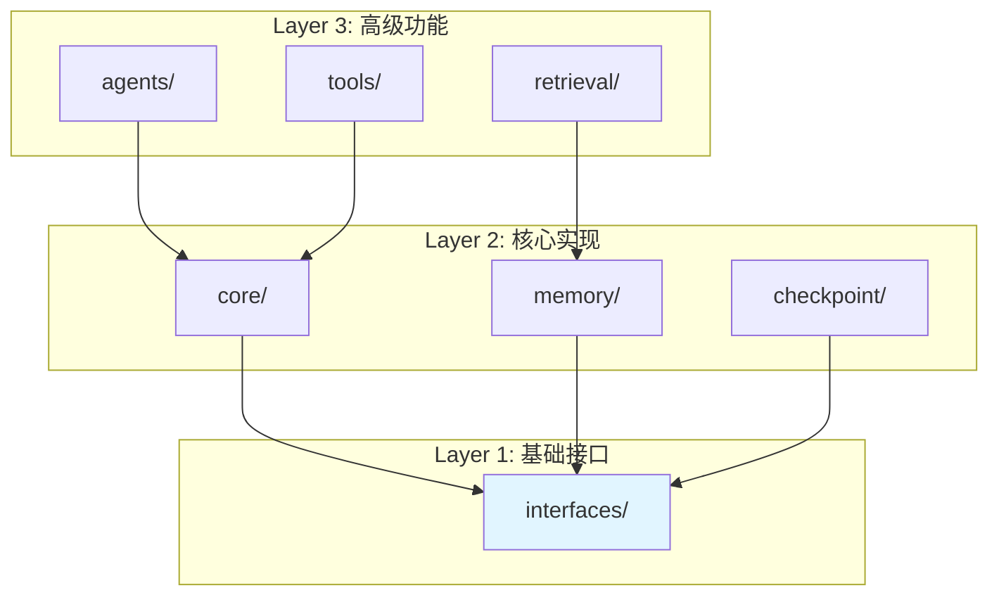
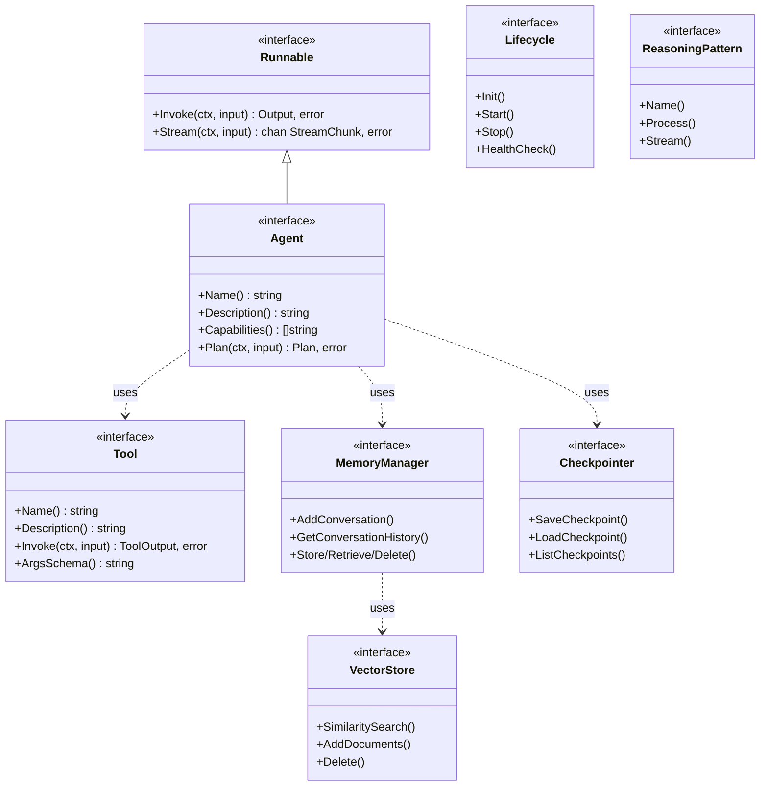
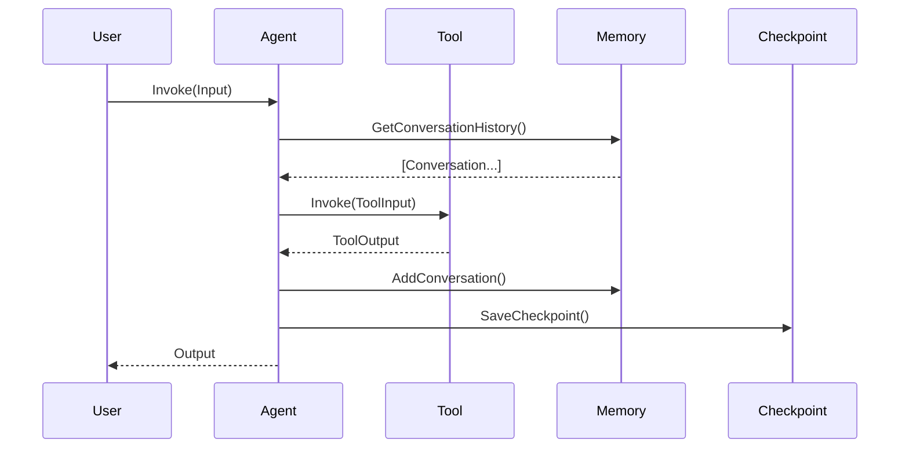

# interfaces 接口定义层

本模块是 goagent 框架的基础层（Layer 1），定义了所有核心接口的规范。这是单一真理来源（Single Source of Truth），确保所有其他包对接口的引用保持一致。

## 目录

- [架构设计](#架构设计)
- [核心接口](#核心接口)
- [数据类型](#数据类型)
- [接口关系](#接口关系)
- [代码结构](#代码结构)

## 架构设计

### 分层架构



### 接口关系图



## 核心接口

### 1. Runnable 基础执行接口

所有可执行组件的基础接口：

```go
type Runnable interface {
    // Invoke 使用给定输入执行 runnable
    Invoke(ctx context.Context, input *Input) (*Output, error)

    // Stream 使用流式输出支持执行
    Stream(ctx context.Context, input *Input) (<-chan *StreamChunk, error)
}
```

### 2. Agent 智能体接口

扩展 Runnable 的智能体接口：

```go
type Agent interface {
    Runnable

    // Name 返回智能体的标识符
    Name() string

    // Description 返回智能体的功能描述
    Description() string

    // Capabilities 返回智能体的能力列表
    Capabilities() []string

    // Plan 为给定输入生成执行计划
    Plan(ctx context.Context, input *Input) (*Plan, error)
}
```

### 3. Tool 工具接口

工具执行接口：

```go
type Tool interface {
    // Name 返回工具标识符
    Name() string

    // Description 返回工具的功能描述
    Description() string

    // Invoke 使用给定输入执行工具
    Invoke(ctx context.Context, input *ToolInput) (*ToolOutput, error)

    // ArgsSchema 返回工具的输入模式（JSON Schema）
    ArgsSchema() string
}

// 可选的验证接口
type ValidatableTool interface {
    Tool
    Validate(ctx context.Context, input *ToolInput) error
}
```

### 4. MemoryManager 内存管理接口

统一的内存管理：

```go
type MemoryManager interface {
    // 对话历史管理
    AddConversation(ctx context.Context, conv *Conversation) error
    GetConversationHistory(ctx context.Context, sessionID string, limit int) ([]*Conversation, error)
    ClearConversation(ctx context.Context, sessionID string) error

    // 案例推理
    AddCase(ctx context.Context, caseMemory *Case) error
    SearchSimilarCases(ctx context.Context, query string, limit int) ([]*Case, error)

    // 键值存储
    Store(ctx context.Context, key string, value interface{}) error
    Retrieve(ctx context.Context, key string) (interface{}, error)
    Delete(ctx context.Context, key string) error

    // 全局操作
    Clear(ctx context.Context) error
}
```

### 5. VectorStore 向量存储接口

向量存储和相似性搜索：

```go
type VectorStore interface {
    // SimilaritySearch 执行向量相似性搜索
    SimilaritySearch(ctx context.Context, query string, topK int) ([]*Document, error)

    // SimilaritySearchWithScore 返回带分数的文档
    SimilaritySearchWithScore(ctx context.Context, query string, topK int) ([]*Document, error)

    // AddDocuments 添加新文档
    AddDocuments(ctx context.Context, docs []*Document) error

    // Delete 按 ID 删除文档
    Delete(ctx context.Context, ids []string) error
}
```

### 6. Checkpointer 检查点接口

状态检查点保存/加载：

```go
type Checkpointer interface {
    // SaveCheckpoint 保存检查点
    SaveCheckpoint(ctx context.Context, checkpoint *Checkpoint) error

    // LoadCheckpoint 按 ID 加载检查点
    LoadCheckpoint(ctx context.Context, checkpointID string) (*Checkpoint, error)

    // ListCheckpoints 列出某个线程的检查点
    ListCheckpoints(ctx context.Context, threadID string, limit int) ([]*CheckpointMetadata, error)

    // DeleteCheckpoint 删除检查点
    DeleteCheckpoint(ctx context.Context, checkpointID string) error
}
```

### 7. Lifecycle 生命周期接口

标准生命周期钩子：

```go
type Lifecycle interface {
    // Init 初始化组件
    Init(ctx context.Context, config interface{}) error

    // Start 开始组件的活跃操作
    Start(ctx context.Context) error

    // Stop 优雅地停止组件
    Stop(ctx context.Context) error

    // HealthCheck 返回组件的健康状态
    HealthCheck(ctx context.Context) HealthStatus
}

// 可选扩展
type LifecycleAware interface {
    OnInit(ctx context.Context) error
    OnShutdown(ctx context.Context) error
}

type Reloadable interface {
    Reload(ctx context.Context, config interface{}) error
}

type DependencyAware interface {
    Dependencies() []string
}
```

### 8. ReasoningPattern 推理模式接口

不同推理策略的接口：

```go
type ReasoningPattern interface {
    // Name 返回推理模式的名称
    Name() string

    // Description 返回推理模式的描述
    Description() string

    // Process 在给定输入上执行推理
    Process(ctx context.Context, input *ReasoningInput) (*ReasoningOutput, error)

    // Stream 执行带流式支持的推理
    Stream(ctx context.Context, input *ReasoningInput) (<-chan *ReasoningChunk, error)
}
```

## 数据类型

### 输入/输出类型

```go
// Input 表示 runnable 的标准化输入
type Input struct {
    Messages []Message              // 对话历史
    State    State                  // 持久状态
    Config   map[string]interface{} // 运行时配置
}

// Output 表示 runnable 的标准化输出
type Output struct {
    Messages []Message              // 生成的消息
    State    State                  // 更新的状态
    Metadata map[string]interface{} // 执行元数据
}

// Message 表示对话中的单条消息
type Message struct {
    Role    string // "user", "assistant", "system", "function"
    Content string
    Name    string
}

// StreamChunk 表示流式输出的数据块
type StreamChunk struct {
    Content  string
    Metadata map[string]interface{}
    Done     bool
}

// State 可持久化的智能体状态
type State map[string]interface{}
```

### 工具类型

```go
// ToolInput 表示工具执行输入
type ToolInput struct {
    Args     map[string]interface{}
    Context  context.Context
    CallerID string
    TraceID  string
}

// ToolOutput 表示工具执行输出
type ToolOutput struct {
    Result   interface{}
    Success  bool
    Error    string
    Metadata map[string]interface{}
}

// ToolCall 表示工具调用记录
type ToolCall struct {
    ID        string
    ToolName  string
    Args      map[string]interface{}
    Result    *ToolOutput
    Error     string
    StartTime int64
    EndTime   int64
    Metadata  map[string]interface{}
}
```

### 内存类型

```go
// Conversation 表示对话中的单条消息
type Conversation struct {
    ID        string
    SessionID string
    Role      string
    Content   string
    Timestamp time.Time
    Metadata  map[string]interface{}
}

// Case 表示用于推理的案例
type Case struct {
    ID          string
    Title       string
    Description string
    Problem     string
    Solution    string
    Category    string
    Tags        []string
    Embedding   []float64
    Similarity  float64
    CreatedAt   time.Time
    UpdatedAt   time.Time
    Metadata    map[string]interface{}
}

// Document 表示带有向量嵌入的文档
type Document struct {
    ID          string
    PageContent string
    Metadata    map[string]interface{}
    Embedding   []float64
    Score       float64
}
```

### 检查点类型

```go
// Checkpoint 表示保存的状态快照
type Checkpoint struct {
    ID        string
    ThreadID  string
    State     State
    Metadata  map[string]interface{}
    CreatedAt time.Time
}

// CheckpointMetadata 检查点摘要信息
type CheckpointMetadata struct {
    ID        string
    ThreadID  string
    CreatedAt time.Time
    UpdatedAt time.Time
    Metadata  map[string]interface{}
    Size      int64
}
```

### 推理类型

```go
// ReasoningInput 推理模式的输入
type ReasoningInput struct {
    Query   string
    Context map[string]interface{}
    Tools   []Tool
    Config  map[string]interface{}
    History []ReasoningStep
}

// ReasoningOutput 推理模式的输出
type ReasoningOutput struct {
    Answer     string
    Steps      []ReasoningStep
    Confidence float64
    Metadata   map[string]interface{}
    ToolCalls  []ReasoningToolCall
}

// ReasoningStep 推理过程中的单个步骤
type ReasoningStep struct {
    StepID      string
    Type        string
    Content     string
    Score       float64
    ParentID    string
    ChildrenIDs []string
    Metadata    map[string]interface{}
}

// ThoughtNode 树/图推理中的节点
type ThoughtNode struct {
    ID       string
    Thought  string
    Score    float64
    State    map[string]interface{}
    Parent   *ThoughtNode
    Children []*ThoughtNode
    Visited  bool
    Depth    int
}
```

### 生命周期类型

```go
// HealthStatus 组件健康状态
type HealthStatus struct {
    State         HealthState
    Message       string
    Details       map[string]interface{}
    LastChecked   time.Time
    ComponentName string
}

// LifecycleState 组件当前状态
type LifecycleState string

const (
    StateUninitialized LifecycleState = "uninitialized"
    StateInitialized   LifecycleState = "initialized"
    StateStarting      LifecycleState = "starting"
    StateRunning       LifecycleState = "running"
    StateStopping      LifecycleState = "stopping"
    StateStopped       LifecycleState = "stopped"
    StateFailed        LifecycleState = "failed"
)

// HealthState 健康状态
type HealthState string

const (
    HealthHealthy   HealthState = "healthy"
    HealthDegraded  HealthState = "degraded"
    HealthUnhealthy HealthState = "unhealthy"
    HealthUnknown   HealthState = "unknown"
)
```

### 令牌统计

```go
// TokenUsage 令牌使用统计
type TokenUsage struct {
    PromptTokens     int // 输入令牌数
    CompletionTokens int // 输出令牌数
    TotalTokens      int // 总令牌数
    CachedTokens     int // 缓存令牌数
}

func (t *TokenUsage) Add(other *TokenUsage)
func (t *TokenUsage) IsEmpty() bool
```

## 接口关系

### 数据流示例



## 代码结构

```text
interfaces/
├── doc.go              # 包文档
├── agent.go            # Agent 和 Runnable 接口
├── tool.go             # Tool 工具相关接口
├── memory.go           # MemoryManager 接口
├── store.go            # VectorStore 和 Store 接口
├── checkpoint.go       # Checkpointer 接口
├── lifecycle.go        # 生命周期管理接口
├── reasoning.go        # 推理模式接口
├── token.go            # TokenUsage 统计
├── constants.go        # 通用常量
├── status_constants.go # 状态常量
├── field_constants.go  # 字段常量
├── http_constants.go   # HTTP 常量
└── *_test.go           # 测试文件
```

## 常用常量

### 消息角色

```go
const (
    RoleSystem    = "system"
    RoleUser      = "user"
    RoleAssistant = "assistant"
    RoleFunction  = "function"
    RoleTool      = "tool"
)
```

### 推理策略

```go
type ReasoningStrategy string

const (
    StrategyDepthFirst  ReasoningStrategy = "depth_first"
    StrategyBreadthFirst ReasoningStrategy = "breadth_first"
    StrategyBeamSearch  ReasoningStrategy = "beam_search"
    StrategyMonteCarlo  ReasoningStrategy = "monte_carlo"
    StrategyGreedy      ReasoningStrategy = "greedy"
)
```

## 设计原则

1. **单一真理来源**：所有实现都应引用这个包的接口定义
2. **上下文驱动**：所有 I/O 操作都接受 `context.Context`
3. **灵活性**：使用 `map[string]interface{}` 进行元数据存储
4. **可组合性**：接口设计简洁，支持灵活组合
5. **流式处理**：支持 `Stream()` 方法实现增量处理

## 扩展阅读

- [core](../core/) - 核心执行引擎
- [memory](../memory/) - 内存管理实现
- [tools](../tools/) - 工具系统
- [agents](../agents/) - Agent 实现
