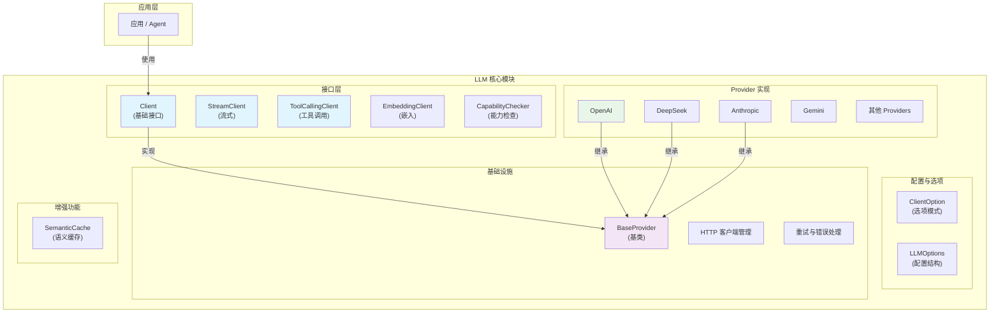
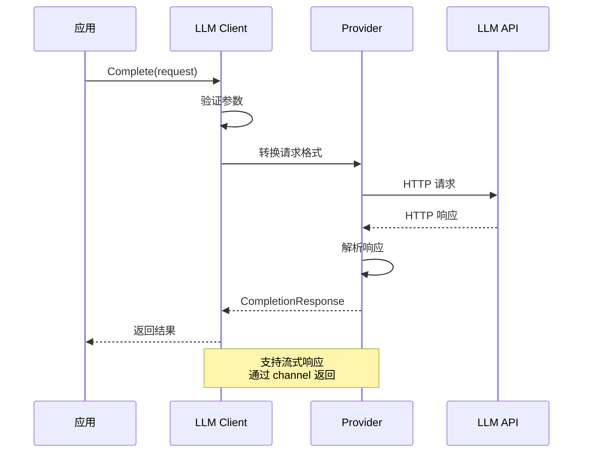

# llm LLM 集成层

本模块是 goagent 框架的 LLM（大语言模型）集成层，提供统一的接口与多个 LLM 服务提供商交互。

## 目录

- [架构设计](#架构设计)
- [支持的提供商](#支持的提供商)
- [核心接口](#核心接口)
- [使用方法](#使用方法)
- [高级功能](#高级功能)
- [API 参考](#api-参考)
- [代码结构](#代码结构)

## 架构设计

### 系统架构图



### 调用流程



### 分层架构

```text
┌─────────────────────────────────────────────────────────┐
│              应用层 (Agent/Orchestrator)                │
└─────────────────────────────────────────────────────────┘
                          ↓
┌─────────────────────────────────────────────────────────┐
│              接口层 (client.go)                         │
│  - Client (基础)                                        │
│  - StreamClient (流式)                                  │
│  - ToolCallingClient (工具调用)                         │
│  - EmbeddingClient (嵌入)                               │
│  - CapabilityChecker (能力检查)                         │
└─────────────────────────────────────────────────────────┘
                          ↓
┌─────────────────────────────────────────────────────────┐
│              基础设施层 (common/base.go)                │
│  - BaseProvider (所有 Provider 基类)                    │
│  - HTTP 客户端管理                                      │
│  - 重试和错误处理                                       │
└─────────────────────────────────────────────────────────┘
                          ↓
┌─────────────────────────────────────────────────────────┐
│              Provider 实现层 (providers/*.go)           │
│  - OpenAI, DeepSeek, Anthropic, Gemini...              │
└─────────────────────────────────────────────────────────┘
```

## 支持的提供商

| Provider | 类型 | Chat | Streaming | Tool Calling | Embedding | Vision |
|----------|------|:----:|:---------:|:------------:|:---------:|:------:|
| **OpenAI** | 商业 | ✓ | ✓ | ✓ | ✓ | ✓ |
| **DeepSeek** | 商业 | ✓ | ✓ | ✓ | ✓ | - |
| **Anthropic** | 商业 | ✓ | ✓ | ✓ | - | - |
| **Gemini** | 商业 | ✓ | ✓ | ✓ | - | ✓ |
| **Cohere** | 商业 | ✓ | ✓ | - | - | - |
| **HuggingFace** | 推理 | ✓ | ✓ | - | - | - |
| **Ollama** | 本地 | ✓ | ✓ | - | - | - |
| **Kimi** | 商业 | ✓ | - | - | - | - |
| **SiliconFlow** | 推理 | ✓ | - | - | - | - |

## 核心接口

### Client 基础接口

```go
type Client interface {
    Complete(ctx context.Context, req *CompletionRequest) (*CompletionResponse, error)
    Chat(ctx context.Context, messages []Message) (*CompletionResponse, error)
    Provider() constants.Provider
    IsAvailable() bool
}
```

### StreamClient 流式接口

```go
type StreamClient interface {
    Client
    CompleteStream(ctx context.Context, req *CompletionRequest) (<-chan *StreamChunk, error)
    ChatStream(ctx context.Context, messages []Message) (<-chan *StreamChunk, error)
}
```

### ToolCallingClient 工具调用接口

```go
type ToolCallingClient interface {
    GenerateWithTools(ctx context.Context, prompt string, tools []interfaces.Tool) (*ToolCallResponse, error)
    StreamWithTools(ctx context.Context, prompt string, tools []interfaces.Tool) (<-chan ToolChunk, error)
}
```

### EmbeddingClient 嵌入接口

```go
type EmbeddingClient interface {
    Embed(ctx context.Context, text string) ([]float64, error)
}

type BatchEmbeddingClient interface {
    EmbeddingClient
    EmbedBatch(ctx context.Context, texts []string) ([][]float64, error)
}
```

### CapabilityChecker 能力检查

```go
type CapabilityChecker interface {
    HasCapability(cap Capability) bool
    Capabilities() []Capability
}

// 能力类型
const (
    CapabilityCompletion      = "completion"
    CapabilityChat            = "chat"
    CapabilityStreaming       = "streaming"
    CapabilityToolCalling     = "tool_calling"
    CapabilityEmbedding       = "embedding"
    CapabilityBatchEmbedding  = "batch_embedding"
    CapabilityVision          = "vision"
    CapabilityJSON            = "json_mode"
)
```

## 使用方法

### 创建客户端

```go
import (
    "github.com/kart-io/goagent/llm"
    "github.com/kart-io/goagent/llm/providers"
)

// OpenAI
client, err := providers.NewOpenAIWithOptions(
    llm.WithAPIKey("sk-xxx"),
    llm.WithModel("gpt-4"),
    llm.WithTemperature(0.7),
    llm.WithMaxTokens(2000),
)

// DeepSeek
client, err := providers.NewDeepSeekWithOptions(
    llm.WithAPIKey("sk-xxx"),
    llm.WithModel("deepseek-chat"),
)

// Anthropic
client, err := providers.NewAnthropicWithOptions(
    llm.WithAPIKey("sk-ant-xxx"),
    llm.WithModel("claude-3-5-sonnet-20241022"),
)

// Ollama (本地)
client, err := providers.NewOllamaWithOptions(
    llm.WithBaseURL("http://localhost:11434"),
    llm.WithModel("llama2"),
)
```

### 基础对话

```go
// 简单对话
response, err := client.Chat(ctx, []llm.Message{
    llm.SystemMessage("你是一个有帮助的助手"),
    llm.UserMessage("你好！"),
})
if err != nil {
    log.Fatal(err)
}
fmt.Println(response.Content)

// 完整请求
response, err := client.Complete(ctx, &llm.CompletionRequest{
    Messages: []llm.Message{
        llm.SystemMessage("你是一个专业的数据分析师"),
        llm.UserMessage("请分析这些数据..."),
    },
    MaxTokens:   2000,
    Temperature: 0.7,
})
```

### 流式响应

```go
// 检查是否支持流式
streamClient, ok := client.(llm.StreamClient)
if !ok {
    log.Fatal("该 Provider 不支持流式")
}

// 流式对话
chunks, err := streamClient.ChatStream(ctx, messages)
if err != nil {
    log.Fatal(err)
}

for chunk := range chunks {
    if chunk.Error != nil {
        log.Printf("错误: %v", chunk.Error)
        continue
    }
    fmt.Print(chunk.Delta) // 实时输出
}

// 使用 StreamReader 收集完整响应
reader := llm.NewStreamReader(chunks)
fullContent, err := reader.ReadAll(ctx)
```

### 工具调用

```go
// 检查是否支持工具调用
toolClient, ok := client.(llm.ToolCallingClient)
if !ok {
    log.Fatal("该 Provider 不支持工具调用")
}

// 定义工具
tools := []interfaces.Tool{
    {
        Name:        "get_weather",
        Description: "获取指定城市的天气",
        Parameters: map[string]interface{}{
            "type": "object",
            "properties": map[string]interface{}{
                "city": map[string]interface{}{
                    "type":        "string",
                    "description": "城市名称",
                },
            },
            "required": []string{"city"},
        },
    },
}

// 带工具的生成
response, err := toolClient.GenerateWithTools(ctx, "查询北京的天气", tools)
if err != nil {
    log.Fatal(err)
}

// 处理工具调用
for _, toolCall := range response.ToolCalls {
    fmt.Printf("调用工具: %s\n", toolCall.Name)
    fmt.Printf("参数: %v\n", toolCall.Arguments)
}
```

### 文本嵌入

```go
// 检查是否支持嵌入
embedder, ok := client.(llm.EmbeddingClient)
if !ok {
    log.Fatal("该 Provider 不支持嵌入")
}

// 单条嵌入
embedding, err := embedder.Embed(ctx, "这是一段需要向量化的文本")
if err != nil {
    log.Fatal(err)
}
fmt.Printf("嵌入维度: %d\n", len(embedding))

// 批量嵌入
batchEmbedder, ok := client.(llm.BatchEmbeddingClient)
if ok {
    embeddings, err := batchEmbedder.EmbedBatch(ctx, []string{
        "文本1",
        "文本2",
        "文本3",
    })
    if err != nil {
        log.Fatal(err)
    }
    fmt.Printf("生成了 %d 个嵌入\n", len(embeddings))
}
```

### 能力检查

```go
// 检查特定能力
if llm.HasToolCalling(client) {
    // 可以使用工具调用
}

if llm.HasStreaming(client) {
    // 可以使用流式响应
}

if llm.HasEmbedding(client) {
    // 可以生成嵌入
}

// 获取所有能力
if checker, ok := client.(llm.CapabilityChecker); ok {
    caps := checker.Capabilities()
    for _, cap := range caps {
        fmt.Printf("支持: %s\n", cap)
    }
}
```

## 高级功能

### 语义缓存

基于向量相似度的智能缓存，避免重复调用：

```go
import "github.com/kart-io/goagent/llm/cache"

// 创建带缓存的客户端
cachedClient, err := cache.NewCachedLLMClient(&cache.CachedLLMClientConfig{
    Client:            originalClient,
    EmbeddingProvider: embeddingProvider,
    CacheConfig: &cache.SemanticCacheConfig{
        SimilarityThreshold: 0.95,  // 相似度阈值
        MaxEntries:          10000, // 最大条目数
        TTL:                 24 * time.Hour,
        EvictionPolicy:      "lru",
    },
})

// 使用（自动缓存相似请求）
response, err := cachedClient.Complete(ctx, req)

// 获取缓存统计
stats := cachedClient.Cache().Stats()
fmt.Printf("命中率: %.2f%%\n", stats.HitRate*100)
```

### 重试配置

```go
client, err := providers.NewOpenAIWithOptions(
    llm.WithAPIKey("sk-xxx"),
    llm.WithRetryCount(3),
    llm.WithRetryDelay(time.Second),
)
```

### 代理设置

```go
client, err := providers.NewOpenAIWithOptions(
    llm.WithAPIKey("sk-xxx"),
    llm.WithProxyURL("http://proxy.example.com:8080"),
)
```

### 自定义 Base URL

```go
// 使用自定义端点（如 Azure OpenAI）
client, err := providers.NewOpenAIWithOptions(
    llm.WithAPIKey("sk-xxx"),
    llm.WithBaseURL("https://your-resource.openai.azure.com"),
)
```

### 响应格式

```go
// JSON 模式
client, err := providers.NewOpenAIWithOptions(
    llm.WithAPIKey("sk-xxx"),
    llm.WithResponseFormat(&llm.ResponseFormat{
        Type: "json_object",
    }),
)
```

## API 参考

### 配置选项

```go
// 基础配置
WithAPIKey(key string)
WithBaseURL(url string)
WithModel(model string)

// 生成参数
WithMaxTokens(tokens int)
WithTemperature(temp float64)
WithTopP(topP float64)
WithResponseFormat(format *ResponseFormat)

// 网络配置
WithTimeout(timeout int)
WithProxyURL(url string)

// 重试配置
WithRetryCount(count int)
WithRetryDelay(delay time.Duration)

// 速率限制
WithRateLimitRPM(rpm int)

// 缓存配置
WithCacheEnabled(enabled bool)
WithCacheTTL(ttl time.Duration)

// 流式响应
WithStreamingEnabled(enabled bool)

// 其他
WithOrganizationID(orgID string)
WithSystemPrompt(prompt string)
WithCustomHeaders(headers map[string]string)
```

### 数据类型

```go
// 消息
type Message struct {
    Role    string // "system", "user", "assistant"
    Content string
    Name    string
}

// 辅助函数
llm.SystemMessage(content string) Message
llm.UserMessage(content string) Message
llm.AssistantMessage(content string) Message

// 补全请求
type CompletionRequest struct {
    Messages    []Message
    Temperature float64
    MaxTokens   int
    Model       string
    Stop        []string
    TopP        float64
}

// 补全响应
type CompletionResponse struct {
    Content      string
    Model        string
    TokensUsed   int
    FinishReason string
    Provider     string
    Usage        *interfaces.TokenUsage
}

// 流式块
type StreamChunk struct {
    Content      string
    Delta        string
    Role         string
    FinishReason string
    Done         bool
    Error        error
}
```

## 环境变量

支持通过环境变量配置 API Key：

```bash
# OpenAI
export OPENAI_API_KEY="sk-..."
export OPENAI_BASE_URL="https://api.openai.com/v1"
export OPENAI_MODEL="gpt-4"

# Anthropic
export ANTHROPIC_API_KEY="sk-ant-..."

# DeepSeek
export DEEPSEEK_API_KEY="sk-..."

# Gemini
export GEMINI_API_KEY="..."

# 其他 Provider 遵循相同模式
```

## 代码结构

```text
llm/
├── client.go           # 核心接口定义
├── stream_client.go    # 流式响应接口
├── capabilities.go     # 能力检查机制
├── options.go          # 配置选项
├── factory.go          # 工厂函数
├── tools.go            # 工具调用类型
├── common/             # 基础设施
│   ├── base.go         # Provider 基类
│   ├── types.go        # 通用类型
│   └── utils.go        # 工具函数
├── constants/          # 常量定义
│   ├── constants.go    # 参数默认值
│   └── providers.go    # Provider 配置
├── providers/          # Provider 实现
│   ├── openai.go
│   ├── deepseek.go
│   ├── anthropic.go
│   ├── gemini.go
│   ├── cohere.go
│   ├── huggingface.go
│   ├── ollama.go
│   ├── kimi.go
│   └── siliconflow.go
└── cache/              # 语义缓存
    ├── types.go
    ├── semantic_cache.go
    ├── similarity.go
    └── middleware.go
```

## 扩展阅读

- [core](../core/) - 核心执行引擎
- [builder](../builder/) - Agent 构建器
- [tools](../tools/) - 工具系统
- [interfaces](../interfaces/) - 接口定义
