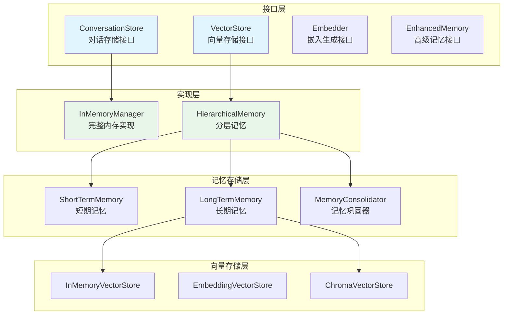
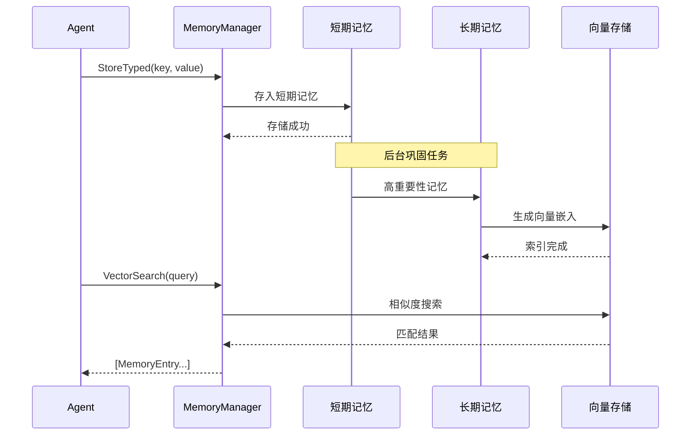

# memory 记忆管理系统

本模块是 goagent 框架的记忆管理系统，提供对话历史、案例存储、向量搜索和分层记忆能力。

## 目录

- [架构设计](#架构设计)
- [核心组件](#核心组件)
- [记忆类型](#记忆类型)
- [使用方法](#使用方法)
- [API 参考](#api-参考)
- [代码结构](#代码结构)

## 架构设计

### 系统架构图



### 记忆存取流程



### 分层记忆架构

```text
┌─────────────────────────────────────────────────────────┐
│                   应用层 (Agent)                         │
└─────────────────────────────────────────────────────────┘
                          ↓
┌─────────────────────────────────────────────────────────┐
│              记忆管理器 (MemoryManager)                  │
│  - 对话管理                                              │
│  - 案例存储                                              │
│  - 键值存储                                              │
└─────────────────────────────────────────────────────────┘
                          ↓
┌─────────────────────────────────────────────────────────┐
│              分层记忆 (HierarchicalMemory)               │
│  ┌─────────────────┐    ┌─────────────────┐            │
│  │   短期记忆       │ ←→ │   长期记忆       │            │
│  │   - 容量有限     │    │   - 持久化       │            │
│  │   - LRU 驱逐     │    │   - 向量索引     │            │
│  └─────────────────┘    └─────────────────┘            │
│                   ↓ 巩固 ↑                               │
│            MemoryConsolidator                           │
└─────────────────────────────────────────────────────────┘
```

## 核心组件

### 1. ConversationStore 对话存储

管理会话对话历史：

```go
type ConversationStore interface {
    Add(ctx context.Context, conv *Conversation) error
    Get(ctx context.Context, sessionID string, limit int) ([]*Conversation, error)
    Clear(ctx context.Context, sessionID string) error
    Count(ctx context.Context, sessionID string) (int, error)
}
```

### 2. VectorStore 向量存储

支持向量相似度搜索：

```go
type VectorStore interface {
    Add(ctx context.Context, id string, embedding []float64, metadata map[string]interface{}) error
    Search(ctx context.Context, embedding []float64, limit int) ([]*SearchResult, error)
    Delete(ctx context.Context, id string) error
    Clear(ctx context.Context) error
}
```

### 3. EnhancedMemory 增强记忆

支持分层记忆和高级操作：

```go
type EnhancedMemory interface {
    StoreTyped(ctx, key, value, memType, opts) error
    GetByType(ctx, memType, limit) ([]*MemoryEntry, error)
    VectorSearch(ctx, embedding, limit, threshold) ([]*MemoryEntry, error)
    Consolidate(ctx) error  // 短期 -> 长期巩固
    Forget(ctx, threshold) error  // 遗忘不重要的记忆
    Associate(ctx, id1, id2, strength) error  // 创建关联
}
```

## 记忆类型

### 五种记忆分类

| 类型 | 说明 | 适用场景 |
|------|------|---------|
| `ShortTerm` | 工作记忆，容量有限 | 当前对话上下文 |
| `LongTerm` | 持久记忆 | 重要信息长期保存 |
| `Episodic` | 事件性记忆 | "发生了什么" |
| `Semantic` | 知识型记忆 | 事实和知识 |
| `Procedural` | 程序化记忆 | "如何做" |

### MemoryEntry 结构

```go
type MemoryEntry struct {
    ID          string                   // 唯一标识
    Type        MemoryType              // 记忆类型
    Content     interface{}             // 记忆内容
    Embedding   []float32               // 向量嵌入
    Timestamp   time.Time               // 创建时间
    LastAccess  time.Time               // 最后访问时间
    AccessCount int                     // 访问次数
    Importance  float64                 // 重要程度 (0.0-1.0)
    Decay       float64                 // 衰减系数
    Tags        []string                // 标签
    Related     []string                // 关联的其他记忆ID
}
```

## 使用方法

### 基础对话管理

```go
// 创建记忆管理器
manager := memory.NewInMemoryManager(memory.DefaultConfig())

// 添加对话
conv := &memory.Conversation{
    SessionID: "user-123",
    Role:      "user",
    Content:   "如何优化数据库查询？",
    Timestamp: time.Now(),
}
manager.AddConversation(ctx, conv)

// 获取对话历史
history, err := manager.GetConversationHistory(ctx, "user-123", 10)

// 清除会话
manager.ClearConversation(ctx, "user-123")
```

### 案例存储与检索

```go
// 添加案例
caseMemory := &memory.Case{
    Title:    "数据库查询超时",
    Problem:  "查询执行时间超过 30 秒",
    Solution: "为外键列添加索引",
    Category: "performance",
    Tags:     []string{"database", "optimization"},
}
manager.AddCase(ctx, caseMemory)

// 搜索相似案例
similar, err := manager.SearchSimilarCases(ctx, "数据库查询很慢", 5)
for _, c := range similar {
    fmt.Printf("相似案例: %s (相似度: %.2f)\n", c.Title, c.Similarity)
}
```

### 键值存储

```go
// 存储数据
manager.Store(ctx, "user:preferences", map[string]interface{}{
    "language": "zh-CN",
    "theme":    "dark",
})

// 检索数据
prefs, err := manager.Retrieve(ctx, "user:preferences")

// 删除数据
manager.Delete(ctx, "user:preferences")
```

### 分层记忆系统

```go
// 创建向量存储
vecStore := memory.NewInMemoryVectorStore(1536)

// 创建分层记忆
hierMem := memory.NewHierarchicalMemoryWithContext(ctx, vecStore,
    memory.WithShortTermCapacity(100),
    memory.WithConsolidationInterval(5*time.Minute),
)

// 存储带类型的记忆
hierMem.StoreTyped(ctx, "query-plan-001", planData,
    memory.MemoryTypeEpisodic,
    memory.StoreOptions{Importance: 0.8},
)

// 按类型检索
entries, err := hierMem.GetByType(ctx, memory.MemoryTypeEpisodic, 10)

// 向量搜索
embedding := getEmbedding("数据库优化")
results, err := hierMem.VectorSearch(ctx, embedding, 5, 0.8)

// 创建记忆关联
hierMem.Associate(ctx, "query-001", "query-002", 0.8)

// 获取关联记忆
associated, err := hierMem.GetAssociated(ctx, "query-001", 5)

// 手动触发巩固
hierMem.Consolidate(ctx)

// 遗忘不重要的记忆
hierMem.Forget(ctx, 0.3) // 遗忘重要性低于 0.3 的记忆

// 关闭（等待后台任务完成）
hierMem.Shutdown(ctx)
```

### 向量存储使用

```go
// 内存向量存储
vecStore := memory.NewInMemoryVectorStore(1536)
vecStore.Store(ctx, "doc-1", embedding)

// 相似度搜索
ids, scores, err := vecStore.Search(ctx, queryEmbedding, 10, 0.8)

// 使用外部嵌入模型
embeddingModel := memory.NewSimpleEmbeddingModel(1536)
vecStore := memory.NewEmbeddingVectorStore(embeddingModel)

// Chroma 向量数据库集成
chromaStore := memory.NewChromaVectorStore(chromaClient, "collection-name")
```

## API 参考

### InMemoryManager

```go
// 创建
NewInMemoryManager(config *Config) *InMemoryManager

// 对话管理
AddConversation(ctx, conv *Conversation) error
GetConversationHistory(ctx, sessionID string, limit int) ([]*Conversation, error)
ClearConversation(ctx, sessionID string) error

// 案例管理
AddCase(ctx, caseMemory *Case) error
SearchSimilarCases(ctx, query string, limit int) ([]*Case, error)

// 键值存储
Store(ctx, key string, value interface{}) error
Retrieve(ctx, key string) (interface{}, error)
Delete(ctx, key string) error
Clear(ctx) error
```

### HierarchicalMemory

```go
// 创建
NewHierarchicalMemoryWithContext(ctx, vectorStore, opts ...MemoryOption) *HierarchicalMemory

// 类型化存储
StoreTyped(ctx, key, value, memType, opts) error
GetByType(ctx, memType, limit) ([]*MemoryEntry, error)

// 向量搜索
VectorSearch(ctx, embedding, limit, threshold) ([]*MemoryEntry, error)

// 记忆管理
Consolidate(ctx) error
Forget(ctx, threshold float64) error
Associate(ctx, id1, id2 string, strength float64) error
GetAssociated(ctx, id string, limit int) ([]*MemoryEntry, error)

// 生命周期
Shutdown(ctx) error
GetStats() *MemoryStats
```

### VectorStore 实现

```go
// 内存向量存储
NewInMemoryVectorStore(dimension int) *InMemoryVectorStore

// 嵌入向量存储
NewEmbeddingVectorStore(model EmbeddingModel) *EmbeddingVectorStore

// Chroma 向量存储
NewChromaVectorStore(client ChromaClient, collection string) *ChromaVectorStore

// 通用操作
Store(ctx, id string, vector []float32) error
Search(ctx, query []float32, k int, threshold float64) (ids []string, scores []float64, error)
Delete(ctx, id string) error
Clear(ctx) error
Size() int
```

## 代码结构

```text
memory/
├── manager.go              # 配置和接口定义
├── inmemory.go             # 基础内存实现
├── enhanced.go             # 分层记忆系统
├── shortterm_longterm.go   # 短期/长期记忆
├── memory_vector_store.go  # 向量存储实现
├── simple_cache_test.go
└── memory_test.go
```

## 配置选项

```go
type Config struct {
    MaxConversationLength int           // 最大对话长度
    VectorStoreType       string        // 向量存储类型
    EmbeddingModel        string        // 嵌入模型
    SimilarityThreshold   float64       // 相似度阈值
}

// 默认配置
config := memory.DefaultConfig()
```

## 特性说明

### 自动巩固机制

- 后台任务每 5 分钟运行一次
- 将重要的短期记忆自动升级到长期存储
- 基于访问频率和重要性评分决定

### 记忆衰减

- 未访问的记忆重要性随时间递减
- 可配置衰减系数
- 支持手动遗忘低重要性记忆

### 向量相似度搜索

- 基于余弦相似度计算
- 支持设置相似度阈值
- 可集成外部向量数据库

## 扩展阅读

- [core](../core/) - 核心执行引擎
- [llm](../llm/) - LLM 集成
- [store](../store/) - 存储适配器
- [retrieval](../retrieval/) - 检索系统
