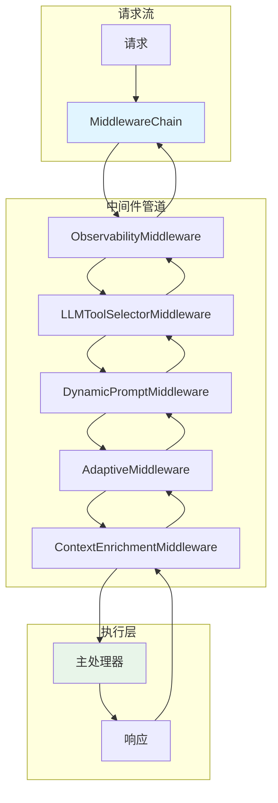
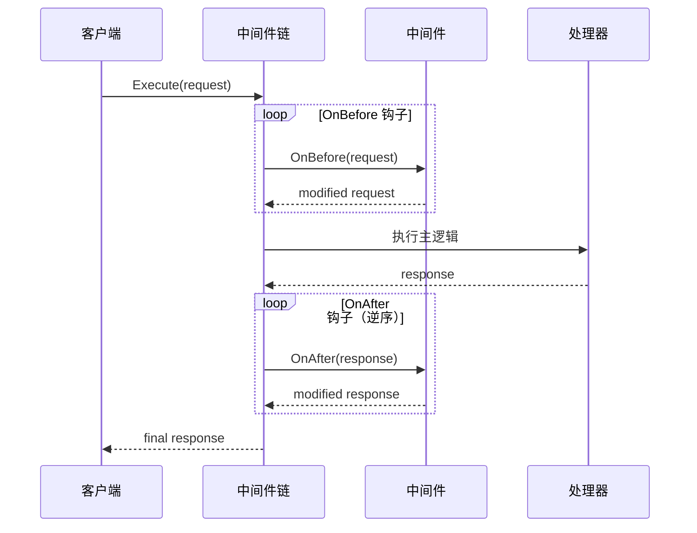

# middleware 中间件系统

本模块是 goagent 框架的中间件系统，提供请求/响应拦截、可观测性集成、工具选择和自适应执行等能力。

## 目录

- [架构设计](#架构设计)
- [核心组件](#核心组件)
- [中间件实现](#中间件实现)
- [使用方法](#使用方法)
- [API 参考](#api-参考)
- [代码结构](#代码结构)

## 架构设计

### 系统架构图



### 执行流程



## 核心组件

### 1. Middleware 接口

所有中间件必须实现的核心接口：

```go
type Middleware interface {
    // 返回中间件名称
    Name() string

    // 在主执行前调用
    OnBefore(ctx context.Context, request *MiddlewareRequest) (*MiddlewareRequest, error)

    // 在主执行后调用
    OnAfter(ctx context.Context, response *MiddlewareResponse) (*MiddlewareResponse, error)

    // 错误处理
    OnError(ctx context.Context, err error) error
}
```

### 2. MiddlewareChain 中间件链

管理中间件序列的执行：

```go
type MiddlewareChain struct {
    middlewares atomic.Pointer[middlewareSlice]
    handler     Handler
    mu          sync.Mutex
}
```

| 方法 | 说明 |
|------|------|
| `NewMiddlewareChain(handler)` | 创建中间件链 |
| `Use(middleware...)` | 添加中间件 |
| `Execute(ctx, request)` | 执行中间件链 |
| `Size()` | 返回中间件数量 |

### 3. 请求/响应结构

```go
// MiddlewareRequest 请求结构
type MiddlewareRequest struct {
    Input     interface{}            // 原始输入
    State     state.State            // 当前状态
    Runtime   interface{}            // 运行时环境
    Metadata  map[string]interface{} // 元数据
    Headers   map[string]string      // 请求头
    Timestamp time.Time              // 时间戳
}

// MiddlewareResponse 响应结构
type MiddlewareResponse struct {
    Output     interface{}            // 输出结果
    State      state.State            // 更新后状态
    Metadata   map[string]interface{} // 元数据
    Headers    map[string]string      // 响应头
    Duration   time.Duration          // 执行耗时
    TokenUsage *interfaces.TokenUsage // Token 统计
    Error      error                  // 错误信息
}
```

## 中间件实现

### 1. ObservabilityMiddleware 可观测性中间件

集成 OpenTelemetry 进行追踪和指标记录：

```go
type ObservabilityMiddleware struct {
    tracer  *observability.AgentTracer
    metrics *observability.AgentMetrics
}
```

**功能**：
- 启动和管理执行 span
- 记录性能指标
- 追踪工具和 LLM 调用

### 2. LLMToolSelectorMiddleware 工具选择器

使用 LLM 智能选择与查询相关的工具：

```go
type LLMToolSelectorMiddleware struct {
    Model          llm.Client
    MaxTools       int
    AlwaysInclude  []string
    SelectionCache map[string][]string
    CacheTTL       time.Duration
}
```

**功能**：
- 基于用户查询动态选择工具
- 工具选择缓存（5分钟 TTL）
- 支持强制包含特定工具
- 备用机制（LLM 失败时使用所有工具）

### 3. DynamicPromptMiddleware 动态提示生成器

基于运行时上下文动态生成系统提示：

```go
type DynamicPromptMiddleware struct {
    PromptGenerators []PromptGenerator
}

type PromptGenerator struct {
    Name      string
    Priority  int
    Condition func(core.State) bool
    Generate  func(core.State) string
}
```

### 4. LLMToolEmulatorMiddleware 工具仿真器

使用 LLM 仿真工具执行（用于测试）：

```go
type LLMToolEmulatorMiddleware struct {
    Model         llm.Client
    EmulatedTools map[string]bool
    EmulateAll    bool
}
```

### 5. AdaptiveMiddleware 自适应中间件

基于运行时性能自动调整配置：

```go
type AdaptiveMiddleware struct {
    Metrics       *PerformanceMetrics
    Adaptations   []Adaptation
    CurrentConfig map[string]interface{}
}

type PerformanceMetrics struct {
    ResponseTimes  []time.Duration
    ErrorRates     []float64
    TokenUsage     []int
    SuccessRate    float64
    AverageLatency time.Duration
}

type Adaptation struct {
    Name      string
    Condition func(*PerformanceMetrics) bool
    Apply     func(map[string]interface{})
}
```

### 6. ContextEnrichmentMiddleware 上下文增强

使用增强器为执行上下文添加额外信息：

```go
type ContextEnrichmentMiddleware struct {
    Enrichers []ContextEnricher
    Cache     map[string]interface{}
    CacheTTL  time.Duration
}

type ContextEnricher struct {
    Name    string
    Enrich  func(context.Context, core.State) (map[string]interface{}, error)
    Async   bool
    Timeout time.Duration
}
```

## 使用方法

### 基础使用

```go
// 创建可观测性中间件
obsMiddleware, err := NewObservabilityMiddleware(provider)

// 创建工具选择器中间件
selectorMiddleware := NewLLMToolSelectorMiddleware(llmClient, 5).
    WithAlwaysInclude("safety_tool", "help_tool")

// 创建中间件链
chain := coremiddleware.NewMiddlewareChain(handler).
    Use(obsMiddleware).
    Use(selectorMiddleware)

// 执行
request := coremiddleware.GetMiddlewareRequest()
request.Input = userInput
request.Timestamp = time.Now()

response, err := chain.Execute(ctx, request)

// 清理资源
coremiddleware.PutMiddlewareRequest(request)
coremiddleware.PutMiddlewareResponse(response)
```

### 动态提示配置

```go
promptMiddleware := NewDynamicPromptMiddleware().
    AddGenerator(PromptGenerator{
        Name:     "expert_mode",
        Priority: 100,
        Condition: func(state core.State) bool {
            ctx, ok := state.Get("context")
            if !ok { return false }
            m := ctx.(map[string]interface{})
            return m["user_expertise"] == "advanced"
        },
        Generate: func(state core.State) string {
            return "你是专家助手，提供详细的技术回答。"
        },
    })
```

### 自适应配置

```go
adaptiveMiddleware := NewAdaptiveMiddleware().
    AddAdaptation(Adaptation{
        Name: "reduce_tokens_on_slow",
        Condition: func(metrics *PerformanceMetrics) bool {
            return metrics.AverageLatency > 2*time.Second
        },
        Apply: func(config map[string]interface{}) {
            config["max_tokens"] = 100
        },
    }).
    AddAdaptation(Adaptation{
        Name: "increase_tokens_on_fast",
        Condition: func(metrics *PerformanceMetrics) bool {
            return metrics.AverageLatency < 500*time.Millisecond
        },
        Apply: func(config map[string]interface{}) {
            config["max_tokens"] = 500
        },
    })
```

### 上下文增强

```go
enrichMiddleware := NewContextEnrichmentMiddleware().
    AddEnricher(ContextEnricher{
        Name: "user_profile",
        Enrich: func(ctx context.Context, state core.State) (map[string]interface{}, error) {
            return map[string]interface{}{
                "user_id": "12345",
                "tier":    "premium",
            }, nil
        },
        Async:   true,
        Timeout: 500 * time.Millisecond,
    })
```

## API 参考

### 工厂函数

```go
// 可观测性中间件
NewObservabilityMiddleware(provider *TelemetryProvider) (*ObservabilityMiddleware, error)

// 工具选择器
NewLLMToolSelectorMiddleware(model llm.Client, maxTools int) *LLMToolSelectorMiddleware

// 动态提示
NewDynamicPromptMiddleware() *DynamicPromptMiddleware

// 工具仿真器
NewLLMToolEmulatorMiddleware(model llm.Client) *LLMToolEmulatorMiddleware

// 自适应中间件
NewAdaptiveMiddleware() *AdaptiveMiddleware

// 上下文增强
NewContextEnrichmentMiddleware() *ContextEnrichmentMiddleware
```

### 对象池函数

```go
// 获取/归还请求对象
GetMiddlewareRequest() *MiddlewareRequest
PutMiddlewareRequest(req *MiddlewareRequest)

// 获取/归还响应对象
GetMiddlewareResponse() *MiddlewareResponse
PutMiddlewareResponse(resp *MiddlewareResponse)
```

## 代码结构

```text
middleware/
├── observability.go           # 可观测性中间件
├── tool_selector_advanced.go  # 高级中间件集合
│   ├── LLMToolSelectorMiddleware
│   ├── DynamicPromptMiddleware
│   ├── LLMToolEmulatorMiddleware
│   ├── AdaptiveMiddleware
│   └── ContextEnrichmentMiddleware
└── tool_selector_test.go      # 测试文件
```

## 设计特点

### 性能优化

- **无锁读取**：热路径通过原子操作实现零锁
- **Copy-On-Write**：中间件添加使用 COW 模式
- **对象池**：减少内存分配

### 错误恢复

- LLM 失败时自动降级
- 工具选择失败用全部工具

### 缓存机制

- 工具选择结果缓存
- 上下文增强结果缓存

### 可观测性

- OpenTelemetry 深度集成
- 详细的性能指标收集

## 扩展阅读

- [core](../core/) - 核心执行引擎
- [observability](../observability/) - 可观测性
- [llm](../llm/) - LLM 集成
