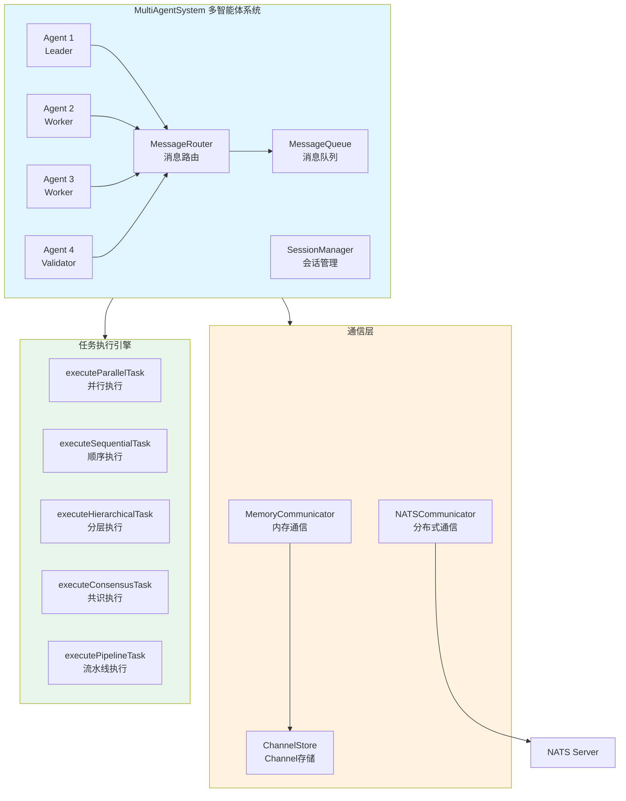
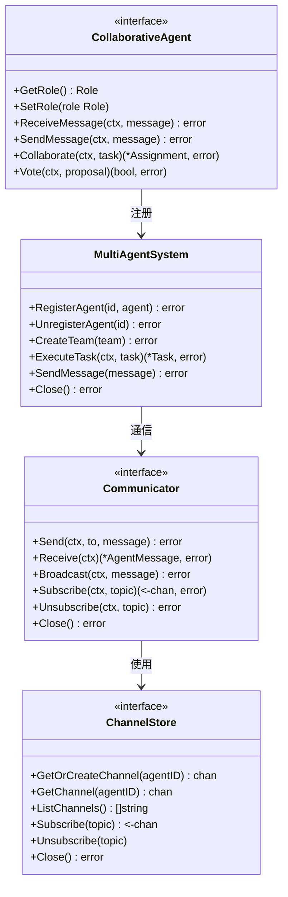
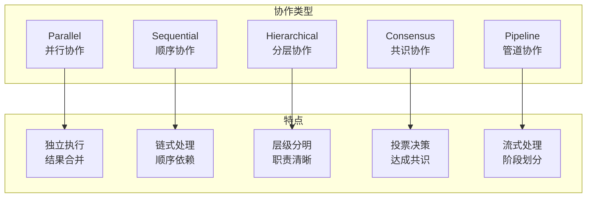
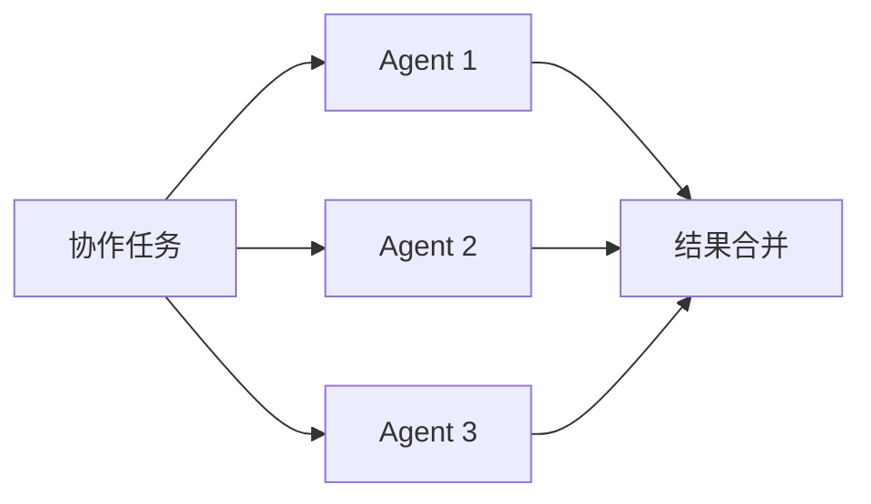
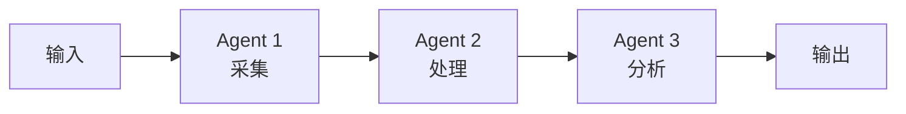
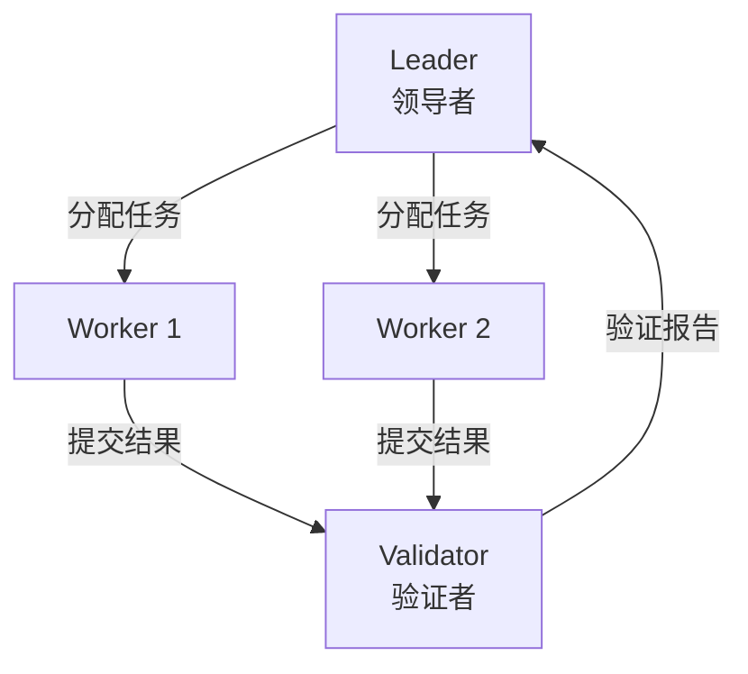
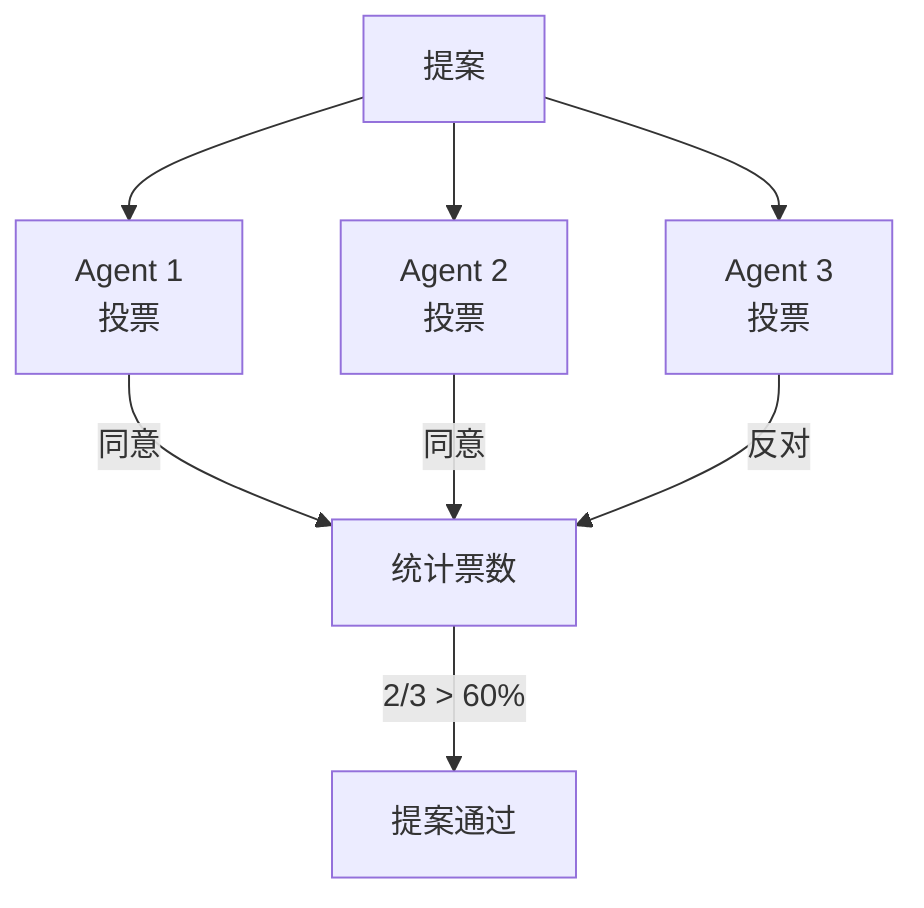
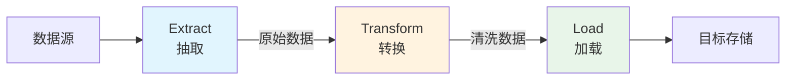
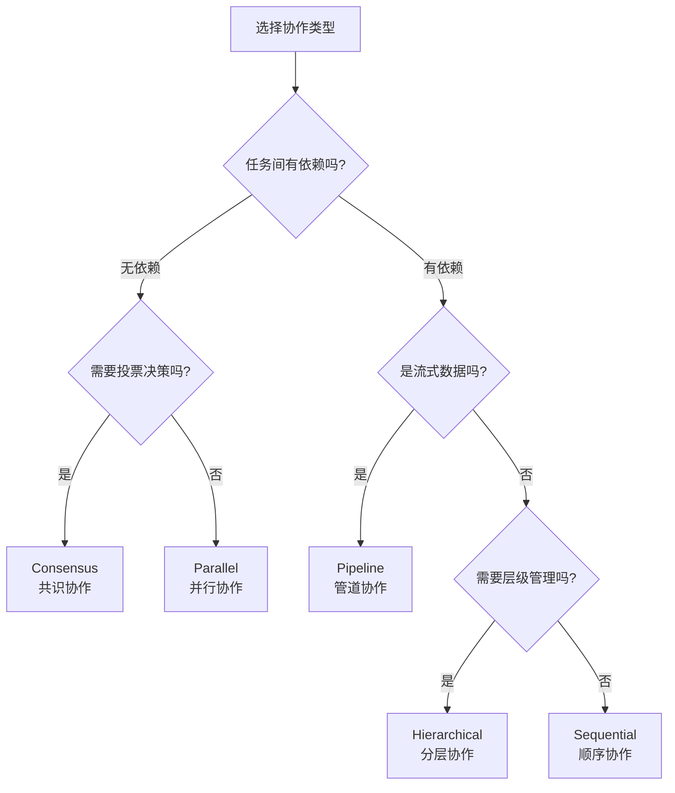
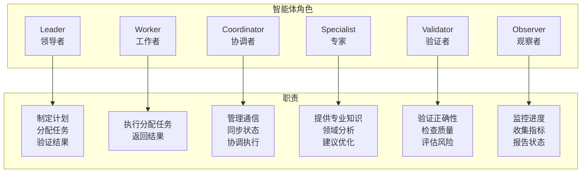

# multiagent 多智能体协作系统

本模块是 goagent 框架的多智能体协作系统，提供多智能体交互、任务调度、消息通信和分布式协作能力。

## 目录

- [架构设计](#架构设计)
- [核心组件](#核心组件)
- [协作模式](#协作模式)
- [角色系统](#角色系统)
- [使用方法](#使用方法)
- [API 参考](#api-参考)
- [代码结构](#代码结构)

## 架构设计

### 系统架构图



### 组件关系图



## 核心组件

### 1. MultiAgentSystem 系统管理器

多智能体系统的核心管理器：

```go
type MultiAgentSystem struct {
    agents      map[string]CollaborativeAgent
    teams       map[string]*Team
    messageQueue chan Message
    router      *MessageRouter
    logger      loggercore.Logger
}
```

| 方法 | 说明 |
|------|------|
| `RegisterAgent(id, agent)` | 注册智能体 |
| `UnregisterAgent(id)` | 注销智能体 |
| `CreateTeam(team)` | 创建团队 |
| `ExecuteTask(ctx, task)` | 执行协作任务 |
| `SendMessage(message)` | 发送消息 |
| `Close()` | 关闭系统 |

### 2. CollaborativeAgent 协作智能体

协作智能体接口定义：

```go
type CollaborativeAgent interface {
    core.Agent
    GetRole() Role
    SetRole(role Role)
    ReceiveMessage(ctx context.Context, message Message) error
    SendMessage(ctx context.Context, message Message) error
    Collaborate(ctx context.Context, task *CollaborativeTask) (*Assignment, error)
    Vote(ctx context.Context, proposal interface{}) (bool, error)
}
```

### 3. Communicator 通信器

支持两种通信实现：

| 通信器 | 说明 | 适用场景 |
|--------|------|---------|
| `MemoryCommunicator` | 内存通信 | 单机多智能体 |
| `NATSCommunicator` | NATS 分布式 | 分布式部署 |

### 4. CollaborativeTask 协作任务

任务定义和状态：

```go
type CollaborativeTask struct {
    ID          string
    Name        string
    Description string
    Type        CollaborationType
    Input       interface{}
    Output      interface{}
    Status      TaskStatus
    Assignments map[string]Assignment
    Results     map[string]interface{}
    StartTime   time.Time
    EndTime     time.Time
}
```

## 协作模式

### 五种协作类型



### 1. Parallel 并行协作

所有智能体同时执行独立子任务：



### 2. Sequential 顺序协作

按顺序执行，前一个的输出作为后一个的输入：



### 3. Hierarchical 分层协作

Leader 分配任务，Worker 执行，Validator 验证：



### 4. Consensus 共识协作

多个智能体投票决策：



### 5. Pipeline 管道协作

数据流经多个处理阶段：



### 协作模式选择



## 角色系统

### 六种角色定义



### 角色常量

```go
const (
    RoleLeader      = "leader"      // 领导者：制定计划和决策
    RoleWorker      = "worker"      // 工作者：执行任务
    RoleCoordinator = "coordinator" // 协调者：管理通信与同步
    RoleSpecialist  = "specialist"  // 专家：提供领域专业知识
    RoleValidator   = "validator"   // 验证者：验证结果
    RoleObserver    = "observer"    // 观察者：监控与报告
)
```

## 使用方法

### 创建多智能体系统

```go
// 创建系统
logger := /* ... */
system := multiagent.NewMultiAgentSystem(logger)

// 创建智能体
leader := multiagent.NewBaseCollaborativeAgent(
    "leader1", "Leader", multiagent.RoleLeader, system)
worker1 := multiagent.NewBaseCollaborativeAgent(
    "worker1", "Worker 1", multiagent.RoleWorker, system)
worker2 := multiagent.NewBaseCollaborativeAgent(
    "worker2", "Worker 2", multiagent.RoleWorker, system)
validator := multiagent.NewBaseCollaborativeAgent(
    "validator1", "Validator", multiagent.RoleValidator, system)

// 注册智能体
system.RegisterAgent("leader1", leader)
system.RegisterAgent("worker1", worker1)
system.RegisterAgent("worker2", worker2)
system.RegisterAgent("validator1", validator)

// 优雅关闭
defer system.Close()
```

### 执行协作任务

```go
// 创建并行任务
task := &multiagent.CollaborativeTask{
    ID:          "task-001",
    Name:        "数据处理",
    Type:        multiagent.CollaborationTypeParallel,
    Input: map[string]interface{}{
        "data": "example",
    },
    Assignments: make(map[string]multiagent.Assignment),
}

// 执行任务
ctx := context.Background()
result, err := system.ExecuteTask(ctx, task)
if err != nil {
    log.Fatal(err)
}

// 访问结果
for agentID, assignment := range result.Assignments {
    fmt.Printf("Agent %s: %v\n", agentID, assignment.Result)
}
```

### 分层协作示例

```go
// 创建分层任务
task := &multiagent.CollaborativeTask{
    ID:   "hierarchical-task",
    Name: "项目管理",
    Type: multiagent.CollaborationTypeHierarchical,
    Input: map[string]interface{}{
        "project": "AI Agent 开发",
        "deadline": "2024-12-31",
    },
    Assignments: make(map[string]multiagent.Assignment),
}

// Leader 会先制定计划，然后分配给 Workers
result, err := system.ExecuteTask(ctx, task)
```

### 共识决策示例

```go
// 创建共识任务
task := &multiagent.CollaborativeTask{
    ID:   "consensus-task",
    Name: "架构决策",
    Type: multiagent.CollaborationTypeConsensus,
    Input: map[string]interface{}{
        "proposal": "采用微服务架构",
        "threshold": 0.6, // 60% 通过
    },
    Assignments: make(map[string]multiagent.Assignment),
}

// 所有智能体投票
result, err := system.ExecuteTask(ctx, task)
fmt.Printf("投票结果: %v\n", result.Output)
```

### 消息通信

```go
// 发送消息
message := multiagent.Message{
    ID:        "msg-001",
    From:      "leader1",
    To:        "worker1",
    Type:      multiagent.MessageTypeCommand,
    Content:   "开始处理数据",
    Priority:  1,
    Timestamp: time.Now(),
}
system.SendMessage(message)

// 智能体接收消息
agent.ReceiveMessage(ctx, message)
```

### 分布式部署（NATS）

```go
// 创建 NATS 通信器
config := &multiagent.NATSConfig{
    URL:       "nats://localhost:4222",
    ClusterID: "goagent-cluster",
}
communicator, err := multiagent.NewNATSCommunicator("agent1", config)
if err != nil {
    log.Fatal(err)
}
defer communicator.Close()

// 发送消息
msg := &multiagent.AgentMessage{
    From:    "agent1",
    To:      "agent2",
    Type:    multiagent.MessageTypeRequest,
    Payload: "Hello",
}
communicator.Send(ctx, "agent2", msg)

// 订阅主题
ch, _ := communicator.Subscribe(ctx, "notifications")
for msg := range ch {
    fmt.Printf("收到消息: %v\n", msg)
}
```

## API 参考

### MultiAgentSystem API

```go
// 创建系统
NewMultiAgentSystem(log Logger, opts ...SystemOption) *MultiAgentSystem

// 智能体管理
RegisterAgent(id string, agent CollaborativeAgent) error
UnregisterAgent(id string) error

// 团队管理
CreateTeam(team *Team) error

// 任务执行
ExecuteTask(ctx context.Context, task *CollaborativeTask) (*CollaborativeTask, error)

// 消息通信
SendMessage(message Message) error

// 生命周期
Close() error
```

### CollaborativeAgent API

```go
// 角色管理
GetRole() Role
SetRole(role Role)

// 消息通信
ReceiveMessage(ctx context.Context, message Message) error
SendMessage(ctx context.Context, message Message) error

// 协作参与
Collaborate(ctx context.Context, task *CollaborativeTask) (*Assignment, error)

// 共识投票
Vote(ctx context.Context, proposal interface{}) (bool, error)

// 状态管理
GetState(key string) (interface{}, bool)
SetState(key string, value interface{})
DeleteState(key string)
```

### Communicator API

```go
// 内存通信器
NewMemoryCommunicator(agentID string) *MemoryCommunicator
NewMemoryCommunicatorWithStore(agentID string, store ChannelStore) *MemoryCommunicator

// NATS 通信器
NewNATSCommunicator(agentID string, config *NATSConfig) (*NATSCommunicator, error)

// 通信操作
Send(ctx context.Context, to string, message *AgentMessage) error
Receive(ctx context.Context) (*AgentMessage, error)
Broadcast(ctx context.Context, message *AgentMessage) error
Subscribe(ctx context.Context, topic string) (<-chan *AgentMessage, error)
Unsubscribe(ctx context.Context, topic string) error
```

### Router 和 Session API

```go
// 消息路由
NewMessageRouter() *MessageRouter
RegisterRoute(pattern string, handler RouteHandler) error
RegisterPatternRoute(pattern string, handler RouteHandler) error
Route(ctx context.Context, message *AgentMessage) (*AgentMessage, error)

// 会话管理
NewSessionManager() *SessionManager
CreateSession(participants []string) (*AgentSession, error)
GetSession(sessionID string) (*AgentSession, error)
AddMessage(sessionID string, message *AgentMessage) error
CloseSession(sessionID string) error
```

## 代码结构

```text
multiagent/
├── system.go               # 多智能体系统核心管理器
├── collaborative_agent.go  # 协作智能体实现
├── communication.go        # 通信接口与消息定义
├── communicator_memory.go  # 内存通信器
├── communicator_nats.go    # NATS 分布式通信器
├── router.go               # 消息路由器
├── channel_store.go        # Channel 存储接口
├── collaborative_agent_test.go
├── communicator_test.go
├── router_test.go
└── system_test.go
```

## 消息类型

```go
const (
    MessageTypeRequest      = "request"      // 请求
    MessageTypeResponse     = "response"     // 响应
    MessageTypeBroadcast    = "broadcast"    // 广播
    MessageTypeNotification = "notification" // 通知
    MessageTypeCommand      = "command"      // 命令
    MessageTypeReport       = "report"       // 报告
    MessageTypeVote         = "vote"         // 投票
)
```

## 任务状态

```go
const (
    TaskStatusPending   = "pending"   // 等待中
    TaskStatusAssigned  = "assigned"  // 已分配
    TaskStatusExecuting = "executing" // 执行中
    TaskStatusCompleted = "completed" // 已完成
    TaskStatusFailed    = "failed"    // 失败
    TaskStatusCancelled = "cancelled" // 已取消
)
```

## 扩展阅读

- [core](../core/) - 核心执行引擎
- [agents](../agents/) - 推理策略实现
- [distributed](../distributed/) - 分布式系统支持
- [examples/multiagent](../examples/multiagent/) - 多智能体示例
