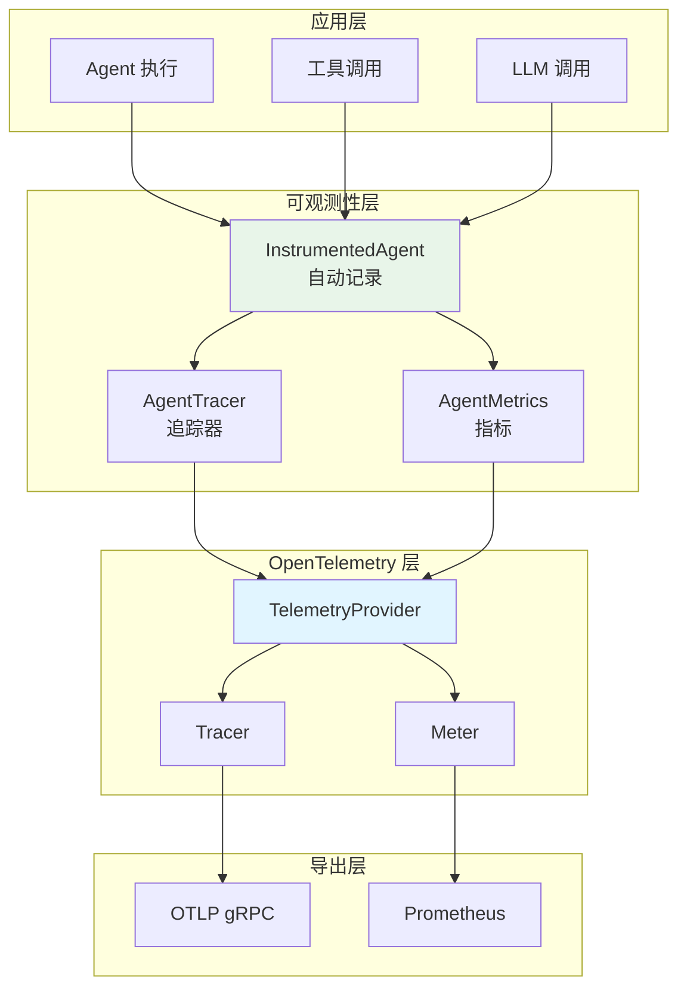
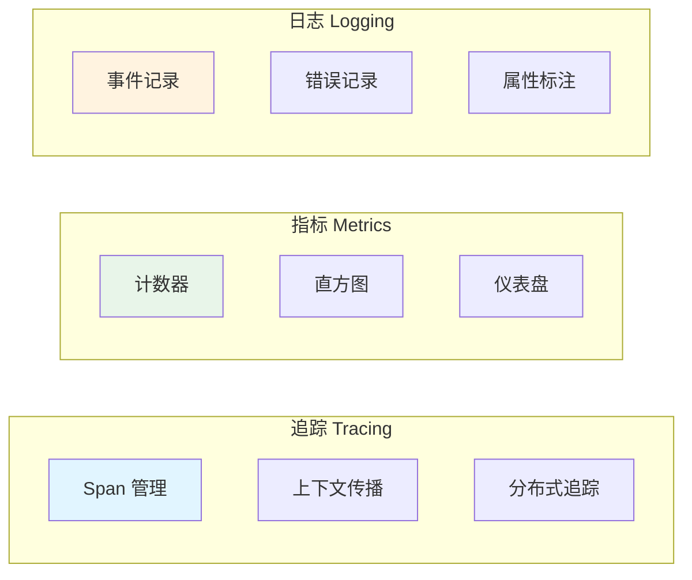

# observability 可观测性系统

本模块是 goagent 框架的可观测性系统，集成 OpenTelemetry 框架，提供分布式追踪、指标监控和日志记录能力。

## 目录

- [架构设计](#架构设计)
- [核心组件](#核心组件)
- [追踪功能](#追踪功能)
- [指标功能](#指标功能)
- [使用方法](#使用方法)
- [API 参考](#api-参考)
- [代码结构](#代码结构)

## 架构设计

### 系统架构图



### 三维可观测性



## 核心组件

### 1. TelemetryProvider 遥测提供者

OpenTelemetry 核心配置管理：

```go
type TelemetryProvider struct {
    tracerProvider *sdktrace.TracerProvider
    meterProvider  *sdkmetric.MeterProvider
    logger         *log.Logger
    config         *TelemetryConfig
    resource       *resource.Resource
}
```

**配置选项**：

| 字段 | 默认值 | 说明 |
|------|--------|------|
| ServiceName | "agent-service" | 服务名称 |
| ServiceVersion | "1.0.0" | 服务版本 |
| Environment | "development" | 部署环境 |
| TraceEnabled | true | 启用追踪 |
| TraceExporter | "otlp" | 导出器类型 |
| TraceEndpoint | "localhost:4317" | OTLP 端点 |
| TraceSampleRate | 1.0 | 采样率 |
| MetricsEnabled | true | 启用指标 |
| MetricsExporter | "prometheus" | 指标导出器 |
| MetricsInterval | 60s | 导出间隔 |

### 2. AgentTracer 追踪器

Agent 专用追踪器：

```go
type AgentTracer struct {
    tracer trace.Tracer
}
```

**领域特定 Span**：

| 方法 | 说明 |
|------|------|
| `StartAgentSpan(ctx, agentName, attrs...)` | Agent 执行 span |
| `StartToolSpan(ctx, toolName, attrs...)` | 工具调用 span |
| `StartLLMSpan(ctx, model, attrs...)` | LLM 调用 span |
| `StartMemorySpan(ctx, operation, attrs...)` | 内存操作 span |
| `StartChainSpan(ctx, chainName, attrs...)` | 链执行 span |

### 3. AgentMetrics 指标收集器

基于 OpenTelemetry 的指标：

```go
type AgentMetrics struct {
    meter             metric.Meter
    requestsTotal     metric.Int64Counter
    errorsTotal       metric.Int64Counter
    toolCallsTotal    metric.Int64Counter
    requestDuration   metric.Float64Histogram
    toolDuration      metric.Float64Histogram
    activeAgents      metric.Int64UpDownCounter
}
```

### 4. Prometheus 指标（Metrics 单例）

```go
type Metrics struct {
    // Agent 执行指标
    agentExecutions        *prometheus.CounterVec
    agentExecutionDuration *prometheus.HistogramVec
    agentErrors            *prometheus.CounterVec

    // 工具调用指标
    toolCalls              *prometheus.CounterVec
    toolCallDuration       *prometheus.HistogramVec
    toolErrors             *prometheus.CounterVec

    // 分布式调用指标
    remoteAgentCalls       *prometheus.CounterVec
    remoteAgentDuration    *prometheus.HistogramVec

    // 服务实例指标
    serviceInstances       *prometheus.GaugeVec
    healthyInstances       *prometheus.GaugeVec

    // 并发指标
    concurrentExecutions   prometheus.Gauge
}
```

### 5. InstrumentedAgent 可观测 Agent

自动记录指标、日志、追踪的 Agent 包装：

```go
type InstrumentedAgent struct {
    agent       agentcore.Agent
    serviceName string
    logger      core.Logger
}
```

**自动记录内容**：
- 并发计数变化
- 执行时长
- 成功/失败状态
- 工具调用详情
- 推理步骤数

### 6. DistributedTracer 分布式追踪

跨服务追踪上下文传播：

```go
type DistributedTracer struct {
    tracer     trace.Tracer
    propagator propagation.TextMapPropagator
}
```

**支持的载体**：
- HTTPCarrier - HTTP 头传播
- MessageCarrier - 消息队列传播

## 追踪功能

### 基础追踪

```go
// 启动 Agent span
ctx, span := agentTracer.StartAgentSpan(ctx, "recommendation-engine",
    attribute.String("user_id", "123"))
defer span.End()

// 添加事件
agentTracer.AddEvent(ctx, "search_started",
    attribute.String("algorithm", "collaborative_filtering"))

// 设置属性
agentTracer.SetAttributes(ctx,
    attribute.Int("items_returned", 10),
    attribute.Float64("confidence", 0.95))

// 记录错误
if err != nil {
    agentTracer.RecordError(ctx, err)
}
```

### 在 Span 中执行

```go
err := agentTracer.WithSpanContext(ctx, "find_recommendations",
    func(ctx context.Context) error {
        return findRecommendations(ctx)
    },
    attribute.String("user_id", "user123"))
```

### 分布式追踪

```go
// HTTP 请求追踪
tracer := NewCrossServiceTracer("api-gateway")
ctx, span := tracer.TraceHTTPRequest(ctx, httpRequest)
defer span.End()

resp, _ := http.DefaultClient.Do(req)
tracer.TraceHTTPResponse(ctx, resp)

// 消息队列追踪
ctx, span, carrier := tracer.TraceMessage(ctx, "orders.created", messageBytes)
// carrier.GetMetadata() 包含追踪头
```

## 指标功能

### Prometheus 指标

```go
// 记录 Agent 执行
start := time.Now()
RecordAgentExecution("search-agent", "search-service", "success", time.Since(start))

// 记录工具调用
RecordToolCall("web-search", "search-agent", "success", duration)

// 更新服务实例
UpdateServiceInstances("payment-service", 5, 5)

// 管理并发
IncrementConcurrentExecutions()
defer DecrementConcurrentExecutions()
```

### OpenTelemetry 指标

```go
metrics, _ := NewAgentMetrics(provider, "my-service")

// 记录请求
metrics.RecordRequest(ctx, 0.25, true,
    attribute.String("agent.name", "analyst"))

// 记录 LLM 调用
metrics.RecordLLMCall(ctx, "gpt-4", "openai", 500, 2.5, true)

// 记录内存操作
metrics.RecordMemoryOperation(ctx, "store", "vector", 1024, 0.05, true)

// 活跃 Agent 计数
metrics.IncrementActiveAgents(ctx, 1)
```

## 使用方法

### 初始化

```go
// 配置
config := &TelemetryConfig{
    ServiceName:    "my-agent-service",
    ServiceVersion: "1.0.0",
    TraceExporter:  "otlp",
    TraceEndpoint:  "localhost:4317",
}

// 创建提供者
provider, err := NewTelemetryProvider(config)
defer provider.Shutdown(context.Background())

// 获取 tracer
agentTracer := NewAgentTracer(provider, "my-agent")

// 获取指标
metrics, err := NewAgentMetrics(provider, "my-agent")
```

### 包装 Agent

```go
// 创建业务 Agent
agent := &MySearchAgent{}

// 包装为可观测 Agent
wrappedAgent := NewInstrumentedAgent(agent, "search-service", logger)

// 使用（自动记录所有可观测数据）
output, err := wrappedAgent.Invoke(ctx, input)
```

### 属性构造器

```go
// Agent 属性
attrs := AgentAttributes("my-agent", "search")

// 工具属性
attrs := ToolAttributes("calculator", "compute")

// LLM 属性
attrs := LLMAttributes("gpt-4", "openai", 500)

// 内存属性
attrs := MemoryAttributes("store", "vector", 1024)

// 错误属性
attrs := ErrorAttributes("timeout", "request timed out")
```

## API 参考

### TelemetryProvider

```go
NewTelemetryProvider(config *TelemetryConfig) (*TelemetryProvider, error)
GetTracer(name string) trace.Tracer
GetMeter(name string) metric.Meter
Shutdown(ctx context.Context) error
ForceFlush(ctx context.Context) error
```

### AgentTracer

```go
NewAgentTracer(provider *TelemetryProvider, name string) *AgentTracer
StartSpan(ctx, name string, opts ...trace.SpanStartOption) (context.Context, trace.Span)
StartAgentSpan(ctx, agentName string, attrs ...attribute.KeyValue) (context.Context, trace.Span)
StartToolSpan(ctx, toolName string, attrs ...attribute.KeyValue) (context.Context, trace.Span)
StartLLMSpan(ctx, model string, attrs ...attribute.KeyValue) (context.Context, trace.Span)
AddEvent(ctx, name string, attrs ...attribute.KeyValue)
SetAttributes(ctx, attrs ...attribute.KeyValue)
RecordError(ctx, err error, opts ...trace.EventOption)
WithSpanContext(ctx, spanName string, fn func(context.Context) error, attrs ...attribute.KeyValue) error
```

### Metrics 全局函数

```go
GetMetrics() *Metrics
RecordAgentExecution(agentName, service, status string, duration time.Duration)
RecordAgentError(agentName, service, errorType string)
RecordToolCall(toolName, agentName, status string, duration time.Duration)
RecordToolError(toolName, agentName, errorType string)
RecordRemoteAgentCall(service, agentName, status string, duration time.Duration)
UpdateServiceInstances(service string, total, healthy int)
IncrementConcurrentExecutions()
DecrementConcurrentExecutions()
```

### DistributedTracer

```go
NewDistributedTracer(tracer trace.Tracer) *DistributedTracer
InjectContext(ctx, carrier propagation.TextMapCarrier) error
ExtractContext(ctx, carrier propagation.TextMapCarrier) context.Context
StartRemoteSpan(ctx, name string, carrier propagation.TextMapCarrier) (context.Context, trace.Span)
```

## 代码结构

```text
observability/
├── telemetry.go              # OpenTelemetry 提供者
├── tracer.go                 # AgentTracer 实现
├── tracing.go                # 基础追踪工具
├── tracing_distributed.go    # 分布式追踪
├── metrics.go                # Prometheus 指标
├── agent_metrics.go          # OpenTelemetry 指标
├── logging.go                # InstrumentedAgent
└── *_test.go                 # 测试文件
```

## 最佳实践

1. **初始化一次**：TelemetryProvider 应在应用启动时创建一次
2. **及时关闭**：应用关闭前调用 `provider.Shutdown()` 确保数据导出
3. **使用 WithSpanContext**：自动记录错误到 span
4. **包装 Agent**：使用 InstrumentedAgent 获得自动可观测性
5. **采样配置**：生产环境建议 `TraceSampleRate: 0.1`

## 扩展阅读

- [core](../core/) - 核心执行引擎
- [middleware](../middleware/) - 中间件系统
- [distributed](../distributed/) - 分布式协调
