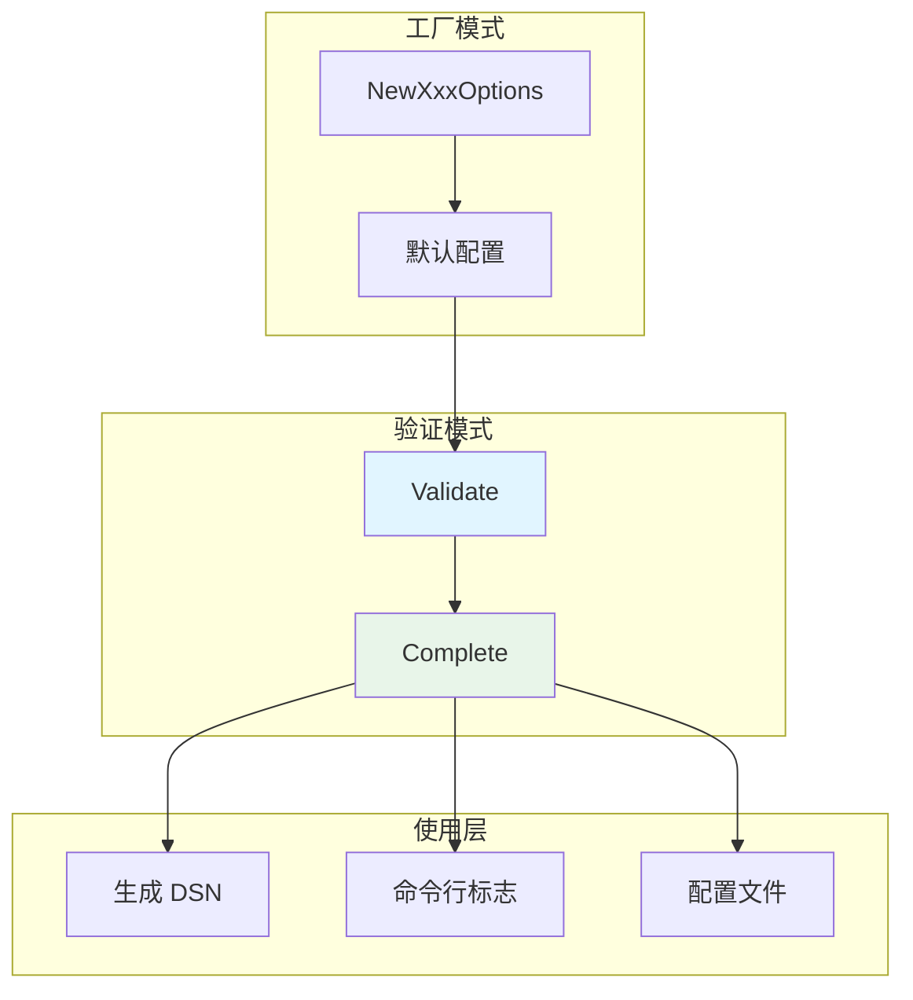
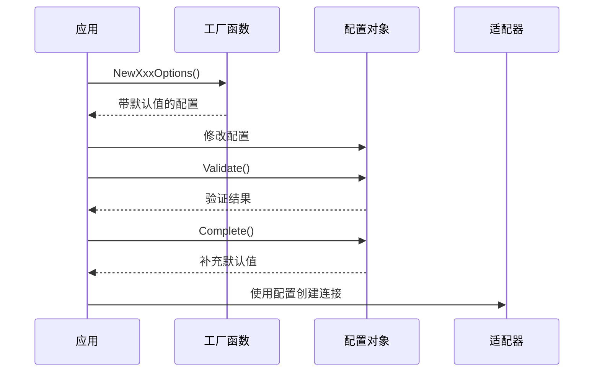

# options 配置选项系统

本模块是 goagent 框架的基础配置层，提供各种外部服务和组件的配置选项管理。

## 目录

- [架构设计](#架构设计)
- [配置类型](#配置类型)
- [使用方法](#使用方法)
- [API 参考](#api-参考)
- [代码结构](#代码结构)

## 架构设计

### 设计模式



### 配置流程



## 配置类型

### 1. RedisOptions

Redis 连接配置：

```go
type RedisOptions struct {
    Addr         string        // Redis 地址 (默认: "localhost:6379")
    Password     string        // 密码 (json:"-" 序列化时隐藏)
    DB           int           // 数据库编号 0-15 (默认: 0)
    PoolSize     int           // 连接池大小 (默认: 10)
    MinIdleConns int           // 最小空闲连接 (默认: 5)
    MaxRetries   int           // 最大重试次数 (默认: 3)
    TTL          time.Duration // 默认过期时间 (默认: 0)
    DialTimeout  time.Duration // 拨号超时 (默认: 5s)
    ReadTimeout  time.Duration // 读取超时 (默认: 3s)
    WriteTimeout time.Duration // 写入超时 (默认: 3s)
}
```

**验证规则**：
- Addr 不能为空
- DB 必须在 0-15 之间
- PoolSize 不能为负数
- MinIdleConns 不能超过 PoolSize

### 2. MySQLOptions

MySQL 连接配置：

```go
type MySQLOptions struct {
    Host            string        // 主机地址 (默认: "localhost")
    Port            int           // 端口 (默认: 3306)
    User            string        // 用户名 (默认: "root")
    Password        string        // 密码 (json:"-")
    Database        string        // 数据库名 (默认: "test")
    Charset         string        // 字符集 (默认: "utf8mb4")
    ParseTime       bool          // 解析时间 (默认: true)
    Loc             string        // 时区 (默认: "Local")
    MaxIdleConns    int           // 最大空闲连接 (默认: 10)
    MaxOpenConns    int           // 最大打开连接 (默认: 100)
    ConnMaxLifetime time.Duration // 连接最大生命周期 (默认: 1h)
    LogLevel        string        // 日志级别 (默认: "silent")
    AutoMigrate     bool          // 自动迁移 (默认: false)
}
```

**DSN 格式**：
```
user:password@tcp(host:port)/database?charset=utf8mb4&parseTime=true&loc=Local
```

### 3. PostgresOptions

PostgreSQL 连接配置：

```go
type PostgresOptions struct {
    Host            string        // 主机地址 (默认: "localhost")
    Port            int           // 端口 (默认: 5432)
    User            string        // 用户名 (默认: "postgres")
    Password        string        // 密码 (json:"-")
    Database        string        // 数据库名 (默认: "postgres")
    SSLMode         string        // SSL 模式 (默认: "disable")
    TimeZone        string        // 时区 (默认: "UTC")
    MaxIdleConns    int           // 最大空闲连接 (默认: 10)
    MaxOpenConns    int           // 最大打开连接 (默认: 100)
    ConnMaxLifetime time.Duration // 连接最大生命周期 (默认: 1h)
    LogLevel        string        // 日志级别 (默认: "silent")
    AutoMigrate     bool          // 自动迁移 (默认: false)
}
```

**SSL 模式枚举**：
- `disable` - 不使用 SSL
- `require` - 必须使用 SSL
- `verify-ca` - 验证 CA 证书
- `verify-full` - 完整验证
- `prefer` - 优先使用 SSL

**DSN 格式**：
```
host=localhost port=5432 user=postgres password=*** dbname=postgres sslmode=disable TimeZone=UTC
```

## 使用方法

### 基础使用

```go
// 1. 创建默认配置
opts := options.NewRedisOptions()

// 2. 修改配置
opts.Addr = "redis.example.com:6379"
opts.Password = "secret"
opts.DB = 1

// 3. 验证配置
if err := opts.Validate(); err != nil {
    log.Fatal("配置验证失败:", err)
}

// 4. 补充默认值
if err := opts.Complete(); err != nil {
    log.Fatal("配置完成失败:", err)
}

// 5. 使用配置
log.Println("Redis 配置:", opts.String())
```

### 命令行标志

```go
import "github.com/spf13/pflag"

// 创建默认配置
opts := options.NewRedisOptions()

// 添加命令行标志
fs := pflag.NewFlagSet("app", pflag.ExitOnError)
opts.AddFlags(fs)
fs.Parse(os.Args[1:])

// 验证和完成
opts.Validate()
opts.Complete()
```

**Redis 命令行标志**：
```
--redis-addr          Redis 服务器地址
--redis-password      Redis 密码
--redis-db            Redis 数据库编号 (0-15)
--redis-pool-size     连接池大小
--redis-min-idle-conns 最小空闲连接数
--redis-max-retries   最大重试次数
--redis-ttl           默认 key 过期时间
--redis-dial-timeout  拨号超时
--redis-read-timeout  读取超时
--redis-write-timeout 写入超时
```

**MySQL 命令行标志**：
```
--mysql-host          MySQL 主机地址
--mysql-port          MySQL 端口
--mysql-user          用户名
--mysql-password      密码
--mysql-database      数据库名
--mysql-charset       字符集
--mysql-max-idle-conns 最大空闲连接数
--mysql-max-open-conns 最大打开连接数
--mysql-log-level     日志级别
--mysql-auto-migrate  自动迁移
```

**PostgreSQL 命令行标志**：
```
--postgres-host       PostgreSQL 主机地址
--postgres-port       PostgreSQL 端口
--postgres-user       用户名
--postgres-password   密码
--postgres-database   数据库名
--postgres-ssl-mode   SSL 模式
--postgres-timezone   时区
--postgres-log-level  日志级别
```

### 配置文件（结合 viper）

```go
import "github.com/spf13/viper"

// 从 YAML 文件读取
viper.SetConfigFile("config.yaml")
viper.ReadInConfig()

// 解析到选项结构
opts := options.NewRedisOptions()
viper.Unmarshal(&opts)

// 验证和完成
opts.Validate()
opts.Complete()
```

**YAML 配置示例**：
```yaml
redis:
  addr: "localhost:6379"
  password: "secret"
  db: 0
  pool_size: 10
  min_idle_conns: 5

mysql:
  host: "localhost"
  port: 3306
  user: "root"
  password: "secret"
  database: "myapp"
  charset: "utf8mb4"
  max_idle_conns: 10
  max_open_conns: 100
```

### 环境变量

```go
viper.SetEnvPrefix("REDIS")
viper.AutomaticEnv()

opts := options.NewRedisOptions()
viper.Unmarshal(&opts)
```

### 生成 DSN

```go
// MySQL DSN
mysqlOpts := options.NewMySQLOptions()
mysqlOpts.Host = "localhost"
mysqlOpts.User = "root"
mysqlOpts.Password = "secret"
mysqlOpts.Database = "myapp"
dsn := mysqlOpts.DSN()
// user:password@tcp(localhost:3306)/myapp?charset=utf8mb4&parseTime=true&loc=Local

// PostgreSQL DSN
pgOpts := options.NewPostgresOptions()
pgOpts.Host = "localhost"
pgOpts.User = "postgres"
pgOpts.Password = "secret"
pgOpts.Database = "myapp"
dsn := pgOpts.DSN()
// host=localhost port=5432 user=postgres password=secret dbname=myapp sslmode=disable TimeZone=UTC
```

## API 参考

### 工厂函数

```go
// Redis 配置
NewRedisOptions() *RedisOptions

// MySQL 配置
NewMySQLOptions() *MySQLOptions

// PostgreSQL 配置
NewPostgresOptions() *PostgresOptions
```

### 通用方法

每个配置类型都实现以下方法：

```go
// 验证配置有效性
Validate() error

// 补充零值字段的默认值
Complete() error

// 安全的字符串表示（隐藏密码）
String() string

// 添加命令行标志
AddFlags(fs *pflag.FlagSet)
```

### 数据库特有方法

```go
// MySQL: 生成 DSN
(o *MySQLOptions) DSN() string

// PostgreSQL: 生成 DSN
(o *PostgresOptions) DSN() string
```

## 代码结构

```text
options/
├── doc.go       # 包文档
├── redis.go     # Redis 配置选项
├── mysql.go     # MySQL 配置选项
└── postgres.go  # PostgreSQL 配置选项
```

## 设计特点

### 安全性

- **密码隐藏**：所有密码字段用 `json:"-"` 标签
- **String() 保护**：密码显示为 `***` 或 `(empty)`
- **无日志泄露**：配置打印时自动隐藏敏感信息

### 灵活配置

- **多源支持**：命令行、环境变量、配置文件
- **完整标签**：`mapstructure`、`yaml`、`json`
- **类型安全**：编译时类型检查

### 可靠性

- **严格验证**：边界条件检查
- **枚举验证**：SSLMode、LogLevel 值检查
- **关系验证**：MinIdleConns 不超过 PoolSize

### 易用性

- **合理默认值**：生产就绪的默认配置
- **自动补全**：Complete() 填充零值
- **一致接口**：统一的方法签名

## 扩展阅读

- [store](../store/) - 数据存储适配器
- [cache](../cache/) - 缓存系统
- [core](../core/) - 核心执行引擎
