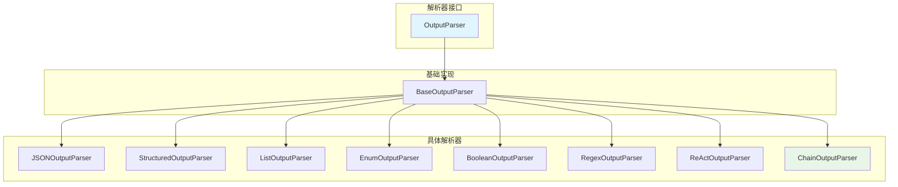
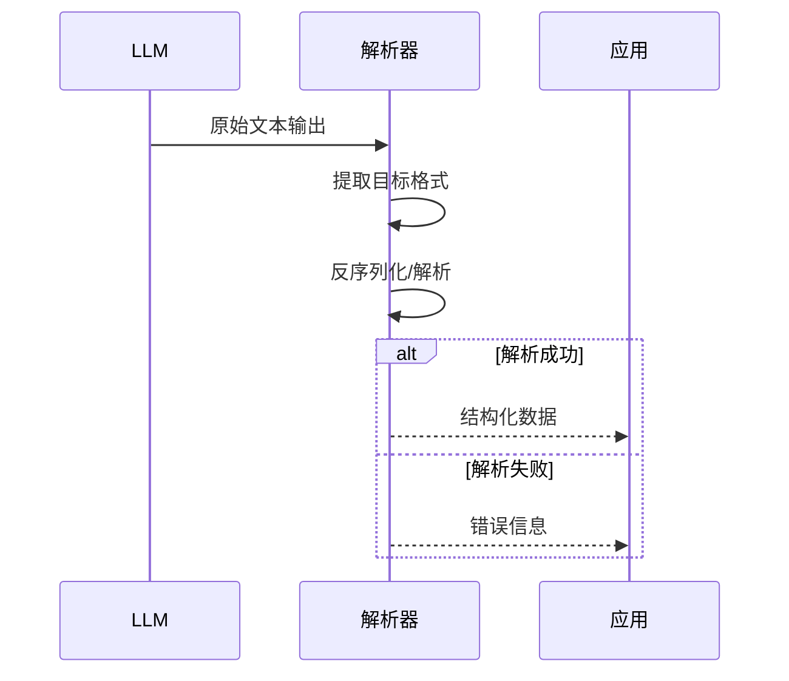

# parsers 输出解析系统

本模块是 goagent 框架的 LLM 输出解析库，提供灵活的输出格式解析能力，支持 JSON、ReAct、结构化文本等多种格式。

## 目录

- [架构设计](#架构设计)
- [核心接口](#核心接口)
- [解析器类型](#解析器类型)
- [ReAct 解析器](#react-解析器)
- [使用方法](#使用方法)
- [API 参考](#api-参考)
- [代码结构](#代码结构)

## 架构设计

### 解析器体系



### 解析流程



## 核心接口

### OutputParser[T any]

泛型输出解析器接口：

```go
type OutputParser[T any] interface {
    // 解析文本输出
    Parse(ctx context.Context, text string) (T, error)

    // 带提示的解析（用于错误恢复）
    ParseWithPrompt(ctx context.Context, text, prompt string) (T, error)

    // 获取格式化指令
    GetFormatInstructions() string

    // 获取输出类型描述
    GetType() string
}
```

## 解析器类型

### 1. JSONOutputParser[T any]

从 LLM 输出中智能提取和解析 JSON：

```go
type JSONOutputParser[T any] struct {
    strict bool  // 严格模式
}
```

**特性**：
- 支持 markdown 代码块提取
- 智能括号匹配
- 严格/宽松模式切换
- 大文本内存优化

**提取策略**：
1. 尝试提取 ```json ... ``` 代码块
2. 查找第一个 `{` 或 `[`
3. 严格模式：括号必须配对
4. 宽松模式：从起始位置到文件末尾

```go
// 创建严格模式解析器
parser := NewJSONOutputParser[MyStruct](true)

// 创建宽松模式解析器
parser := NewJSONOutputParser[MyStruct](false)
```

### 2. StructuredOutputParser[T any]

解析自定义格式的结构化文本：

```go
type FieldSchema struct {
    Name        string // 字段名称
    Type        string // 字段类型
    Description string // 字段描述
    Required    bool   // 是否必需
}
```

**支持的格式**：
- `field_name: value`
- `field_name:value`
- `**field_name**: value` (markdown 加粗)

```go
schema := map[string]FieldSchema{
    "task": {Name: "task", Type: "string", Required: true},
    "result": {Name: "result", Type: "string", Required: true},
}
parser := NewStructuredOutputParser[MyOutput](schema)
```

### 3. ListOutputParser

解析列表格式的输出：

```go
// 创建换行分隔的列表解析器
parser := NewListOutputParser("\n")

// 创建逗号分隔的列表解析器
parser := NewListOutputParser(", ")
```

**自动处理**：
- 移除编号前缀：`1.`, `-`, `*`, `•`
- 自动 trim 空行

### 4. EnumOutputParser

限制输出为预定义的枚举值：

```go
parser := NewEnumOutputParser(
    []string{"yes", "no", "maybe"},
    false,  // 不区分大小写
)
```

### 5. BooleanOutputParser

解析是/否、真/假等布尔值：

```go
parser := NewBooleanOutputParser()
```

**支持的值**：
- True: `yes`, `true`, `y`, `1`, `是`, `对`, `correct`
- False: `no`, `false`, `n`, `0`, `否`, `错`, `incorrect`

### 6. RegexOutputParser

使用正则表达式提取多个字段：

```go
parser := NewRegexOutputParser(map[string]string{
    "email": `([a-zA-Z0-9._%+-]+@[a-zA-Z0-9.-]+\.[a-zA-Z]{2,})`,
    "phone": `(\d{3}-\d{3}-\d{4})`,
})
```

### 7. ChainOutputParser[T any]

尝试多个解析器直到成功（降级策略）：

```go
parser := NewChainOutputParser[MyStruct](
    NewJSONOutputParser[MyStruct](true),   // 首先尝试严格 JSON
    NewJSONOutputParser[MyStruct](false),  // 然后尝试宽松 JSON
    NewStructuredOutputParser[MyStruct](schema), // 最后尝试结构化文本
)
```

## ReAct 解析器

### ReActOutput 结构

```go
type ReActOutput struct {
    FinalAnswer string                 // 最终答案
    Thought     string                 // 思考推理
    Action      string                 // 工具名称
    ActionInput map[string]interface{} // 工具输入
}
```

### ReActOutputParser

专门解析 ReAct 模式的 LLM 输出：

```go
parser := NewReActOutputParser()
```

**支持的格式**：
```
Thought: <推理内容>
Action: <工具名称>
Action Input: <JSON格式输入>
Observation: <工具执行结果>
...循环...
Final Answer: <最终答案>
```

**特殊方法**：

```go
// 带重试的解析
output, err := parser.ParseWithRetry(ctx, text, 3)

// 验证解析结果
err := parser.Validate(output)
```

## 使用方法

### 基础使用

```go
// 1. 创建解析器
parser := NewJSONOutputParser[MyStruct](false)

// 2. 获取格式指令（用于 prompt）
formatInstructions := parser.GetFormatInstructions()
prompt := "请返回 JSON 格式的结果。\n" + formatInstructions

// 3. 调用 LLM
output := callLLM(prompt)

// 4. 解析输出
ctx := context.Background()
result, err := parser.Parse(ctx, output)
if err != nil {
    // 使用 ParseWithPrompt 重试
    result, err = parser.ParseWithPrompt(ctx, output, prompt)
}
```

### 链式降级

```go
// 多层降级：严格JSON → 宽松JSON → 结构化文本
parser := NewChainOutputParser[MyStruct](
    NewJSONOutputParser[MyStruct](true),
    NewJSONOutputParser[MyStruct](false),
    NewStructuredOutputParser[MyStruct](schema),
)

result, err := parser.Parse(ctx, llmOutput)
```

### ReAct Agent 使用

```go
parser := NewReActOutputParser()

// 获取格式指令
instructions := parser.GetFormatInstructions()

// 解析输出
output, err := parser.Parse(ctx, agentOutput)
if err != nil {
    output, err = parser.ParseWithRetry(ctx, agentOutput, 3)
}

// 验证结果
if err = parser.Validate(output); err != nil {
    // 处理验证错误
}

// 使用结果
if output.FinalAnswer != "" {
    // Agent 已完成
    finalResult := output.FinalAnswer
} else {
    // 继续迭代
    toolName := output.Action
    toolInput := output.ActionInput
}
```

## API 参考

### 工厂函数

```go
// 基础解析器
NewBaseOutputParser[T any]() *BaseOutputParser[T]

// JSON 解析器
NewJSONOutputParser[T any](strict bool) *JSONOutputParser[T]

// 结构化解析器
NewStructuredOutputParser[T any](schema map[string]FieldSchema) *StructuredOutputParser[T]

// 列表解析器
NewListOutputParser(separator string) *ListOutputParser

// 枚举解析器
NewEnumOutputParser(allowedValues []string, caseSensitive bool) *EnumOutputParser

// 布尔解析器
NewBooleanOutputParser() *BooleanOutputParser

// 正则解析器
NewRegexOutputParser(patterns map[string]string) *RegexOutputParser

// 链式解析器
NewChainOutputParser[T any](parsers ...OutputParser[T]) *ChainOutputParser[T]

// ReAct 解析器
NewReActOutputParser() *ReActOutputParser
```

### 通用方法

```go
// 解析文本
Parse(ctx context.Context, text string) (T, error)

// 带提示解析
ParseWithPrompt(ctx context.Context, text, prompt string) (T, error)

// 获取格式指令
GetFormatInstructions() string

// 获取类型描述
GetType() string
```

### ReAct 特有方法

```go
// 带重试解析
ParseWithRetry(ctx context.Context, text string, maxRetries int) (*ReActOutput, error)

// 验证结果
Validate(parsed *ReActOutput) error
```

### 错误变量

```go
var (
    ErrParseFailed    = errors.New("failed to parse output")
    ErrInvalidFormat  = errors.New("invalid output format")
    ErrMissingField   = errors.New("missing required field")
    ErrTypeConversion = errors.New("type conversion failed")
)
```

## 代码结构

```text
parsers/
├── output_parser.go       # 核心解析器接口和实现
│   ├── OutputParser[T] 接口
│   ├── BaseOutputParser[T]
│   ├── JSONOutputParser[T]
│   ├── StructuredOutputParser[T]
│   ├── ListOutputParser
│   ├── EnumOutputParser
│   ├── BooleanOutputParser
│   ├── RegexOutputParser
│   └── ChainOutputParser[T]
├── parser_react.go        # ReAct 解析器
├── constants.go           # 常量定义
├── output_parser_test.go  # 单元测试
└── output_parser_bench_test.go # 性能测试
```

## 常量定义

### ReAct 字段名称

```go
const (
    FieldThought     = "thought"
    FieldAction      = "action"
    FieldActionInput = "action_input"
    FieldObservation = "observation"
    FieldFinalAnswer = "final_answer"
)
```

### ReAct 标记符

```go
const (
    MarkerThought     = "Thought:"
    MarkerAction      = "Action:"
    MarkerActionInput = "Action Input:"
    MarkerObservation = "Observation:"
    MarkerFinalAnswer = "Final Answer:"
)
```

### 输出格式类型

```go
const (
    FormatJSON       = "json"
    FormatText       = "text"
    FormatMarkdown   = "markdown"
    FormatStructured = "structured"
)
```

### 解析模式

```go
const (
    ModeStrict  = "strict"
    ModeLenient = "lenient"
    ModeAuto    = "auto"
)
```

## 性能优化

- **内存效率**：大文本中的小 JSON 自动 clone
- **低分配**：使用 `strings.Index()` 单次查找
- **并发友好**：所有解析器无状态

## 扩展阅读

- [llm](../llm/) - LLM 集成
- [agents](../agents/) - Agent 实现
- [core](../core/) - 核心执行引擎
