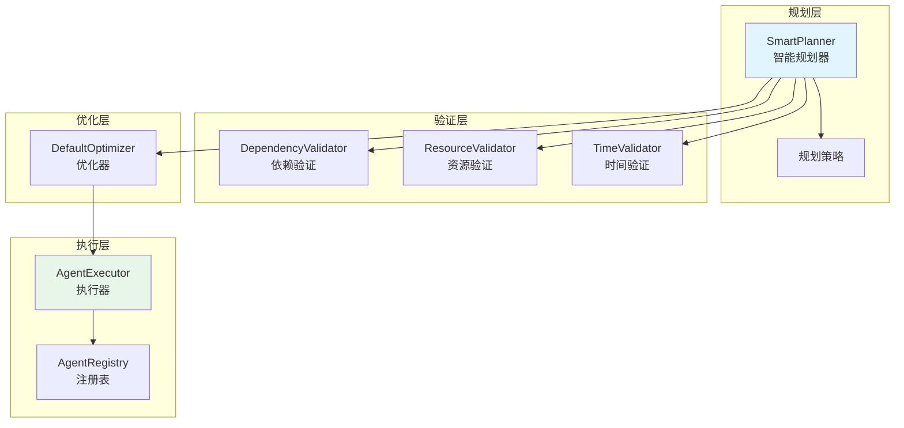
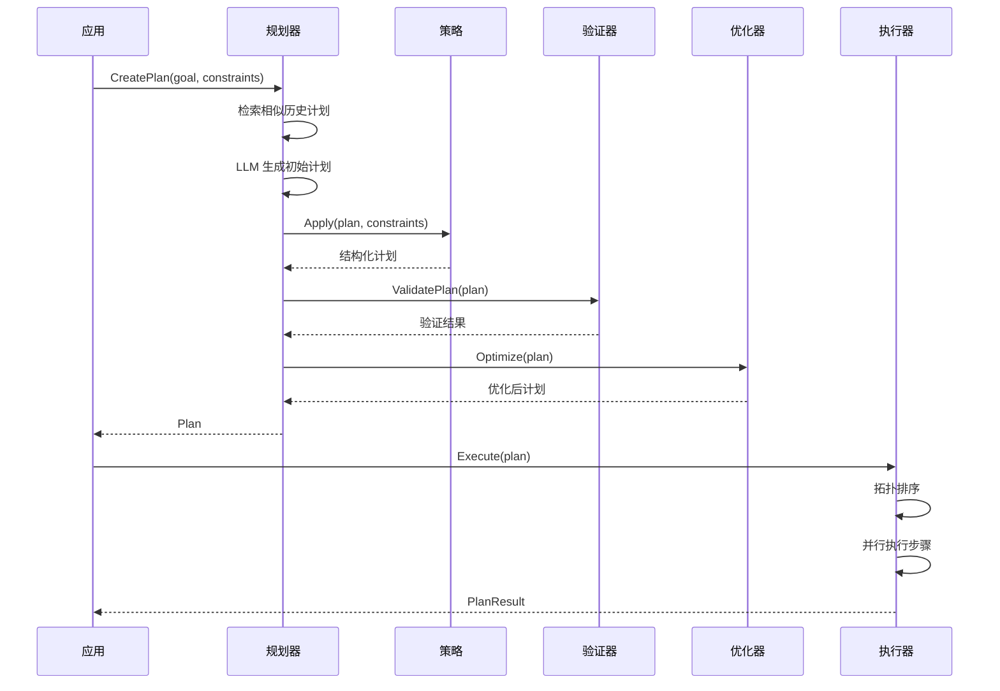

# planning 规划系统

本模块是 goagent 框架的规划系统，提供计划创建、分解、执行和优化能力，支持多种规划策略。

## 目录

- [架构设计](#架构设计)
- [核心组件](#核心组件)
- [规划策略](#规划策略)
- [验证器](#验证器)
- [执行器](#执行器)
- [使用方法](#使用方法)
- [API 参考](#api-参考)
- [代码结构](#代码结构)

## 架构设计

### 系统架构图



### 执行流程



## 核心组件

### 1. Plan 计划结构

```go
type Plan struct {
    ID           string                 // 计划 ID
    Goal         string                 // 目标描述
    Strategy     string                 // 使用的策略
    Steps        []*Step                // 执行步骤
    Dependencies map[string][]string    // 依赖关系
    Context      map[string]interface{} // 上下文
    CreatedAt    time.Time
    UpdatedAt    time.Time
    Status       PlanStatus             // 状态
    Metrics      *PlanMetrics           // 指标
}
```

**PlanStatus 状态**：
- `draft` - 草稿
- `ready` - 就绪
- `executing` - 执行中
- `completed` - 已完成
- `failed` - 失败
- `cancelled` - 已取消

### 2. Step 步骤结构

```go
type Step struct {
    ID                string                 // 步骤 ID
    Name              string                 // 名称
    Description       string                 // 描述
    Type              StepType               // 类型
    Agent             string                 // 执行 Agent
    Parameters        map[string]interface{} // 参数
    Expected          *ExpectedOutcome       // 预期输出
    Priority          int                    // 优先级
    EstimatedDuration time.Duration          // 预计耗时
    Status            StepStatus             // 状态
    Result            *StepResult            // 结果
}
```

**StepType 类型**：
- `analysis` - 分析步骤
- `decision` - 决策步骤
- `action` - 动作步骤
- `validation` - 验证步骤
- `optimization` - 优化步骤

### 3. PlanConstraints 约束

```go
type PlanConstraints struct {
    MaxSteps       int                    // 最大步骤数
    MaxDuration    time.Duration          // 最大耗时
    RequiredSteps  []string               // 必需步骤
    ForbiddenSteps []string               // 禁止步骤
    Resources      map[string]interface{} // 资源约束
    Priority       int                    // 优先级
}
```

### 4. Planner 接口

```go
type Planner interface {
    // 创建计划
    CreatePlan(ctx context.Context, goal string, constraints PlanConstraints) (*Plan, error)

    // 细化计划
    RefinePlan(ctx context.Context, plan *Plan, feedback string) (*Plan, error)

    // 分解步骤
    DecomposePlan(ctx context.Context, plan *Plan, step *Step) ([]*Step, error)

    // 优化计划
    OptimizePlan(ctx context.Context, plan *Plan) (*Plan, error)

    // 验证计划
    ValidatePlan(ctx context.Context, plan *Plan) (bool, []string, error)
}
```

## 规划策略

### 1. DecompositionStrategy 分解策略

自上而下分解复杂目标：

```go
type DecompositionStrategy struct{}
```

**分解模式**：
```
复杂步骤
  ├── Prepare（准备数据）
  ├── Execute（执行分析）
  └── Verify（验证结果）
```

**触发条件**：描述>100字 或 步骤类型为分析

### 2. BackwardChainingStrategy 回溯链接策略

从目标反向推导所需步骤：

```go
type BackwardChainingStrategy struct{}
```

**反向推导流程**：
```
目标状态
  ↑ Achieve Goal（验证）
  ↑ Execute Main Action
  ↑ Prepare Environment
  ↑ Gather Required Resources
起始状态
```

### 3. HierarchicalStrategy 层次化策略

多层级抽象规划：

```go
type HierarchicalStrategy struct{}
```

**层级结构**：
```
Phase 1: Initialization
  ├── Check Prerequisites
  └── Load Configuration

Phase 2: Execution
  ├── Process Data
  └── Apply Transformations

Phase 3: Finalization
  ├── Validate Output
  └── Generate Report
```

### 策略选择算法

```go
func selectStrategy(goal string, constraints PlanConstraints) PlanStrategy {
    // 规则优先级：
    // 1. MaxSteps < 5 → BackwardChaining
    // 2. goal 包含 "complex" 或 "multi" → Hierarchical
    // 3. 默认 → Decomposition
}
```

## 验证器

### 1. DependencyValidator 依赖验证

- 循环依赖检测（DFS 算法）
- 步骤 ID 存在性验证
- 依赖目标存在性验证

### 2. ResourceValidator 资源验证

- 总耗时 vs 最大耗时约束
- 资源可用性检查

### 3. TimeValidator 时间验证

- 步骤耗时有效性（非负）
- 时间约束合规性

## 执行器

### AgentExecutor 实现

```go
type AgentExecutor struct {
    logger         core.Logger
    registry       *AgentRegistry
    maxConcurrency int
    timeout        time.Duration
    retryPolicy    *RetryPolicy
    states         map[string]*ExecutionState
}
```

**执行流程**：
1. 创建执行状态
2. 拓扑排序生成执行级别
3. 并行执行同级步骤
4. 支持暂停/继续/取消

**重试策略**：
```go
type RetryPolicy struct {
    MaxRetries    int           // 最大重试次数（默认 3）
    RetryDelay    time.Duration // 初始延迟（默认 1s）
    BackoffFactor float64       // 退避因子（默认 2.0）
}
```

### AgentRegistry 注册表

按步骤类型自动选择 Agent：

| 步骤类型 | 默认 Agent |
|----------|------------|
| analysis | analysis_agent |
| decision | decision_agent |
| action | action_agent |
| validation | validation_agent |
| optimization | optimization_agent |

## 使用方法

### 创建规划器

```go
llmClient := llm.NewClient(...)
memory := interfaces.NewMemoryManager(...)

planner := planning.NewSmartPlanner(
    llmClient,
    memory,
    planning.WithMaxDepth(10),
    planning.WithTimeout(10*time.Minute),
)
```

### 创建和执行计划

```go
ctx := context.Background()

// 创建计划
constraints := planning.PlanConstraints{
    MaxSteps:    10,
    MaxDuration: 5 * time.Minute,
}
plan, err := planner.CreatePlan(ctx, "构建 Web 应用", constraints)

// 验证计划
valid, issues, err := planner.ValidatePlan(ctx, plan)

// 执行计划
logger := log.New(...)
executor := planning.NewAgentExecutor(logger)
executor.RegisterAgent("action_agent", actionAgent)
executor.RegisterAgent("analysis_agent", analysisAgent)

result, err := executor.Execute(ctx, plan)
```

### 分解复杂步骤

```go
complexStep := plan.Steps[0]
subSteps, err := planner.DecomposePlan(ctx, plan, complexStep)
// subSteps ID: step_1.1, step_1.2, step_1.3
```

### 细化计划

```go
feedback := "需要添加错误处理步骤"
refinedPlan, err := planner.RefinePlan(ctx, plan, feedback)
```

### 流程控制

```go
// 暂停执行
executor.Pause(plan.ID)

// 继续执行
executor.Resume(plan.ID)

// 取消执行
executor.Cancel(plan.ID)

// 获取状态
status, err := executor.GetStatus(plan.ID)
```

## API 参考

### Planner

```go
NewSmartPlanner(llmClient llm.Client, memory interfaces.MemoryManager, opts ...PlannerOption) *SmartPlanner

// 配置选项
WithMaxDepth(depth int) PlannerOption
WithTimeout(timeout time.Duration) PlannerOption
WithOptimizer(optimizer PlanOptimizer) PlannerOption
```

### PlanExecutor

```go
NewAgentExecutor(logger core.Logger) *AgentExecutor

// 执行方法
Execute(ctx context.Context, plan *Plan) (*PlanResult, error)
ExecuteStep(ctx context.Context, step *Step) (*StepResult, error)
Pause(planID string) error
Resume(planID string) error
Cancel(planID string) error
GetStatus(planID string) (*PlanStatus, error)

// Agent 管理
RegisterAgent(name string, agent core.Agent)
```

### PlanStrategy

```go
// 策略接口
type PlanStrategy interface {
    Apply(ctx context.Context, plan *Plan, constraints PlanConstraints) (*Plan, error)
    Name() string
}

// 内置策略
NewDecompositionStrategy() *DecompositionStrategy
NewBackwardChainingStrategy() *BackwardChainingStrategy
NewHierarchicalStrategy() *HierarchicalStrategy
```

### PlanValidator

```go
type PlanValidator interface {
    Validate(ctx context.Context, plan *Plan) (bool, []string, error)
}

NewDependencyValidator() *DependencyValidator
NewResourceValidator() *ResourceValidator
NewTimeValidator() *TimeValidator
```

### PlanOptimizer

```go
type PlanOptimizer interface {
    Optimize(ctx context.Context, plan *Plan) (*Plan, error)
}

NewDefaultOptimizer() *DefaultOptimizer
```

## 代码结构

```text
planning/
├── planner.go          # 规划器接口和 SmartPlanner
├── strategies.go       # 规划策略和验证器
├── executor.go         # 执行引擎
├── agents.go           # 规划相关 Agent
├── constants.go        # 常量定义
├── test_helpers.go     # 测试辅助
└── *_test.go           # 测试文件
```

## 默认配置

```go
const (
    DefaultMaxSteps       = 20           // 最大步骤数
    DefaultMaxDuration    = 3600s        // 最大总耗时
    DefaultMaxParallelism = 5            // 并发数
    DefaultRetryAttempts  = 3            // 重试次数
)

// SmartPlanner
maxPlanDepth = 5
maxRetries   = 3
timeout      = 5 * time.Minute

// AgentExecutor
maxConcurrency = 5
timeout        = 30 * time.Minute
```

## 扩展阅读

- [core](../core/) - 核心执行引擎
- [agents](../agents/) - Agent 实现
- [memory](../memory/) - 内存系统
