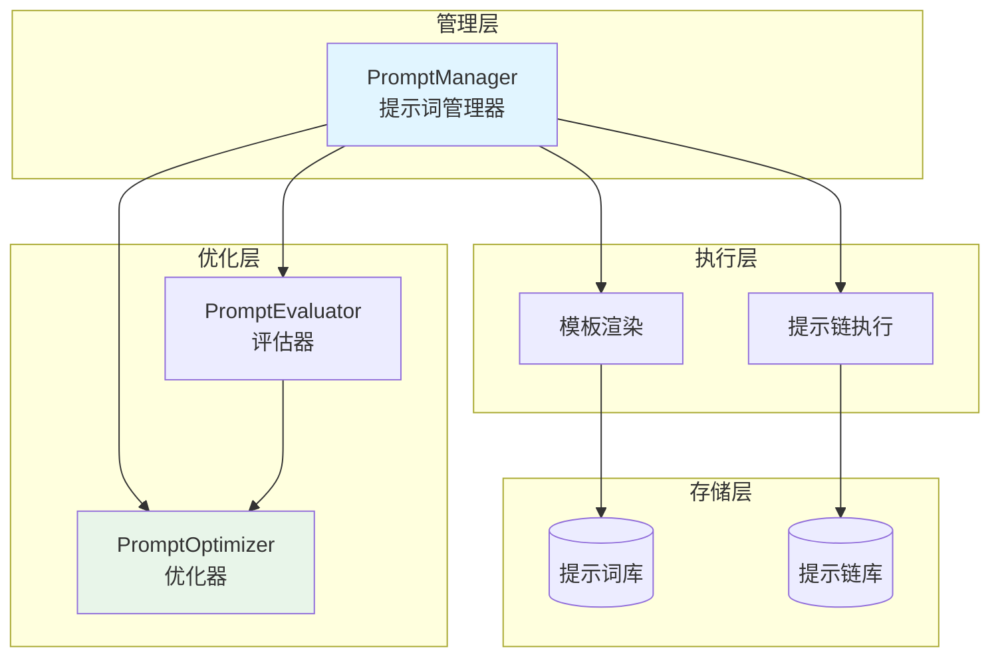

# prompt 提示词工程系统

本模块是 goagent 框架的提示词工程与管理子模块，提供完整的提示词定义、执行、优化和评估能力。

## 目录

- [架构设计](#架构设计)
- [核心组件](#核心组件)
- [提示词类型](#提示词类型)
- [评估器](#评估器)
- [优化器](#优化器)
- [使用方法](#使用方法)
- [API 参考](#api-参考)
- [代码结构](#代码结构)

## 架构设计

### 系统架构图



### 提示词生命周期

```mermaid
sequenceDiagram
    participant User as 用户
    participant PM as 管理器
    participant Eval as 评估器
    participant Opt as 优化器

    User->>PM: CreatePrompt()
    PM-->>User: Prompt

    User->>PM: ExecutePrompt()
    PM->>PM: 渲染模板
    PM-->>User: 完整提示

    User->>PM: TestPrompt(testCases)
    PM->>Eval: Evaluate()
    Eval-->>PM: 评分

    User->>PM: OptimizePrompt(feedback)
    PM->>Opt: Optimize()
    Opt-->>PM: 优化后提示词
```

## 核心组件

### 1. Prompt 提示词结构

```go
type Prompt struct {
    ID           string                 // 唯一标识
    Name         string                 // 名称
    Description  string                 // 描述
    Type         PromptType             // 类型
    Strategy     PromptStrategy         // 策略
    Template     string                 // Go 模板
    Variables    map[string]interface{} // 默认变量
    Examples     []Example              // 少样本示例
    Constraints  []string               // 约束条件
    Context      string                 // 上下文信息
    SystemPrompt string                 // 系统提示
    Version      string                 // 版本号
    Tags         []string               // 标签
    Metadata     map[string]interface{} // 元数据
    CreatedAt    time.Time
    UpdatedAt    time.Time
}
```

### 2. Example 示例结构

```go
type Example struct {
    Input     string                 // 输入样本
    Output    string                 // 输出样本
    Reasoning string                 // 推理过程
    Metadata  map[string]interface{} // 元数据
}
```

### 3. PromptChain 提示链

```go
type PromptChain struct {
    ID          string        // 链 ID
    Name        string        // 名称
    Description string        // 描述
    Steps       []PromptStep  // 步骤
    Strategy    ChainStrategy // 执行策略
    CreatedAt   time.Time
}

type PromptStep struct {
    ID           string            // 步骤 ID
    PromptID     string            // 提示词 ID
    Order        int               // 执行顺序
    Condition    string            // 条件表达式
    InputMapping map[string]string // 输入映射
    OutputKey    string            // 输出键名
}
```

### 4. PromptManager 接口

```go
type PromptManager interface {
    // 提示词管理
    CreatePrompt(prompt *Prompt) error
    GetPrompt(id string) (*Prompt, error)
    UpdatePrompt(prompt *Prompt) error
    DeletePrompt(id string) error
    ListPrompts(filter PromptFilter) ([]*Prompt, error)

    // 执行
    ExecutePrompt(ctx context.Context, promptID string, variables map[string]interface{}) (string, error)

    // 链式执行
    CreateChain(chain *PromptChain) error
    ExecuteChain(ctx context.Context, chainID string, input map[string]interface{}) (map[string]interface{}, error)

    // 优化与测试
    OptimizePrompt(promptID string, feedback []Feedback) (*Prompt, error)
    TestPrompt(promptID string, testCases []TestCase) (*TestResult, error)
}
```

## 提示词类型

### PromptType 类型枚举

```go
const (
    PromptTypeSystem         = "system"          // 系统提示
    PromptTypeUser           = "user"            // 用户输入
    PromptTypeAssistant      = "assistant"       // 助手回复
    PromptTypeInstruction    = "instruction"     // 指令提示
    PromptTypeContext        = "context"         // 上下文信息
    PromptTypeExample        = "example"         // 示例提示
    PromptTypeConstraint     = "constraint"      // 约束提示
    PromptTypeChainOfThought = "chain_of_thought" // 思维链
)
```

### PromptStrategy 策略枚举

```go
const (
    StrategyZeroShot       = "zero_shot"        // 零样本学习
    StrategyFewShot        = "few_shot"         // 少样本学习
    StrategyChainOfThought = "chain_of_thought" // 思维链
    StrategyTreeOfThoughts = "tree_of_thoughts" // 思维树
    StrategyReAct          = "react"            // ReAct 框架
    StrategyRolePlay       = "role_play"        // 角色扮演
    StrategyInstructional  = "instructional"    // 指令式
    StrategyConversational = "conversational"   // 对话式
)
```

### ChainStrategy 链执行策略

```go
const (
    ChainStrategySequential  = "sequential"  // 顺序执行
    ChainStrategyConditional = "conditional" // 条件执行
    ChainStrategyIterative   = "iterative"   // 迭代执行
    ChainStrategyParallel    = "parallel"    // 并行执行
)
```

## 评估器

### PromptEvaluator

多维度评估生成输出与期望输出的匹配度：

```go
type PromptEvaluator struct {
    weights EvaluationWeights
}
```

**评估维度**：

| 维度 | 默认权重 | 说明 |
|------|----------|------|
| 精确匹配 | 0.3 | 完全相同、大小写差异、空白差异 |
| 模糊匹配 | 0.2 | 编辑距离（Levenshtein） |
| 语义相似度 | 0.2 | Jaccard 相似度 + 重叠系数 |
| 格式符合度 | 0.1 | 行数比例、结构标记、JSON 检查 |
| 完整性 | 0.1 | 关键短语覆盖率 |
| 相关性 | 0.1 | 词频率相关性 |

**使用示例**：

```go
evaluator := NewPromptEvaluator()

// 简单评分
score := evaluator.Evaluate(actual, expected)

// 详细指标
metrics := evaluator.EvaluateWithMetrics(actual, expected)

// 自定义权重
evaluator.SetWeights(0.4, 0.3, 0.2, 0.05, 0.03, 0.02)
```

## 优化器

### PromptOptimizer

基于反馈的提示词自动优化引擎：

```go
type PromptOptimizer struct {
    evaluator        *PromptEvaluator
    improvementRules []ImprovementRule
}
```

**优化规则**：

| 规则 | 优先级 | 触发条件 | 优化动作 |
|------|--------|---------|---------|
| add_examples | 10 | 平均得分<0.6 且示例<5 | 添加高质量示例 |
| add_cot | 9 | 反馈提及"推理"或"逻辑" | 切换为 CoT 策略 |
| simplify | 8 | 模板>1000 字或约束>10 | 简化模板 |
| improve_clarity | 7 | 反馈提及"不清楚" | 增加澄清约束 |
| add_role | 6 | 无系统提示 | 添加角色扮演 |

**使用示例**：

```go
optimizer := NewPromptOptimizer()

// 单轮优化
optimized, err := optimizer.Optimize(prompt, feedback)

// 迭代优化
optimized, err := optimizer.OptimizeIterative(ctx, prompt, testCases, executor)
```

## 使用方法

### 创建和执行提示词

```go
manager := NewPromptManager()

// 创建提示词
prompt := &Prompt{
    ID:       "classify-sentiment",
    Name:     "情感分类",
    Type:     PromptTypeUser,
    Strategy: StrategyFewShot,
    Template: "分类以下文本的情感: {{.text}}",
    Examples: []Example{
        {Input: "这很好", Output: "积极"},
        {Input: "这很差", Output: "消极"},
    },
}
manager.CreatePrompt(prompt)

// 执行提示词
result, err := manager.ExecutePrompt(
    context.Background(),
    "classify-sentiment",
    map[string]interface{}{"text": "产品很棒"},
)
```

### 使用提示链

```go
chain := &PromptChain{
    ID:   "analysis-chain",
    Name: "多步分析",
    Steps: []PromptStep{
        {
            ID:        "step1",
            PromptID:  "extract",
            Order:     1,
            OutputKey: "entities",
        },
        {
            ID:       "step2",
            PromptID: "classify",
            Order:    2,
            InputMapping: map[string]string{
                "entities": "entities",
            },
            OutputKey: "classes",
        },
    },
}
manager.CreateChain(chain)

results, err := manager.ExecuteChain(
    context.Background(),
    "analysis-chain",
    map[string]interface{}{"text": "input"},
)
// results["entities"], results["classes"]
```

### 测试和优化

```go
// 定义测试用例
testCases := []TestCase{
    {
        ID:       "test-1",
        Input:    map[string]interface{}{"text": "很好"},
        Expected: "积极",
    },
}

// 执行测试
result, err := manager.TestPrompt("classify-sentiment", testCases)
fmt.Printf("成功率: %.2f%%\n", result.SuccessRate*100)

// 收集反馈
feedback := []Feedback{
    {PromptID: "classify-sentiment", Score: 0.7, Comments: "需要更多例子"},
}

// 优化提示词
optimized, err := manager.OptimizePrompt("classify-sentiment", feedback)
```

### 模板语法

使用 Go 的 `text/template` 语法：

```go
// 基本变量替换
"Hello {{.name}}, your task is {{.task}}"

// 条件判断
"{{if .advanced}}Advanced mode{{else}}Basic mode{{end}}"

// 循环
"{{range .examples}}Example: {{.}}{{end}}"

// 管道操作
"{{.text | toupper}}"
```

## API 参考

### PromptManager

```go
NewPromptManager() *DefaultPromptManager

// 提示词管理
CreatePrompt(prompt *Prompt) error
GetPrompt(id string) (*Prompt, error)
UpdatePrompt(prompt *Prompt) error
DeletePrompt(id string) error
ListPrompts(filter PromptFilter) ([]*Prompt, error)

// 执行
ExecutePrompt(ctx context.Context, promptID string, variables map[string]interface{}) (string, error)

// 链式执行
CreateChain(chain *PromptChain) error
ExecuteChain(ctx context.Context, chainID string, input map[string]interface{}) (map[string]interface{}, error)

// 优化与测试
OptimizePrompt(promptID string, feedback []Feedback) (*Prompt, error)
TestPrompt(promptID string, testCases []TestCase) (*TestResult, error)
```

### PromptEvaluator

```go
NewPromptEvaluator() *PromptEvaluator

Evaluate(actual, expected string) float64
EvaluateWithMetrics(actual, expected string) map[string]float64
SetWeights(exact, fuzzy, semantic, format, completeness, relevance float64)
```

### PromptOptimizer

```go
NewPromptOptimizer() *PromptOptimizer

Optimize(prompt *Prompt, feedback []Feedback) (*Prompt, error)
OptimizeIterative(ctx context.Context, prompt *Prompt, testCases []TestCase, executor func(*Prompt) (string, error)) (*Prompt, error)
```

## 代码结构

```text
prompt/
├── prompt_manager.go       # 提示词管理器
│   ├── 类型定义
│   ├── PromptManager 接口
│   └── DefaultPromptManager 实现
├── evaluator.go            # 评估器
│   ├── PromptEvaluator
│   └── 6 个评估方法
├── optimizer.go            # 优化器
│   ├── PromptOptimizer
│   └── 5 个优化规则
└── *_test.go               # 测试文件
```

## 设计特点

### 灵活的模板系统

- 基于 Go 的 `text/template`
- 支持条件、循环、管道
- 可扩展自定义函数

### 多维评估

- 6 个评估维度
- 可调整权重
- 详细指标输出

### 智能优化

- 规则引擎驱动
- 反馈模式分析
- 迭代优化支持

### 并发安全

- `sync.RWMutex` 保护
- 线程安全的 CRUD 操作

## 扩展阅读

- [llm](../llm/) - LLM 集成
- [parsers](../parsers/) - 输出解析
- [agents](../agents/) - Agent 实现
