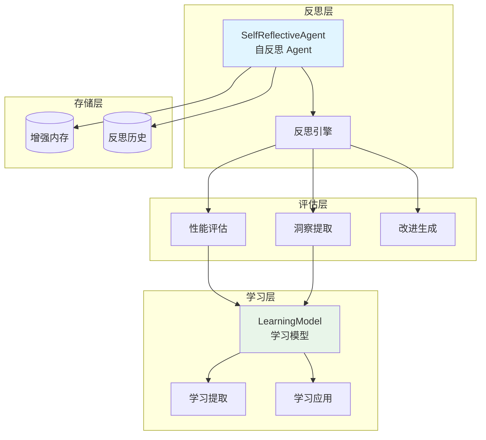
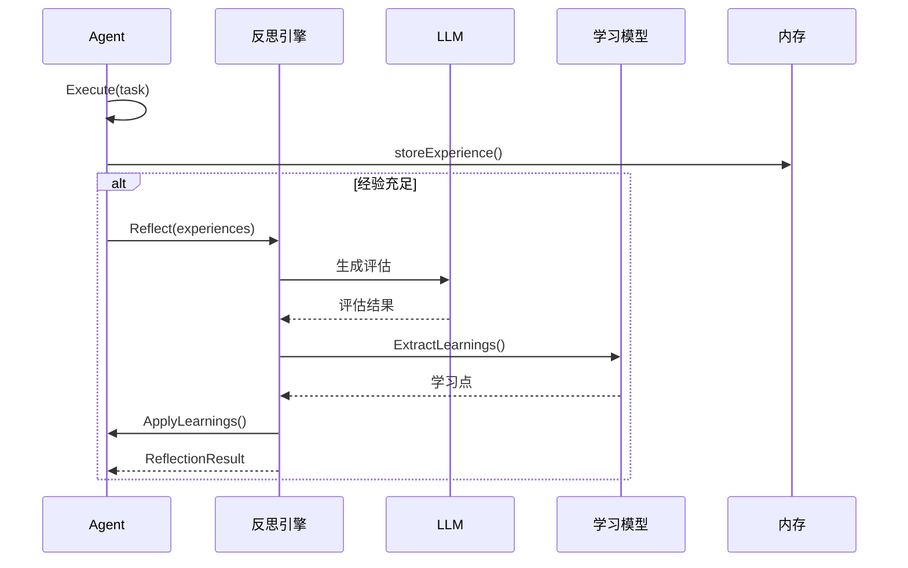

# reflection 自反思系统

本模块是 goagent 框架的自反思系统，提供 Agent 的自我评估、学习提取和持续改进能力。

## 目录

- [架构设计](#架构设计)
- [核心组件](#核心组件)
- [反思类型](#反思类型)
- [学习模型](#学习模型)
- [使用方法](#使用方法)
- [API 参考](#api-参考)
- [代码结构](#代码结构)

## 架构设计

### 系统架构图



### 反思循环



## 核心组件

### 1. ReflectionResult 反思结果

```go
type ReflectionResult struct {
    ID               string                 // 反思 ID
    Type             ReflectionType         // 反思类型
    Subject          string                 // 反思主题
    Timestamp        time.Time              // 时间戳
    Evaluation       *Evaluation            // 评估结果
    Insights         []Insight              // 洞察列表
    Improvements     []Improvement          // 改进建议
    LearningPoints   []LearningPoint        // 学习点
    PerformanceScore float64                // 性能得分 (0-1)
    Confidence       float64                // 置信度 (0-1)
    Metadata         map[string]interface{} // 元数据
}
```

### 2. Evaluation 评估结构

SWOT 分析模型：

```go
type Evaluation struct {
    Strengths     []string               // 优势
    Weaknesses    []string               // 劣势
    Opportunities []string               // 机会
    Threats       []string               // 威胁
    Score         float64                // 评分 (0-1)
    Details       map[string]interface{} // 详细信息
}
```

### 3. Insight 洞察结构

```go
type Insight struct {
    Description string    // 描述
    Category    string    // 分类
    Importance  float64   // 重要性 (0-1)
    Evidence    []string  // 证据
    Timestamp   time.Time // 时间戳
}
```

### 4. Improvement 改进建议

```go
type Improvement struct {
    Description   string                 // 描述
    Priority      int                    // 优先级 (1-5)
    Impact        float64                // 预期影响 (0-1)
    Effort        float64                // 所需努力 (0-1)
    ActionItems   []string               // 行动项
    Prerequisites []string               // 前置条件
    Metadata      map[string]interface{} // 元数据
}
```

### 5. LearningPoint 学习点

```go
type LearningPoint struct {
    Lesson        string    // 经验教训
    Context       string    // 上下文
    Category      string    // 分类
    Applicability float64   // 适用性 (0-1)
    Confidence    float64   // 置信度 (0-1)
    Examples      []string  // 示例
    Timestamp     time.Time // 时间戳
}
```

### 6. ReflectiveAgent 接口

```go
type ReflectiveAgent interface {
    core.Agent

    // 执行自我反思
    Reflect(ctx context.Context, subject interface{}) (*ReflectionResult, error)

    // 评估性能
    EvaluatePerformance(ctx context.Context, metrics PerformanceMetrics) (*Evaluation, error)

    // 提取学习
    ExtractLearnings(ctx context.Context, experiences []Experience) ([]LearningPoint, error)

    // 生成改进建议
    GenerateImprovements(ctx context.Context, evaluation *Evaluation) ([]Improvement, error)

    // 应用学习
    ApplyLearnings(ctx context.Context, learnings []LearningPoint) error
}
```

## 反思类型

### ReflectionType 枚举

```go
const (
    ReflectionTypeSelfEvaluation     = "self_evaluation"      // 自我评估
    ReflectionTypePerformanceReview  = "performance_review"   // 性能审查
    ReflectionTypeStrategyAnalysis   = "strategy_analysis"    // 策略分析
    ReflectionTypeLearningExtraction = "learning_extraction"  // 学习提取
    ReflectionTypeErrorAnalysis      = "error_analysis"       // 错误分析
)
```

### PerformanceMetrics 性能指标

```go
type PerformanceMetrics struct {
    SuccessRate     float64                // 成功率
    AverageTime     time.Duration          // 平均时间
    ErrorRate       float64                // 错误率
    TotalExecutions int                    // 总执行次数
    ResourceUsage   map[string]float64     // 资源使用
    CustomMetrics   map[string]interface{} // 自定义指标
}
```

### Experience 经验结构

```go
type Experience struct {
    ID          string                 // 经验 ID
    Description string                 // 描述
    Input       interface{}            // 输入
    Output      interface{}            // 输出
    Success     bool                   // 是否成功
    Duration    time.Duration          // 持续时间
    Error       string                 // 错误信息
    Context     map[string]interface{} // 上下文
    Timestamp   time.Time              // 时间戳
}
```

## 学习模型

### LearningModel 结构

```go
type LearningModel struct {
    learnings     map[string]*LearningPoint // 学习点存储
    categories    map[string][]*LearningPoint // 分类索引
    applications  map[string]int             // 应用次数追踪
    effectiveness map[string]float64         // 有效性追踪
}
```

### 核心功能

| 方法 | 说明 |
|------|------|
| `AddLearning(learning)` | 添加新学习点 |
| `GetRelevantLearnings(context)` | 获取相关学习（返回 top 5） |
| `GetLearningsByCategory(category)` | 按分类获取 |
| `UpdateEffectiveness(id, success)` | 更新有效性（指数移动平均） |
| `PruneLowEffectiveness(threshold)` | 清理低效学习点 |
| `GetStatistics()` | 获取统计信息 |

### 相关性评分算法

```go
func calculateRelevanceScore(learning, context) float64 {
    score := 0.0

    // 上下文匹配
    if learning.Context == context {
        score += 0.5
    }

    // 适用性因子
    score += learning.Applicability * 0.3

    // 置信度因子
    score += learning.Confidence * 0.2

    // 时间衰减（最多 20% 惩罚）
    agePenalty := age.Hours() / (24 * 30)
    score *= (1.0 - min(agePenalty, 1.0) * 0.2)

    return score
}
```

### ReflectionMetrics 指标追踪

```go
type ReflectionMetrics struct {
    TotalReflections       int                      // 总反思次数
    AverageScore           float64                  // 平均得分
    ImprovementRate        float64                  // 改进率
    LearningsGenerated     int                      // 生成的学习数
    LearningsApplied       int                      // 应用的学习数
    SuccessfulApplications int                      // 成功应用数
    CategoryPerformance    map[string]float64       // 分类性能
    TimeMetrics            map[string]time.Duration // 时间指标
}
```

## 使用方法

### 创建自反思 Agent

```go
llmClient := llm.NewClient(...)
memory := interfaces.NewEnhancedMemory(...)

// 创建自反思 Agent（带父上下文）
ctx := context.Background()
agent := reflection.NewSelfReflectiveAgentWithContext(
    ctx,
    llmClient,
    memory,
    reflection.WithReflectionInterval(1*time.Hour),
    reflection.WithLearningThreshold(0.7),
)
defer agent.Shutdown(context.Background())
```

### 执行任务（自动反思）

```go
input := &core.AgentInput{
    Task:    "分析销售数据",
    Context: map[string]interface{}{"data": salesData},
}

// Execute 自动记录经验并触发反思
output, err := agent.Execute(ctx, input)

// 输出包含应用的学习数
fmt.Printf("应用了 %d 个学习点\n", output.Metadata["learnings_applied"])
```

### 手动反思

```go
// 收集经验
experiences := []reflection.Experience{
    {
        ID:       "exp_1",
        Input:    input1,
        Output:   output1,
        Success:  true,
        Duration: 2 * time.Second,
    },
    // ... 更多经验
}

// 执行反思
result, err := agent.Reflect(ctx, experiences)

// 查看结果
fmt.Printf("性能得分: %.2f\n", result.PerformanceScore)
fmt.Printf("发现 %d 个洞察\n", len(result.Insights))
fmt.Printf("生成 %d 个改进建议\n", len(result.Improvements))
```

### 性能评估

```go
metrics := reflection.PerformanceMetrics{
    SuccessRate:     0.85,
    AverageTime:     500 * time.Millisecond,
    ErrorRate:       0.05,
    TotalExecutions: 100,
}

evaluation, err := agent.EvaluatePerformance(ctx, metrics)

// SWOT 分析结果
fmt.Println("优势:", evaluation.Strengths)
fmt.Println("劣势:", evaluation.Weaknesses)
fmt.Println("机会:", evaluation.Opportunities)
fmt.Println("威胁:", evaluation.Threats)
```

### 提取和应用学习

```go
// 提取学习（需要至少 minExperiences 个经验）
learnings, err := agent.ExtractLearnings(ctx, experiences)

// 过滤高置信度学习
var highConfidence []reflection.LearningPoint
for _, l := range learnings {
    if l.Confidence >= 0.8 {
        highConfidence = append(highConfidence, l)
    }
}

// 应用学习
err = agent.ApplyLearnings(ctx, highConfidence)
```

### 生成改进建议

```go
// 基于评估生成改进
improvements, err := agent.GenerateImprovements(ctx, evaluation)

// 按 ROI 排序（Impact/Effort）
for _, imp := range improvements {
    roi := imp.Impact / imp.Effort
    fmt.Printf("改进: %s (ROI: %.2f, 优先级: %d)\n",
        imp.Description, roi, imp.Priority)
    fmt.Println("  行动项:", imp.ActionItems)
}
```

## API 参考

### SelfReflectiveAgent

```go
// 创建
NewSelfReflectiveAgentWithContext(ctx context.Context, llmClient llm.Client, mem memory.EnhancedMemory, opts ...ReflectionOption) *SelfReflectiveAgent

// 配置选项
WithReflectionInterval(interval time.Duration) ReflectionOption
WithLearningThreshold(threshold float64) ReflectionOption

// 生命周期
Shutdown(ctx context.Context) error

// 执行
Execute(ctx context.Context, input *core.AgentInput) (*core.AgentOutput, error)

// 反思
Reflect(ctx context.Context, subject interface{}) (*ReflectionResult, error)
EvaluatePerformance(ctx context.Context, metrics PerformanceMetrics) (*Evaluation, error)
ExtractLearnings(ctx context.Context, experiences []Experience) ([]LearningPoint, error)
GenerateImprovements(ctx context.Context, evaluation *Evaluation) ([]Improvement, error)
ApplyLearnings(ctx context.Context, learnings []LearningPoint) error
```

### LearningModel

```go
NewLearningModel() *LearningModel

AddLearning(learning LearningPoint)
UpdateWithLearnings(learnings []LearningPoint)
GetRelevantLearnings(context interface{}) []LearningPoint
GetLearningsByCategory(category string) []LearningPoint
UpdateEffectiveness(learningID string, success bool)
PruneLowEffectiveness(threshold float64) int
GetStatistics() map[string]interface{}
```

### ReflectionMetrics

```go
NewReflectionMetrics() *ReflectionMetrics

RecordReflection(result *ReflectionResult)
RecordLearningApplication(success bool)
GetImprovementRate() float64
GetSummary() map[string]interface{}
```

## 代码结构

```text
reflection/
├── reflective_agent.go    # 自反思 Agent 实现
│   ├── ReflectionResult
│   ├── Evaluation
│   ├── Insight
│   ├── Improvement
│   ├── LearningPoint
│   ├── ReflectiveAgent 接口
│   └── SelfReflectiveAgent 实现
└── learning_model.go      # 学习模型
    ├── LearningModel
    └── ReflectionMetrics
```

## 默认配置

```go
const (
    // SelfReflectiveAgent
    reflectionInterval = 1 * time.Hour  // 后台反思间隔
    minExperiences     = 10             // 最小经验数
    learningThreshold  = 0.7            // 学习置信度阈值

    // LearningModel
    relevanceThreshold = 0.3            // 相关性阈值
    maxLearnings       = 5              // 返回最大学习数
    learningRate       = 0.1            // 有效性更新学习率
)
```

## 设计特点

### 自动化反思

- **后台反思**：定时执行后台反思任务
- **触发式反思**：经验充足时自动触发
- **优雅关闭**：支持上下文取消和 WaitGroup

### 学习增强

- **相关性匹配**：基于上下文匹配学习点
- **时间衰减**：旧学习权重自动降低
- **有效性追踪**：基于应用结果更新有效性
- **自动清理**：清理低效学习点

### 并发安全

- **读写锁**：`sync.RWMutex` 保护共享状态
- **生命周期管理**：正确处理 goroutine 关闭

## 扩展阅读

- [core](../core/) - 核心执行引擎
- [memory](../memory/) - 内存系统
- [llm](../llm/) - LLM 集成
