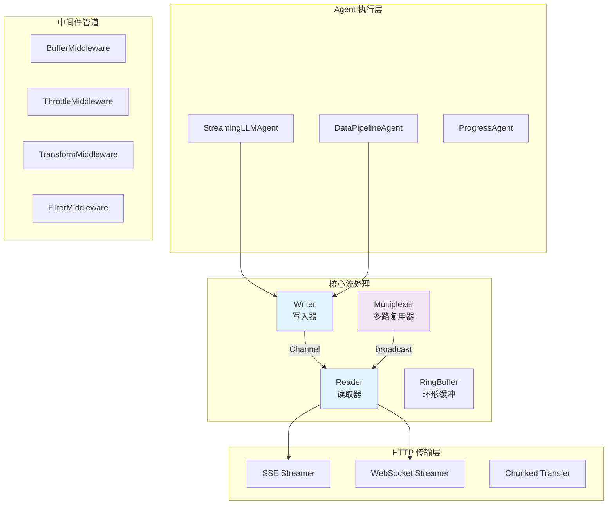
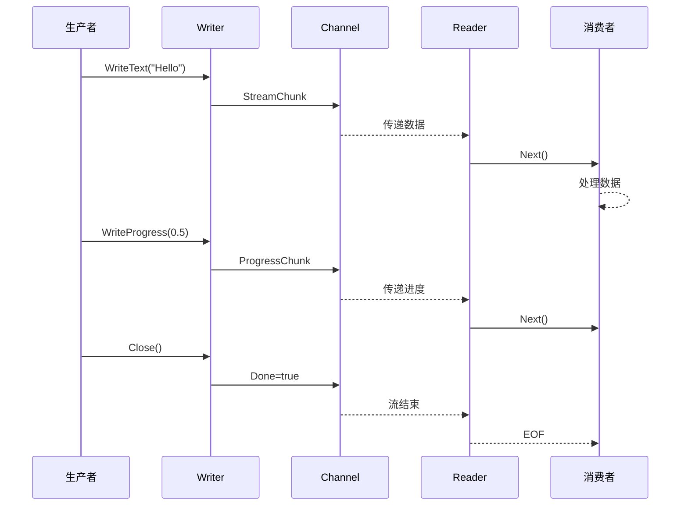

# stream 流式数据处理

本模块是 goagent 框架的流式数据处理系统，提供高性能、类型安全的流式处理能力。

## 目录

- [架构设计](#架构设计)
- [核心组件](#核心组件)
- [流式模式](#流式模式)
- [使用方法](#使用方法)
- [中间件](#中间件)
- [HTTP 传输](#http-传输)
- [代码结构](#代码结构)

## 架构设计

### 系统架构图



### 数据流转



### 分层架构

```text
┌─────────────────────────────────────────────────────────┐
│                   HTTP 传输层                            │
│  (SSE, WebSocket, Chunked Transfer, 轮询)               │
└─────────────────────────────────────────────────────────┘
                          ↓
┌─────────────────────────────────────────────────────────┐
│                   Agent 执行层                           │
│  (LLM, DataPipeline, Progress, Custom Agents)           │
└─────────────────────────────────────────────────────────┘
                          ↓
┌─────────────────────────────────────────────────────────┐
│                   中间件管道层                           │
│  (Buffer, Throttle, Transform, Filter, Batch...)        │
└─────────────────────────────────────────────────────────┘
                          ↓
┌─────────────────────────────────────────────────────────┐
│                 核心流处理层                             │
│     (Reader, Writer, Multiplexer, RingBuffer)           │
└─────────────────────────────────────────────────────────┘
```

## 核心组件

### 1. Writer 流写入器

生产数据到流：

```go
type Writer struct {
    ch          chan *LegacyStreamChunk
    ctx         context.Context
    opts        *StreamOptions
    transform   func(interface{}) interface{}
    // ...
}
```

### 2. Reader 流读取器

消费流中的数据：

```go
type Reader struct {
    ch      <-chan *LegacyStreamChunk
    ctx     context.Context
    buffer  *RingBuffer
    opts    *StreamOptions
    // ...
}
```

### 3. Multiplexer 多路复用器

将单个流广播到多个消费者：

```go
type Multiplexer struct {
    source    StreamOutput
    consumers map[string]StreamConsumer
    // ...
}
```

### 4. RingBuffer 环形缓冲

高效的固定大小缓冲区，O(1) 读写：

```go
type RingBuffer struct {
    data  []*LegacyStreamChunk
    head  int
    tail  int
    size  int
    cap   int
}
```

## 流式模式

### 五种预定义模式

| 模式 | 说明 | 适用场景 |
|------|------|---------|
| `messages` | LLM token 流 | 对话生成 |
| `updates` | 状态更新 | 进度通知 |
| `custom` | 自定义数据 | 任意数据流 |
| `values` | 完整状态快照 | 状态同步 |
| `debug` | 调试信息 | 开发调试 |

### StreamChunk 结构

```go
type StreamChunk struct {
    Data      interface{}
    Metadata  map[string]interface{}
    Timestamp time.Time
    ChunkID   int
    Error     error
    Done      bool
}
```

## 使用方法

### 基础读写

```go
// 创建写入器
writer := stream.NewWriter(ctx, &stream.StreamOptions{
    BufferSize: 100,
})

// 写入数据
writer.WriteText("Hello, ")
writer.WriteText("World!")
writer.WriteProgress(0.5, "处理中...")
writer.Close()

// 创建读取器
reader := stream.NewReader(ctx, writer.Channel(), nil)

// 读取数据
for {
    chunk, err := reader.Next()
    if err != nil {
        break
    }
    fmt.Print(chunk.Text)
}

// 收集所有文本
text, err := reader.CollectText()
```

### 多路复用

```go
// 创建多路复用器
mux := stream.NewMultiplexer(ctx, nil)

// 添加多个消费者
mux.AddConsumer(&LogConsumer{})
mux.AddConsumer(&MetricsConsumer{})
mux.AddConsumer(&StorageConsumer{})

// 启动广播
mux.Start(ctx, sourceStream)
```

### 多模式流

```go
// 创建多模式流
multiStream := stream.NewMultiModeStream(ctx, &stream.StreamConfig{
    BufferSize: 100,
})

// 获取特定模式的写入器
msgWriter, _ := multiStream.GetWriter(stream.StreamModeMessages)
msgWriter.Write([]byte("Token content"))

// 订阅特定模式
msgChan, _ := multiStream.Subscribe(stream.StreamModeMessages)
for event := range msgChan {
    fmt.Println(event.Data)
}

// 订阅所有模式
allChan := multiStream.SubscribeAll()
```

### LLM 流式 Agent

```go
// 创建流式 LLM Agent
agent := stream.NewStreamingLLMAgent(llmClient, &stream.StreamingLLMConfig{
    Temperature: 0.7,
    MaxTokens:   2000,
})

// 流式执行
output, err := agent.ExecuteStream(ctx, &core.AgentInput{
    Task: "解释量子计算",
})

// 消费流
reader := stream.NewReader(ctx, output, nil)
for {
    chunk, err := reader.Next()
    if err != nil {
        break
    }
    fmt.Print(chunk.Text) // 实时输出
}
```

### 数据管道 Agent

```go
// 创建数据管道
pipeline := stream.NewDataPipelineAgent(&stream.DataPipelineConfig{
    BatchSize: 100,
})

// 流式映射
output, err := pipeline.StreamMap(ctx, sourceStream, func(item interface{}) interface{} {
    return transform(item)
})

// 流式过滤
filtered, err := pipeline.StreamFilter(ctx, sourceStream, func(item interface{}) bool {
    return shouldKeep(item)
})

// 流式归约
result, err := pipeline.StreamReduce(ctx, sourceStream, initialValue,
    func(acc, item interface{}) interface{} {
        return accumulate(acc, item)
    })
```

### 进度跟踪 Agent

```go
// 创建进度 Agent
progress := stream.NewProgressAgent(&stream.ProgressConfig{
    TotalSteps: 10,
})

// 执行带进度的任务
output, err := progress.ExecuteStream(ctx, input)

// 监控进度
reader := stream.NewReader(ctx, output, nil)
for {
    chunk, err := reader.Next()
    if err != nil {
        break
    }
    if chunk.Metadata.Progress > 0 {
        fmt.Printf("进度: %.1f%% - %s\n",
            chunk.Metadata.Progress*100,
            chunk.Metadata.Status)
    }
}
```

## 中间件

### BufferMiddleware 缓冲中间件

```go
buffer := stream.NewBufferMiddleware(100)
buffered, err := buffer.Apply(ctx, source)
```

### ThrottleMiddleware 限流中间件

```go
throttle := stream.NewThrottleMiddleware(10) // 10 chunks/秒
throttled, err := throttle.Apply(ctx, source)
```

### TransformMiddleware 转换中间件

```go
transform := stream.NewTransformMiddleware(func(chunk *StreamChunk) *StreamChunk {
    chunk.Data = strings.ToUpper(chunk.Data.(string))
    return chunk
})
transformed, err := transform.Apply(ctx, source)
```

### FilterMiddleware 过滤中间件

```go
filter := stream.NewFilterMiddleware(func(chunk *StreamChunk) bool {
    return chunk.Data != nil
})
filtered, err := filter.Apply(ctx, source)
```

### BatchMiddleware 批处理中间件

```go
batch := stream.NewBatchMiddleware(10, 100*time.Millisecond)
batched, err := batch.Apply(ctx, source)
```

### RetryMiddleware 重试中间件

```go
retry := stream.NewRetryMiddleware(3, time.Second)
reliable, err := retry.Apply(ctx, source)
```

### 中间件链

```go
// 组合多个中间件
pipeline := source
pipeline, _ = buffer.Apply(ctx, pipeline)
pipeline, _ = transform.Apply(ctx, pipeline)
pipeline, _ = filter.Apply(ctx, pipeline)
pipeline, _ = throttle.Apply(ctx, pipeline)
```

## HTTP 传输

### SSE (Server-Sent Events)

```go
// 创建 SSE 流
func handler(w http.ResponseWriter, r *http.Request) {
    streamer, err := stream.NewSSEStreamer(w)
    if err != nil {
        return
    }

    // 发送事件
    streamer.Send(&stream.StreamChunk{
        Data: "Hello",
    })
}

// 或使用辅助函数
http.HandleFunc("/stream", stream.SSEHandler(func(ctx context.Context, r *http.Request) (stream.StreamOutput, error) {
    return agent.ExecuteStream(ctx, input)
}))

// 直接流式传输
stream.StreamToSSE(ctx, w, sourceStream)
```

### WebSocket

```go
// 创建 WebSocket 流
func wsHandler(conn *websocket.Conn) {
    streamer, err := stream.NewWebSocketStreamer(conn)
    if err != nil {
        return
    }

    // 双向通信
    go streamer.ReadLoop(func(msg []byte) {
        // 处理客户端消息
    })

    // 发送数据
    streamer.Send(&stream.StreamChunk{
        Data: "Response",
    })
}

// 直接流式传输
stream.StreamToWebSocket(ctx, conn, sourceStream)
```

### Chunked Transfer

```go
func handler(w http.ResponseWriter, r *http.Request) {
    streamer, err := stream.NewChunkedTransferStreamer(w)
    if err != nil {
        return
    }

    for chunk := range sourceStream {
        streamer.Send(chunk)
    }
    streamer.Close()
}

// 直接流式传输
stream.StreamToChunkedTransfer(ctx, w, sourceStream)
```

## 代码结构

```text
stream/
├── stream_base.go          # 基础框架
├── reader.go               # 流读取器
├── writer.go               # 流写入器
├── modes.go                # 多模式流
├── multiplexer.go          # 多路复用器
├── middleware_stream.go    # 中间件集合
├── buffer.go               # 环形缓冲区
├── pool.go                 # 对象池
├── agent_streaming_llm.go  # LLM 流式 Agent
├── agent_data_pipeline.go  # 数据管道 Agent
├── agent_progress.go       # 进度跟踪 Agent
├── transport_sse.go        # SSE 传输
└── transport_websocket.go  # WebSocket 传输
```

## 性能优化

### 对象池

```go
// 使用对象池减少 GC 压力
chunk := stream.GetChunkFromPool()
defer stream.PutChunkToPool(chunk)
```

### 环形缓冲

```go
// 固定大小，O(1) 操作
buffer := stream.NewRingBuffer(1000)
buffer.Push(chunk)
chunk, ok := buffer.Pop()
```

### 背压控制

```go
// 写入器自动处理背压
writer := stream.NewWriter(ctx, &stream.StreamOptions{
    BufferSize:      100,
    BlockOnFull:     true,
    DropOnOverflow:  false,
})
```

## 扩展阅读

- [core](../core/) - 核心执行引擎
- [llm](../llm/) - LLM 集成
- [agents](../agents/) - Agent 实现
