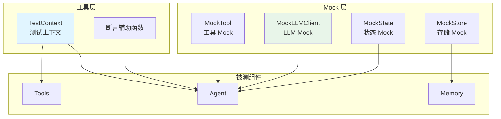
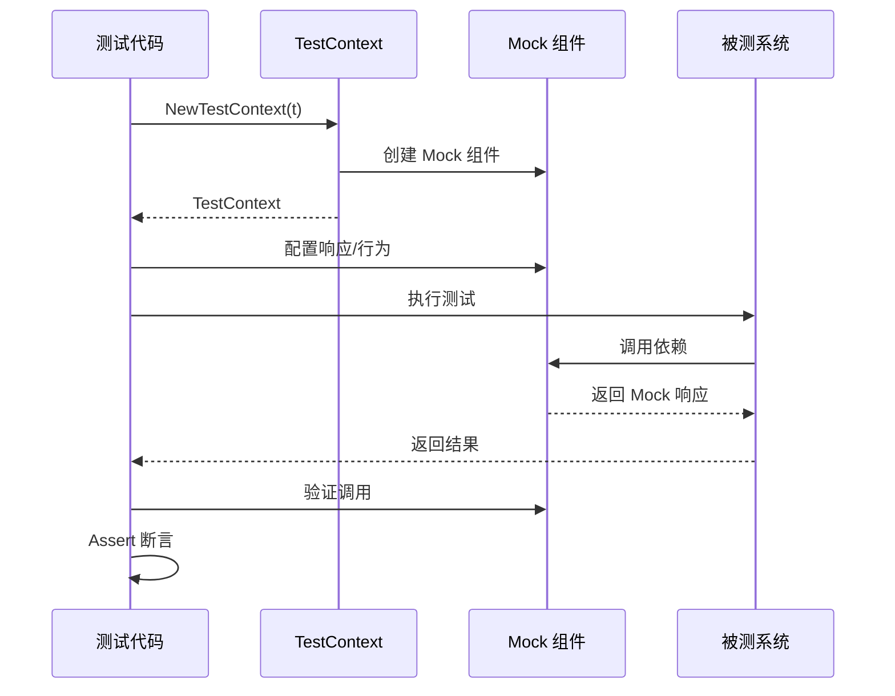

# testing 测试工具库

本模块是 goagent 框架的测试支持库，提供 Mock 实现、测试工具和断言辅助函数，简化单元测试和集成测试编写。

## 目录

- [架构设计](#架构设计)
- [Mock 实现](#mock-实现)
- [测试工具](#测试工具)
- [断言函数](#断言函数)
- [使用方法](#使用方法)
- [API 参考](#api-参考)
- [代码结构](#代码结构)

## 架构设计

### 模块结构



### 测试流程



## Mock 实现

### 1. MockTool 工具 Mock

```go
type MockTool struct {
    name         string
    description  string
    schema       string
    invokeFunc   func(ctx, input) (*ToolOutput, error)
    invokeCount  int
    lastInput    *ToolInput
    shouldError  bool
    errorMessage string
}
```

**核心功能**：

| 方法 | 说明 |
|------|------|
| `NewMockTool(name, desc)` | 创建 Mock 工具 |
| `SetInvokeFunc(fn)` | 设置自定义执行函数 |
| `SetError(should, msg)` | 配置错误返回 |
| `GetInvokeCount()` | 获取调用次数 |
| `GetLastInput()` | 获取最后输入 |
| `Reset()` | 重置状态 |

### 2. MockLLMClient LLM Mock

```go
type MockLLMClient struct {
    responses         []CompletionResponse
    currentIndex      int
    shouldError       bool
    errorMessage      string
    requestHistory    []CompletionRequest
    functionCallsMode bool
    functionResponses map[string]interface{}
}
```

**核心功能**：

| 方法 | 说明 |
|------|------|
| `NewMockLLMClient()` | 创建 Mock LLM |
| `SetResponses(responses...)` | 设置预定义响应序列 |
| `SetError(should, msg)` | 配置错误返回 |
| `SetFunctionCallMode(enabled)` | 启用函数调用模式 |
| `SetFunctionResponse(name, resp)` | 设置函数响应 |
| `GetRequestHistory()` | 获取请求历史 |
| `Reset()` | 重置状态 |

### 3. MockStreamingLLMClient 流式 Mock

```go
type MockStreamingLLMClient struct {
    *MockLLMClient
    streamChunks []string
    streamDelay  int
}
```

**核心功能**：

| 方法 | 说明 |
|------|------|
| `NewMockStreamingLLMClient()` | 创建流式 Mock |
| `SetStreamChunks(chunks...)` | 设置流式分块 |
| `Stream(ctx, req)` | 返回流式 channel |

### 4. MockState 状态 Mock

```go
type MockState struct {
    data       map[string]interface{}
    snapshots  []map[string]interface{}
    getCount   int
    setCount   int
    updateFunc func(key, value) error
}
```

**实现接口**：`state.State`

**核心功能**：

| 方法 | 说明 |
|------|------|
| `Get/Set/Delete/Clear` | 基础 CRUD |
| `Snapshot/Restore/Clone` | 快照管理 |
| `GetString/Int/Bool/Float64/Time` | 类型化获取 |
| `SetUpdateFunc(fn)` | 设置更新回调 |
| `GetStats()` | 获取统计 (get/set 次数) |

### 5. MockStore 存储 Mock

```go
type MockStore struct {
    data         map[string]map[string]*store.Value
    namespaces   []string
    putCount     int
    getCount     int
    shouldError  bool
    errorMessage string
}
```

**实现接口**：`store.Store`

**核心功能**：

| 方法 | 说明 |
|------|------|
| `Put/Get/Delete` | 基础存储操作 |
| `List(namespace)` | 列出键 |
| `Search(namespace, filter)` | 搜索（支持 prefix） |
| `Clear(namespace)` | 清空命名空间 |
| `Size/Namespaces` | 统计信息 |
| `SetError(should, msg)` | 配置错误 |
| `GetStats()` | 获取统计 |

### 6. MockToolRegistry 工具注册表 Mock

```go
type MockToolRegistry struct {
    tools map[string]interfaces.Tool
}
```

**核心功能**：

| 方法 | 说明 |
|------|------|
| `Register(tool)` | 注册工具 |
| `Get(name)` | 获取工具 |
| `List()` | 列出所有工具 |
| `Clear()` | 清空注册表 |

### 7. MockToolExecutor 工具执行器 Mock

```go
type MockToolExecutor struct {
    executeFunc     func(ctx, tools, inputs) ([]interface{}, error)
    executeCalls    int
    lastTools       []interfaces.Tool
    lastInputs      []map[string]interface{}
    parallelResults []interface{}
}
```

**核心功能**：

| 方法 | 说明 |
|------|------|
| `ExecuteParallel(ctx, tools, inputs)` | 并行执行 |
| `SetExecuteFunc(fn)` | 设置自定义执行函数 |
| `SetParallelResults(results...)` | 设置并行结果 |
| `GetExecuteCalls()` | 获取执行次数 |
| `Reset()` | 重置状态 |

## 测试工具

### TestContext 测试上下文

```go
type TestContext struct {
    Ctx          context.Context
    Cancel       context.CancelFunc
    State        *state.AgentState
    Store        store.Store
    Checkpointer checkpoint.Checkpointer
    MockLLM      *mocks.MockLLMClient
    MockTools    map[string]*mocks.MockTool
    T            *testing.T
}
```

**自动管理**：
- 30 秒超时的 context
- 自动注册 cleanup 回调
- 内存存储后端
- 内存检查点存储

### TestAppContext 应用上下文

```go
type TestAppContext struct {
    UserID   string
    UserName string
    Metadata map[string]interface{}
}
```

### TestAgentConfig 测试配置

```go
type TestAgentConfig struct {
    Name         string   // Agent 名称
    SystemPrompt string   // 系统提示
    Tools        []string // 工具列表
    MaxIter      int      // 最大迭代
}

// 默认配置
func DefaultTestAgentConfig() TestAgentConfig {
    return TestAgentConfig{
        Name:         "test-agent",
        SystemPrompt: "You are a test agent",
        Tools:        []string{"calculator", "search"},
        MaxIter:      5,
    }
}
```

## 断言函数

### 基础断言

| 函数 | 说明 |
|------|------|
| `AssertNoError(t, err, msg...)` | 断言无错误 |
| `AssertError(t, err, msg...)` | 断言有错误 |
| `AssertEqual(t, expected, actual, msg...)` | 断言相等 |
| `AssertNotNil(t, value, msg...)` | 断言非空 |
| `AssertNil(t, value, msg...)` | 断言为空 |
| `AssertTrue(t, value, msg...)` | 断言为真 |
| `AssertFalse(t, value, msg...)` | 断言为假 |
| `AssertContains(t, haystack, needle, msg...)` | 断言包含子串 |

### 异步断言

```go
// 等待条件成立（轮询）
AssertEventually(t, condition func() bool, timeout time.Duration, msg...)

// 等待条件（带 context）
WaitForCondition(ctx context.Context, condition func() bool, interval time.Duration) error
```

### 并行测试

```go
// 并行运行多个测试
RunParallel(t *testing.T, tests map[string]func(t *testing.T))
```

## 使用方法

### 基础测试设置

```go
func TestMyAgent(t *testing.T) {
    // 创建测试上下文
    tc := testutil.NewTestContext(t)

    // 配置 Mock LLM 响应
    tc.MockLLM.SetResponses(
        llm.CompletionResponse{
            Content:    "这是 Mock 响应",
            Model:      "mock-model",
            TokensUsed: 10,
        },
    )

    // 添加 Mock 工具
    calcTool := tc.AddMockTool("calculator", "计算器工具")
    calcTool.SetInvokeFunc(func(ctx context.Context, input *interfaces.ToolInput) (*interfaces.ToolOutput, error) {
        return &interfaces.ToolOutput{
            Result:  "42",
            Success: true,
        }, nil
    })

    // 创建运行时
    runtime := tc.CreateRuntime("test-session")

    // 执行测试...
}
```

### Mock LLM 多轮对话

```go
func TestMultiTurnConversation(t *testing.T) {
    tc := testutil.NewTestContext(t)

    // 设置多轮响应序列
    tc.MockLLM.SetResponses(
        llm.CompletionResponse{Content: "第一轮响应"},
        llm.CompletionResponse{Content: "第二轮响应"},
        llm.CompletionResponse{Content: "Final Answer: 42"},
    )

    // 执行 Agent...

    // 验证请求历史
    history := tc.MockLLM.GetRequestHistory()
    testutil.AssertEqual(t, 3, len(history), "应该有 3 轮对话")
}
```

### Mock 函数调用

```go
func TestFunctionCalling(t *testing.T) {
    tc := testutil.NewTestContext(t)

    // 启用函数调用模式
    tc.MockLLM.SetFunctionCallMode(true)

    // 设置函数响应
    tc.MockLLM.SetFunctionResponse("calculator", map[string]interface{}{
        "result": 42,
    })

    // 当消息包含 "calculate" 时，自动返回函数调用响应
}
```

### 流式响应测试

```go
func TestStreamingResponse(t *testing.T) {
    streamClient := mocks.NewMockStreamingLLMClient()

    // 设置流式分块
    streamClient.SetStreamChunks(
        "这是",
        "流式",
        "响应",
    )

    // 获取流
    ch, err := streamClient.Stream(ctx, req)
    testutil.AssertNoError(t, err)

    // 消费流
    var content strings.Builder
    for chunk := range ch {
        content.WriteString(chunk.Content)
        if chunk.Done {
            break
        }
    }

    testutil.AssertEqual(t, "这是流式响应", content.String())
}
```

### Mock 状态测试

```go
func TestStateManagement(t *testing.T) {
    state := mocks.NewMockState()

    // 设置更新回调
    var updates []string
    state.SetUpdateFunc(func(key string, value interface{}) error {
        updates = append(updates, key)
        return nil
    })

    // 执行操作
    state.Set("key1", "value1")
    state.Update(map[string]interface{}{
        "key2": "value2",
        "key3": "value3",
    })

    // 验证
    testutil.AssertEqual(t, 2, len(updates))

    // 快照和恢复
    snapshot := state.Snapshot()
    state.Clear()
    state.Restore(snapshot)

    val, ok := state.GetString("key1")
    testutil.AssertTrue(t, ok)
    testutil.AssertEqual(t, "value1", val)
}
```

### Mock 存储测试

```go
func TestStoreOperations(t *testing.T) {
    store := mocks.NewMockStore()

    ctx := context.Background()
    namespace := []string{"test", "namespace"}

    // 存储
    err := store.Put(ctx, namespace, "key1", "value1")
    testutil.AssertNoError(t, err)

    // 获取
    item, err := store.Get(ctx, namespace, "key1")
    testutil.AssertNoError(t, err)
    testutil.AssertEqual(t, "value1", item.Value)

    // 搜索
    results, err := store.Search(ctx, namespace, map[string]interface{}{
        "prefix": "key",
    })
    testutil.AssertNoError(t, err)
    testutil.AssertEqual(t, 1, len(results))

    // 统计
    putCount, getCount := store.GetStats()
    testutil.AssertEqual(t, 1, putCount)
    testutil.AssertEqual(t, 1, getCount)
}
```

### 错误注入测试

```go
func TestErrorHandling(t *testing.T) {
    tc := testutil.NewTestContext(t)

    // 配置 LLM 返回错误
    tc.MockLLM.SetError(true, "API 调用失败")

    // 执行并验证错误处理
    _, err := agent.Execute(tc.Ctx, input)
    testutil.AssertError(t, err)
    testutil.AssertContains(t, err.Error(), "API 调用失败")

    // 重置错误状态
    tc.MockLLM.Reset()
}
```

### 异步条件等待

```go
func TestAsyncOperation(t *testing.T) {
    tc := testutil.NewTestContext(t)

    var completed bool
    go func() {
        time.Sleep(100 * time.Millisecond)
        completed = true
    }()

    // 等待条件成立
    testutil.AssertEventually(t, func() bool {
        return completed
    }, 1*time.Second, "操作应该在 1 秒内完成")
}
```

### 并行测试

```go
func TestParallel(t *testing.T) {
    testutil.RunParallel(t, map[string]func(t *testing.T){
        "TestCase1": func(t *testing.T) {
            // 测试用例 1
        },
        "TestCase2": func(t *testing.T) {
            // 测试用例 2
        },
        "TestCase3": func(t *testing.T) {
            // 测试用例 3
        },
    })
}
```

## API 参考

### mocks 包

```go
// 工具 Mock
NewMockTool(name, description string) *MockTool
NewMockToolRegistry() *MockToolRegistry
NewMockToolExecutor() *MockToolExecutor

// LLM Mock
NewMockLLMClient() *MockLLMClient
NewMockStreamingLLMClient() *MockStreamingLLMClient

// 状态 Mock
NewMockState() *MockState

// 存储 Mock
NewMockStore() *MockStore
```

### testutil 包

```go
// 测试上下文
NewTestContext(t *testing.T) *TestContext
(tc *TestContext) AddMockTool(name, description string) *MockTool
(tc *TestContext) CreateRuntime(sessionID string) *Runtime

// 断言
AssertNoError(t, err, msg...)
AssertError(t, err, msg...)
AssertEqual(t, expected, actual, msg...)
AssertNotNil(t, value, msg...)
AssertNil(t, value, msg...)
AssertTrue(t, value, msg...)
AssertFalse(t, value, msg...)
AssertContains(t, haystack, needle, msg...)
AssertEventually(t, condition, timeout, msg...)

// 工具
WaitForCondition(ctx, condition, interval) error
RunParallel(t, tests)

// 配置
DefaultTestAgentConfig() TestAgentConfig
```

## 代码结构

```text
testing/
├── mocks/
│   ├── mock_tools.go      # 工具相关 Mock
│   │   ├── MockTool
│   │   ├── MockToolRegistry
│   │   └── MockToolExecutor
│   ├── mock_llm.go        # LLM Mock
│   │   ├── MockLLMClient
│   │   └── MockStreamingLLMClient
│   └── mock_state.go      # 状态和存储 Mock
│       ├── MockState
│       └── MockStore
├── testutil/
│   └── helpers.go         # 测试辅助函数
│       ├── TestContext
│       ├── 断言函数
│       └── 工具函数
└── test_token_usage.go    # Token 使用测试示例
```

## 最佳实践

### 1. 使用 TestContext

```go
// 推荐：使用 TestContext 统一管理
tc := testutil.NewTestContext(t)
// 自动管理超时、cleanup、Mock 组件

// 不推荐：手动创建每个组件
ctx := context.Background()
mockLLM := mocks.NewMockLLMClient()
// 需要手动管理生命周期
```

### 2. 验证 Mock 调用

```go
// 验证调用次数
count := mockTool.GetInvokeCount()
testutil.AssertEqual(t, 3, count, "工具应该被调用 3 次")

// 验证调用参数
lastInput := mockTool.GetLastInput()
testutil.AssertEqual(t, "expected_arg", lastInput.Arguments["arg1"])
```

### 3. 测试后重置

```go
// 重置以复用 Mock
mockLLM.Reset()
mockTool.Reset()
mockStore.SetError(false, "")
```

### 4. 使用 t.Cleanup

```go
// TestContext 自动注册 cleanup
tc := testutil.NewTestContext(t)
// context 会在测试结束时自动取消

// 手动添加 cleanup
t.Cleanup(func() {
    // 清理资源
})
```

## 扩展阅读

- [core](../core/) - 核心执行引擎
- [llm](../llm/) - LLM 集成
- [interfaces](../interfaces/) - 接口定义
- [store](../store/) - 存储系统
