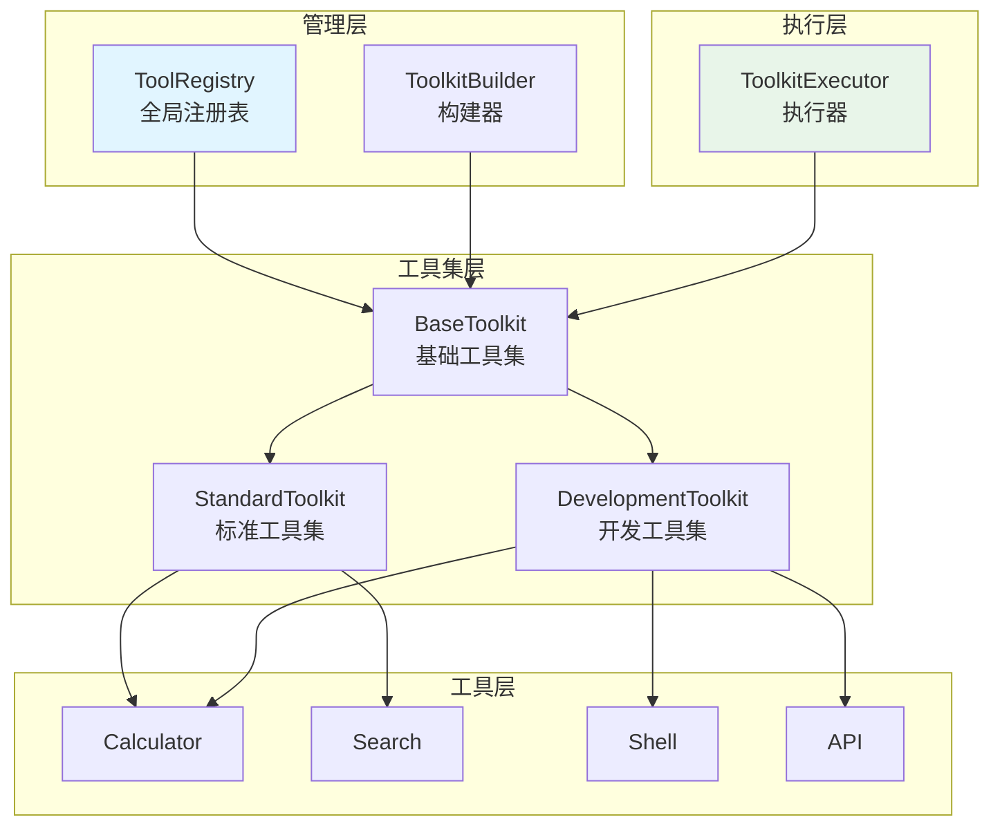
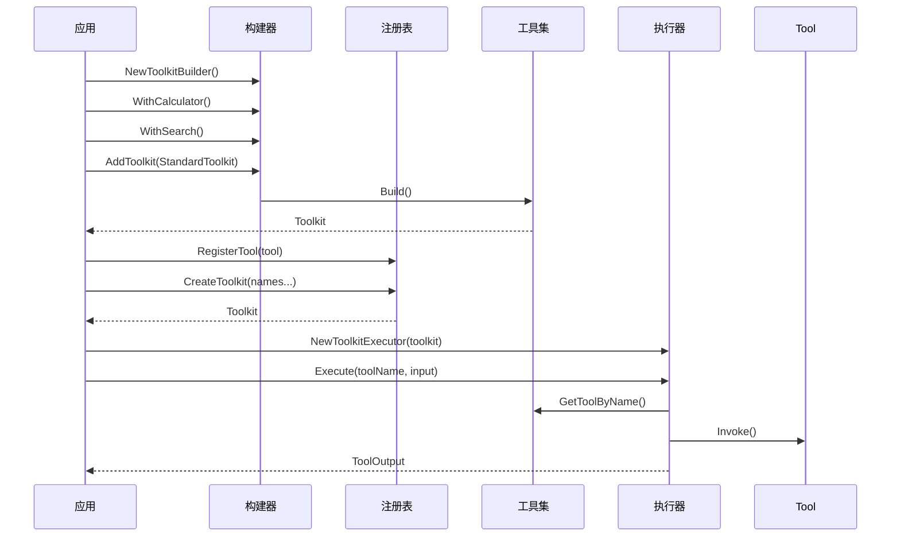
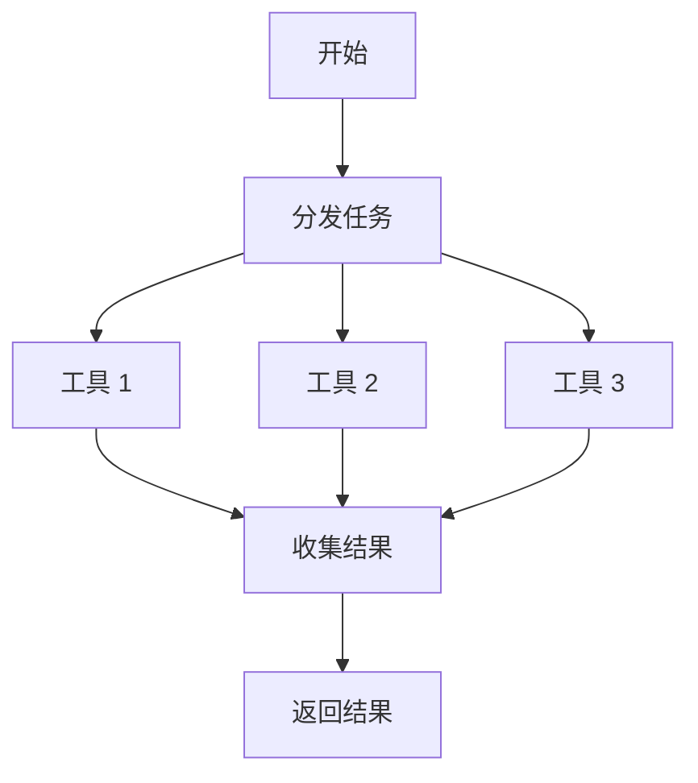

# toolkits 工具集管理系统

本模块是 goagent 框架的工具集管理系统，提供工具的组织、注册、发现和执行能力。

## 目录

- [架构设计](#架构设计)
- [核心组件](#核心组件)
- [预置工具集](#预置工具集)
- [工具注册表](#工具注册表)
- [工具执行器](#工具执行器)
- [使用方法](#使用方法)
- [API 参考](#api-参考)
- [代码结构](#代码结构)

## 架构设计

### 系统架构图



### 工具集组合流程



## 核心组件

### 1. Toolkit 接口

```go
type Toolkit interface {
    // 获取所有工具
    GetTools() []interfaces.Tool

    // 根据名称获取工具
    GetToolByName(name string) (interfaces.Tool, error)

    // 获取所有工具名称
    GetToolNames() []string
}
```

### 2. BaseToolkit 基础工具集

```go
type BaseToolkit struct {
    tools    []interfaces.Tool          // 工具列表
    toolsMap map[string]interfaces.Tool // 名称索引
    mu       sync.RWMutex               // 读写锁
}
```

**核心方法**：

| 方法 | 说明 |
|------|------|
| `GetTools()` | 获取所有工具 |
| `GetToolByName(name)` | 按名称获取 |
| `GetToolNames()` | 获取工具名称列表 |
| `AddTool(tool)` | 添加工具 |
| `RemoveTool(name)` | 移除工具 |
| `MergeTool(other)` | 合并另一个工具集 |

### 3. ToolkitBuilder 构建器

流式 API 构建工具集：

```go
type ToolkitBuilder struct {
    tools []interfaces.Tool
}
```

**链式方法**：

| 方法 | 说明 |
|------|------|
| `AddTool(tool)` | 添加单个工具 |
| `AddTools(tools...)` | 批量添加工具 |
| `AddToolkit(toolkit)` | 添加整个工具集 |
| `WithCalculator()` | 添加计算器 |
| `WithSearch(engine)` | 添加搜索工具 |
| `WithShell(commands)` | 添加 Shell 工具 |
| `WithAPI(baseURL, headers)` | 添加 API 工具 |
| `Build()` | 构建工具集 |

### 4. ToolRegistry 全局注册表

```go
type ToolRegistry struct {
    tools map[string]interfaces.Tool
    mu    sync.RWMutex
}
```

**核心方法**：

| 方法 | 说明 |
|------|------|
| `Register(tool)` | 注册工具（重复报错） |
| `Unregister(name)` | 注销工具 |
| `Get(name)` | 获取工具 |
| `List()` | 列出所有工具 |
| `CreateToolkit(names...)` | 从注册表创建工具集 |

**全局函数**：

```go
RegisterTool(tool)   // 注册到默认注册表
GetTool(name)        // 从默认注册表获取
ListTools()          // 列出默认注册表中的工具
```

### 5. ToolkitExecutor 执行器

```go
type ToolkitExecutor struct {
    toolkit  Toolkit
    parallel bool // 是否并行执行
}
```

**执行模式**：
- **顺序执行**：逐个执行，遇错停止
- **并行执行**：并发执行，收集所有结果

## 预置工具集

### StandardToolkit 标准工具集

包含常用基础工具：

```go
func NewStandardToolkit() *StandardToolkit {
    return &StandardToolkit{
        BaseToolkit: NewBaseToolkit(
            compute.NewCalculatorTool(),
            search.NewSearchTool(search.NewMockSearchEngine()),
        ),
    }
}
```

**包含工具**：
- `calculator` - 数学计算
- `search` - 搜索工具

### DevelopmentToolkit 开发工具集

包含开发常用工具（带安全限制）：

```go
func NewDevelopmentToolkit() *DevelopmentToolkit {
    safeCommands := []string{
        "ls", "pwd", "echo", "cat", "grep", "find",
        "git", "curl", "wget",
        "uname", "hostname", "whoami", "date",
    }

    return &DevelopmentToolkit{
        BaseToolkit: NewBaseToolkit(
            shell.NewShellTool(safeCommands, 0),
            http.NewAPITool("", 0, nil),
            compute.NewCalculatorTool(),
        ),
    }
}
```

**包含工具**：
- `shell` - Shell 命令执行（白名单限制）
- `api` - HTTP API 调用
- `calculator` - 数学计算

**安全白名单**：
| 类别 | 命令 |
|------|------|
| 文件系统 | ls, pwd, cat, grep, find |
| 网络 | curl, wget |
| 版本控制 | git |
| 系统信息 | uname, hostname, whoami, date |
| 输出 | echo |

## 工具执行器

### ToolkitExecutor

```go
type ToolkitExecutor struct {
    toolkit  Toolkit
    parallel bool
}
```

### 执行模式

**顺序执行**（默认）：
```go
executor := NewToolkitExecutor(toolkit)
results, err := executor.ExecuteMultiple(ctx, requests)
// 遇到第一个错误即停止
```

**并行执行**：
```go
executor := NewToolkitExecutor(toolkit).WithParallel(true)
results, err := executor.ExecuteMultiple(ctx, requests)
// 并发执行所有工具，返回第一个错误
```

### 并行执行流程



## 使用方法

### 基础使用

```go
// 创建基础工具集
toolkit := toolkits.NewBaseToolkit(
    compute.NewCalculatorTool(),
    search.NewSearchTool(engine),
)

// 获取工具
calc, err := toolkit.GetToolByName("calculator")
if err != nil {
    log.Fatal(err)
}

// 执行工具
output, err := calc.Invoke(ctx, &interfaces.ToolInput{
    Arguments: map[string]interface{}{
        "expression": "2 + 2",
    },
})
```

### 使用构建器

```go
// 链式构建
toolkit := toolkits.NewToolkitBuilder().
    WithCalculator().
    WithSearch(nil). // 使用 MockSearchEngine
    WithShell([]string{"ls", "pwd", "git"}).
    WithAPI("https://api.example.com", map[string]string{
        "Authorization": "Bearer token",
    }).
    Build()

// 查看包含的工具
names := toolkit.GetToolNames()
fmt.Println("工具:", names)
```

### 组合多个工具集

```go
// 创建自定义工具集
customToolkit := toolkits.NewBaseToolkit(customTool1, customTool2)

// 合并标准工具集
customToolkit.MergeTool(toolkits.NewStandardToolkit())

// 或使用构建器
toolkit := toolkits.NewToolkitBuilder().
    AddToolkit(toolkits.NewStandardToolkit()).
    AddToolkit(toolkits.NewDevelopmentToolkit()).
    AddTool(myCustomTool).
    Build()
```

### 使用全局注册表

```go
// 注册工具
err := toolkits.RegisterTool(compute.NewCalculatorTool())
err = toolkits.RegisterTool(search.NewSearchTool(engine))

// 获取工具
calc, err := toolkits.GetTool("calculator")

// 列出所有工具
allTools := toolkits.ListTools()

// 从注册表创建工具集
registry := toolkits.NewToolRegistry()
registry.Register(tool1)
registry.Register(tool2)
registry.Register(tool3)

toolkit, err := registry.CreateToolkit("calculator", "search")
```

### 使用执行器

```go
// 创建执行器
executor := toolkits.NewToolkitExecutor(toolkit)

// 单个工具执行
output, err := executor.Execute(ctx, "calculator", &interfaces.ToolInput{
    Arguments: map[string]interface{}{
        "expression": "10 * 5",
    },
})

// 多个工具顺序执行
requests := map[string]*interfaces.ToolInput{
    "calculator": {Arguments: map[string]interface{}{"expression": "1 + 1"}},
    "search":     {Arguments: map[string]interface{}{"query": "golang"}},
}
results, err := executor.ExecuteMultiple(ctx, requests)

// 多个工具并行执行
executor.WithParallel(true)
results, err := executor.ExecuteMultiple(ctx, requests)
```

### 动态添加/移除工具

```go
toolkit := toolkits.NewBaseToolkit()

// 动态添加
toolkit.AddTool(compute.NewCalculatorTool())
toolkit.AddTool(search.NewSearchTool(engine))

// 检查工具
names := toolkit.GetToolNames()
fmt.Println("当前工具:", names) // [calculator, search]

// 动态移除
err := toolkit.RemoveTool("calculator")
if err != nil {
    log.Println("移除失败:", err)
}

names = toolkit.GetToolNames()
fmt.Println("剩余工具:", names) // [search]
```

### 与 Agent 集成

```go
// 创建工具集
toolkit := toolkits.NewToolkitBuilder().
    WithCalculator().
    WithSearch(searchEngine).
    Build()

// 传递给 Agent
agent := builder.NewAgentBuilder().
    WithLLM(llmClient).
    WithTools(toolkit.GetTools()...).
    Build()

// 或使用标准工具集
agent := builder.NewAgentBuilder().
    WithLLM(llmClient).
    WithTools(toolkits.NewStandardToolkit().GetTools()...).
    Build()
```

## API 参考

### 工具集

```go
// 基础工具集
NewBaseToolkit(tools ...interfaces.Tool) *BaseToolkit
(t *BaseToolkit) GetTools() []interfaces.Tool
(t *BaseToolkit) GetToolByName(name string) (interfaces.Tool, error)
(t *BaseToolkit) GetToolNames() []string
(t *BaseToolkit) AddTool(tool interfaces.Tool)
(t *BaseToolkit) RemoveTool(name string) error
(t *BaseToolkit) MergeTool(other Toolkit)

// 预置工具集
NewStandardToolkit() *StandardToolkit
NewDevelopmentToolkit() *DevelopmentToolkit
```

### 构建器

```go
NewToolkitBuilder() *ToolkitBuilder
(b *ToolkitBuilder) AddTool(tool interfaces.Tool) *ToolkitBuilder
(b *ToolkitBuilder) AddTools(tools ...interfaces.Tool) *ToolkitBuilder
(b *ToolkitBuilder) AddToolkit(toolkit Toolkit) *ToolkitBuilder
(b *ToolkitBuilder) WithCalculator() *ToolkitBuilder
(b *ToolkitBuilder) WithSearch(engine search.SearchEngine) *ToolkitBuilder
(b *ToolkitBuilder) WithShell(allowedCommands []string) *ToolkitBuilder
(b *ToolkitBuilder) WithAPI(baseURL string, headers map[string]string) *ToolkitBuilder
(b *ToolkitBuilder) Build() Toolkit
```

### 注册表

```go
NewToolRegistry() *ToolRegistry
(r *ToolRegistry) Register(tool interfaces.Tool) error
(r *ToolRegistry) Unregister(name string) error
(r *ToolRegistry) Get(name string) (interfaces.Tool, error)
(r *ToolRegistry) List() []interfaces.Tool
(r *ToolRegistry) CreateToolkit(names ...string) (Toolkit, error)

// 全局函数
RegisterTool(tool interfaces.Tool) error
GetTool(name string) (interfaces.Tool, error)
ListTools() []interfaces.Tool
```

### 执行器

```go
NewToolkitExecutor(toolkit Toolkit) *ToolkitExecutor
(e *ToolkitExecutor) WithParallel(parallel bool) *ToolkitExecutor
(e *ToolkitExecutor) Execute(ctx context.Context, toolName string, input *interfaces.ToolInput) (*interfaces.ToolOutput, error)
(e *ToolkitExecutor) ExecuteMultiple(ctx context.Context, requests map[string]*interfaces.ToolInput) (map[string]*interfaces.ToolOutput, error)
```

## 代码结构

```text
toolkits/
└── toolkit.go           # 完整实现
    ├── Toolkit 接口
    ├── BaseToolkit
    ├── StandardToolkit
    ├── DevelopmentToolkit
    ├── ToolkitBuilder
    ├── ToolRegistry
    └── ToolkitExecutor
```

## 设计特点

### 灵活组合

- **构建器模式**：链式 API 简化工具集创建
- **合并能力**：支持合并多个工具集
- **动态管理**：运行时添加/移除工具

### 全局管理

- **单例注册表**：全局工具发现和管理
- **按需创建**：从注册表选择性创建工具集
- **重复检测**：防止重复注册

### 并发安全

- **读写锁**：`sync.RWMutex` 保护共享状态
- **并行执行**：支持工具并发执行
- **上下文传播**：支持 context 取消

### 安全设计

- **命令白名单**：Shell 工具限制可执行命令
- **超时控制**：工具执行支持超时配置

## 扩展阅读

- [interfaces](../interfaces/) - 工具接口定义
- [tools](../tools/) - 内置工具实现
- [builder](../builder/) - Agent 构建器
- [core](../core/) - 核心执行引擎
