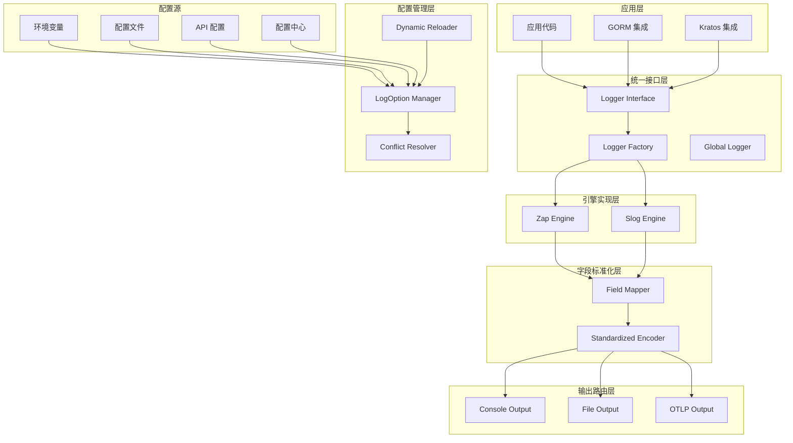
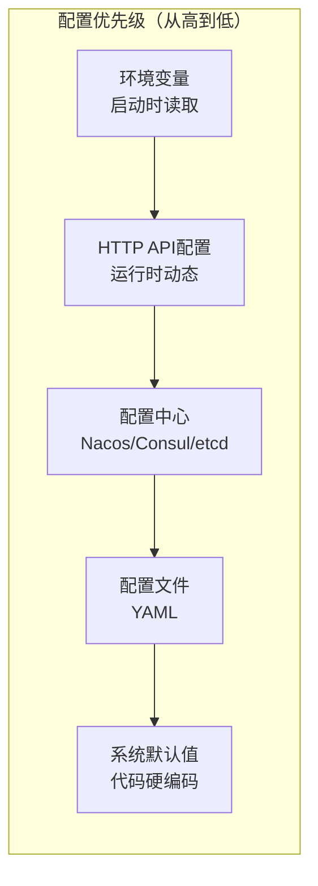
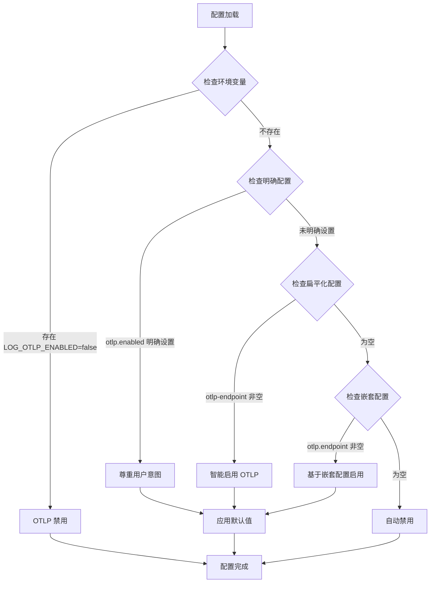

# 统一日志库设计文档

## 概述

本设计文档基于详细的需求分析，为 Go 日志库项目提供技术架构和实现方案。该项目旨在解决现有日志库配置复杂、OTLP 启用冗余、框架日志分散等核心痛点，通过智能配置检测、多源配置管理和统一字段标准化，提供一个既高性能又易用的日志解决方案。

### 核心设计目标

- **统一接口抽象**：提供一致的日志接口，支持 Zap 和 Slog 双引擎透明切换
- **智能配置管理**：实现多源配置冲突解决和 OTLP 自动检测
- **字段标准化**：确保不同底层库输出完全一致的日志格式
- **动态配置支持**：支持运行时配置变更和多级智能回滚
- **框架集成**：统一 GORM、Kratos 等框架的日志输出

## 架构设计

### 整体架构图



### 核心架构层次

#### 1. 应用层

- 应用代码通过统一接口使用日志功能
- 框架集成适配器提供无缝集成

#### 2. 统一接口层

- **Logger Interface**: 定义标准日志方法（Debug/Info/Warn/Error/Fatal + 格式化 + 结构化）
- **Logger Factory**: 根据配置创建和管理具体引擎实例
- **Global Logger**: 提供包级别便捷函数

#### 3. 配置管理层

- **LogOption Manager**: 统一管理多源配置
- **Conflict Resolver**: 实现配置冲突解决算法
- **Dynamic Reloader**: 处理运行时配置变更

#### 4. 字段标准化层

- **Field Mapper**: 统一字段名称映射
- **Standardized Encoder**: 确保输出格式一致性

#### 5. 引擎实现层

- **Zap Engine**: 高性能结构化日志实现
- **Slog Engine**: Go 标准库实现

#### 6. 输出路由层

- 智能输出控制到多个目标（控制台、文件、OTLP）

## 组件和接口设计

### 核心接口定义

```go
// Logger 统一日志接口
type Logger interface {
    // 基础方法
    Debug(args ...interface{})
    Info(args ...interface{})
    Warn(args ...interface{})
    Error(args ...interface{})
    Fatal(args ...interface{})

    // 格式化方法
    Debugf(template string, args ...interface{})
    Infof(template string, args ...interface{})
    Warnf(template string, args ...interface{})
    Errorf(template string, args ...interface{})
    Fatalf(template string, args ...interface{})

    // 结构化方法
    Debugw(msg string, keysAndValues ...interface{})
    Infow(msg string, keysAndValues ...interface{})
    Warnw(msg string, keysAndValues ...interface{})
    Errorw(msg string, keysAndValues ...interface{})
    Fatalw(msg string, keysAndValues ...interface{})

    // 增强方法
    With(keyValues ...interface{}) Logger
    WithCtx(ctx context.Context, keyValues ...interface{}) Logger
    WithCallerSkip(skip int) Logger
    SetLevel(level Level)
}
```

### 配置结构设计

```go
type LogOption struct {
    Engine            string      `json:"engine" mapstructure:"engine"`
    Level             string      `json:"level" mapstructure:"level"`
    Format            string      `json:"format" mapstructure:"format"`
    OutputPaths       []string    `json:"output_paths" mapstructure:"output_paths"`
    OTLPEndpoint      string      `json:"otlp_endpoint" mapstructure:"otlp_endpoint"`
    OTLP              *OTLPOption `json:"otlp" mapstructure:"otlp"`
    Development       bool        `json:"development" mapstructure:"development"`
    DisableCaller     bool        `json:"disable_caller" mapstructure:"disable_caller"`
    DisableStacktrace bool        `json:"disable_stacktrace" mapstructure:"disable_stacktrace"`
}

type OTLPOption struct {
    Enabled  *bool             `json:"enabled" mapstructure:"enabled"`
    Endpoint string            `json:"endpoint" mapstructure:"endpoint"`
    Protocol string            `json:"protocol" mapstructure:"protocol"`
    Timeout  time.Duration     `json:"timeout" mapstructure:"timeout"`
    Headers  map[string]string `json:"headers" mapstructure:"headers"`
}

// AddFlags 将 LogOption 字段添加到 pflag.FlagSet
func (opt *LogOption) AddFlags(fs *pflag.FlagSet) {
    fs.StringVar(&opt.Engine, "engine", "slog", "日志引擎 (zap|slog)")
    fs.StringVar(&opt.Level, "level", "INFO", "日志级别")
    fs.StringVar(&opt.Format, "format", "json", "日志格式 (json|console)")
    fs.StringSliceVar(&opt.OutputPaths, "output-paths", []string{"stdout"}, "输出路径")
    fs.StringVar(&opt.OTLPEndpoint, "otlp-endpoint", "", "OTLP 端点地址")
    fs.BoolVar(&opt.Development, "development", false, "开发模式")
    fs.BoolVar(&opt.DisableCaller, "disable-caller", false, "禁用调用者信息")
    fs.BoolVar(&opt.DisableStacktrace, "disable-stacktrace", false, "禁用堆栈跟踪")
    
    // OTLP 详细选项
    if opt.OTLP == nil {
        opt.OTLP = &OTLPOption{}
    }
    fs.StringVar(&opt.OTLP.Endpoint, "otlp-endpoint-detailed", "", "OTLP 详细端点配置")
    fs.StringVar(&opt.OTLP.Protocol, "otlp-protocol", "grpc", "OTLP 协议 (grpc|http)")
    fs.DurationVar(&opt.OTLP.Timeout, "otlp-timeout", 10*time.Second, "OTLP 超时时间")
}
```

### 多源配置支持

LogOption 结构体支持多种配置源：

- **`json`**: 用于 JSON 序列化和 API 传输
- **`mapstructure`**: 用于通用配置映射（支持 YAML、TOML、JSON 等格式）
- **`AddFlags()` 方法**: 用于 spf13/pflag 命令行参数支持

这种设计支持灵活的配置方式：
- 配置文件通过 mapstructure 支持（YAML、JSON、TOML 等）
- 环境变量通过 mapstructure 的环境变量解析支持
- 命令行参数通过 AddFlags 方法集成 pflag
- API 传输通过 JSON 标签支持

### 字段标准化系统

基于研究发现，需要确保不同引擎输出完全一致的字段格式：

```go
const (
    TimestampField = "timestamp"    // 统一时间字段
    LevelField     = "level"        // 统一级别字段
    MessageField   = "message"      // 统一消息字段
    CallerField    = "caller"       // 统一调用者字段
    TraceIDField   = "trace_id"     // 统一跟踪ID字段
    SpanIDField    = "span_id"      // 统一跨度ID字段
)
```

## 数据模型

### 配置优先级模型



### 配置冲突解决流程



### 字段映射模型

```go
type StandardizedOutput struct {
    Timestamp string                 `json:"timestamp"`
    Level     string                 `json:"level"`
    Message   string                 `json:"message"`
    Caller    string                 `json:"caller,omitempty"`
    TraceID   string                 `json:"trace_id,omitempty"`
    SpanID    string                 `json:"span_id,omitempty"`
    Fields    map[string]interface{} `json:",inline"`
}
```

## 错误处理

### 错误分类和处理策略

#### 1. 配置错误

- **配置解析失败**: 记录错误，使用默认配置继续运行
- **配置验证失败**: 记录错误，应用智能默认值
- **配置源不可用**: 使用降级策略，按优先级查找可用配置

#### 2. 引擎初始化错误

- **Zap 初始化失败**: 自动降级到 Slog
- **Slog 初始化失败**: 使用标准库 log 作为最后兜底
- **所有引擎失败**: 使用 NoOp Logger，确保应用不崩溃

#### 3. 输出错误

- **OTLP 连接失败**: 记录错误，继续使用本地输出
- **文件写入失败**: 降级到控制台输出
- **网络超时**: 使用重试机制，超时后降级

#### 4. 动态配置错误

- **配置重载失败**: 保持当前配置，记录错误
- **配置验证失败**: 拒绝更新，保持稳定状态
- **回滚失败**: 使用安全默认配置

### 错误恢复机制

```go
type ErrorHandler struct {
    fallbackLogger Logger
    retryConfig    RetryConfig
    errorCount     int64
}

func (eh *ErrorHandler) HandleConfigError(err error, source string) {
    // 记录配置错误，尝试降级策略
}

func (eh *ErrorHandler) HandleOutputError(err error, target string) {
    // 处理输出错误，切换到备用输出
}
```

## 测试策略

### 单元测试

#### 1. 核心接口测试

- Logger 接口的所有方法正确性测试
- Level 解析和格式化测试
- 字段标准化映射测试

#### 2. 配置管理测试

- 多源配置优先级测试
- OTLP 智能配置解决测试
- 配置冲突解决算法测试
- 环境变量覆盖测试

#### 3. 引擎实现测试

- Zap 和 Slog 引擎功能对等性测试
- 字段输出一致性测试
- 性能基准测试

### 集成测试

#### 1. 端到端日志流程测试

```go
func TestE2ELoggingFlow(t *testing.T) {
    // 测试从配置加载到日志输出的完整流程
    opt := &LogOption{
        Engine: "zap",
        Level:  "INFO",
        OTLP: &OTLPOption{
            Endpoint: "http://localhost:4317",
        },
    }

    logger, err := New(opt)
    require.NoError(t, err)

    logger.Infow("test message", "key", "value")
    // 验证输出格式和字段一致性
}
```

#### 2. 配置动态更新测试

```go
func TestDynamicConfigUpdate(t *testing.T) {
    // 测试运行时配置变更和回滚
}
```

#### 3. 框架集成测试

```go
func TestGORMIntegration(t *testing.T) {
    // 测试 GORM 日志集成
}

func TestKratosIntegration(t *testing.T) {
    // 测试 Kratos 日志集成
}
```

### 性能测试

基于研究发现的性能对比（Zap > Slog），需要进行：

#### 1. 引擎性能基准测试

```go
func BenchmarkZapEngine(b *testing.B) {
    // 测试 Zap 引擎性能
}

func BenchmarkSlogEngine(b *testing.B) {
    // 测试 Slog 引擎性能
}

func BenchmarkEngineSwitch(b *testing.B) {
    // 测试引擎切换开销
}
```

#### 2. 内存分配测试

- 零分配路径验证
- 内存泄漏检测
- GC 压力测试

#### 3. 并发安全测试

```go
func TestConcurrentLogging(t *testing.T) {
    // 测试高并发日志记录的安全性和性能
}
```

### 兼容性测试

#### 1. Go 版本兼容性

- Go 1.21+ (Slog 要求)
- Go 1.25.0 (当前模块版本)

#### 2. 第三方库兼容性

- Zap 最新版本兼容性
- OTLP exporter 兼容性
- 配置中心客户端兼容性

### 回归测试

#### 1. 字段标准化回归测试

```go
func TestFieldStandardizationRegression(t *testing.T) {
    // 确保不同引擎输出格式永远一致
    zapOutput := captureZapOutput()
    slogOutput := captureSlogOutput()

    assert.Equal(t, zapOutput.Fields, slogOutput.Fields)
}
```

#### 2. 配置解析回归测试

- 确保配置解析逻辑变更不破坏现有行为
- 验证向后兼容性

### 测试环境配置

#### 1. 本地开发测试

```yaml
# test-option.yaml
engine: "slog"
level: "DEBUG"
format: "json"
output-paths: ["stdout"]
development: true
```

#### 2. CI/CD 测试

- 自动化单元测试
- 集成测试
- 性能回归测试
- 代码覆盖率检查

#### 3. 模拟环境测试

- OTLP 服务器模拟
- 配置中心模拟
- 网络故障模拟

这个测试策略确保了日志库的可靠性、性能和向后兼容性，同时验证了核心设计目标的实现。

## 使用案例和示例

### 基础使用示例

#### 1. 简单日志记录

```go
package main

import (
    "github.com/kart-io/logger"
    "github.com/kart-io/logger/option"
)

func main() {
    // 使用默认配置
    log := logger.Global()
    
    // 三种调用风格
    log.Info("应用启动")                          // 基础方法
    log.Infof("服务监听端口: %d", 8080)            // 格式化方法  
    log.Infow("用户登录", "user_id", 12345, "ip", "192.168.1.100") // 结构化方法
}
```

#### 2. 自定义配置

```go
func customConfigExample() {
    opt := &option.LogOption{
        Engine: "zap",           // 使用高性能 Zap 引擎
        Level:  "INFO",
        Format: "json",
        OutputPaths: []string{"stdout", "logs/app.log"},
        OTLPEndpoint: "http://localhost:4317", // 自动启用 OTLP
        Development: false,
    }
    
    logger, err := logger.New(opt)
    if err != nil {
        panic(err)
    }
    
    logger.Infow("订单创建成功", 
        "order_id", "ORD-001",
        "amount", 99.99,
        "currency", "CNY")
}
```

#### 3. 命令行参数支持 (pflag)

```go
import (
    "github.com/spf13/pflag"
    "github.com/kart-io/logger/option"
)

func pflagExample() {
    // 创建默认配置
    opt := option.DefaultLogOption()
    
    // 使用 AddFlags 方法绑定命令行参数
    fs := pflag.NewFlagSet("logger", pflag.ExitOnError)
    opt.AddFlags(fs)
    
    // 解析命令行参数
    fs.Parse(os.Args[1:])
    
    // 使用解析后的配置创建日志器
    logger, err := logger.New(opt)
    if err != nil {
        panic(err)
    }
    
    logger.Info("使用命令行参数配置的日志器")
}
```

#### 3.1. Cobra 集成示例

```go
import (
    "github.com/spf13/cobra"
    "github.com/kart-io/logger/option"
)

func cobraIntegrationExample() {
    var opt option.LogOption
    
    var rootCmd = &cobra.Command{
        Use:   "myapp",
        Short: "示例应用",
        Run: func(cmd *cobra.Command, args []string) {
            logger, err := logger.New(&opt)
            if err != nil {
                panic(err)
            }
            
            logger.Info("应用启动完成")
        },
    }
    
    // 使用 AddFlags 方法添加日志配置参数
    opt.AddFlags(rootCmd.Flags())
    
    // 执行命令
    rootCmd.Execute()
}
```

#### 4. mapstructure 配置映射

```go
import (
    "github.com/mitchellh/mapstructure"
    "github.com/kart-io/logger/option"
)

func mapstructureExample() {
    // 从外部系统获取的配置数据 (如 Consul、etcd 等)
    configData := map[string]interface{}{
        "engine": "zap",
        "level": "DEBUG", 
        "format": "json",
        "output_paths": []string{"stdout", "/var/log/app.log"},
        "otlp_endpoint": "http://jaeger:4317",
        "development": true,
        "otlp": map[string]interface{}{
            "enabled": true,
            "protocol": "grpc",
            "timeout": "10s",
            "headers": map[string]string{
                "authorization": "Bearer token123",
            },
        },
    }
    
    var opt option.LogOption
    
    // 使用 mapstructure 标签进行配置映射
    decoder, err := mapstructure.NewDecoder(&mapstructure.DecoderConfig{
        TagName: "mapstructure",
        Result:  &opt,
    })
    if err != nil {
        panic(err)
    }
    
    err = decoder.Decode(configData)
    if err != nil {
        panic(err)
    }
    
    logger, err := logger.New(&opt)
    if err != nil {
        panic(err)
    }
    
    logger.Infow("使用 mapstructure 配置映射的日志器", 
        "source", "external_config_system")
}
```

#### 5. 多源配置优先级示例

```go
func multiSourceConfigExample() {
    // 1. 从 YAML 配置文件加载基础配置
    baseOpt, err := option.LoadFromFile("logger.yaml")
    if err != nil {
        baseOpt = option.DefaultLogOption()
    }
    
    // 2. 应用命令行参数覆盖
    fs := pflag.NewFlagSet("logger", pflag.ContinueOnError)
    baseOpt.AddFlags(fs)
    fs.Parse(os.Args[1:])
    
    // 3. 应用环境变量覆盖 (最高优先级)
    // 使用 mapstructure 的环境变量解析
    if envLevel := os.Getenv("LOG_LEVEL"); envLevel != "" {
        baseOpt.Level = envLevel
    }
    if envEngine := os.Getenv("LOG_ENGINE"); envEngine != "" {
        baseOpt.Engine = envEngine
    }
    if envOTLP := os.Getenv("LOG_OTLP_ENDPOINT"); envOTLP != "" {
        baseOpt.OTLPEndpoint = envOTLP
    }
    
    // 4. 从配置中心动态更新 (如 Consul)
    if consulConfig := fetchFromConsul("logger/config"); consulConfig != nil {
        var consulOpt option.LogOption
        decoder, _ := mapstructure.NewDecoder(&mapstructure.DecoderConfig{
            TagName: "mapstructure",
            Result:  &consulOpt,
        })
        decoder.Decode(consulConfig)
        
        // 合并配置中心的配置 (仅更新非零值)
        if consulOpt.Engine != "" {
            baseOpt.Engine = consulOpt.Engine
        }
        if consulOpt.Level != "" {
            baseOpt.Level = consulOpt.Level
        }
    }
    
    // 最终配置优先级: 环境变量 > 命令行参数 > 配置中心 > 配置文件 > 默认值
    logger, err := logger.New(baseOpt)
    if err != nil {
        panic(err)
    }
    
    logger.Infow("多源配置日志器初始化完成",
        "final_engine", baseOpt.Engine,
        "final_level", baseOpt.Level,
        "otlp_enabled", baseOpt.OTLPEndpoint != "")
}
```

### 配置冲突解决示例

#### 1. 智能 OTLP 配置

```yaml
# logger.yaml - 用户配置文件
log:
  engine: "slog"
  level: "INFO"
  otlp-endpoint: "http://jaeger:4317"  # 扁平化配置，自动启用 OTLP
  otlp:
    timeout: 15s
    headers:
      authorization: "Bearer token123"
```

```bash
# 环境变量覆盖
export LOG_OTLP_ENABLED=false  # 明确禁用，覆盖文件配置
export LOG_LEVEL=DEBUG         # 覆盖文件中的 INFO 级别
```

实际解析结果：
```go
// 最终生效配置
{
    Engine: "slog",
    Level: "DEBUG",           // 环境变量覆盖
    OTLPEndpoint: "http://jaeger:4317",
    OTLP: {
        Enabled: false,       // 环境变量强制禁用
        Timeout: 15s,
        Headers: {...},
    }
}
```

#### 2. 配置优先级实际场景

```go
func priorityExample() {
    // 场景：生产环境紧急调试
    
    // 1. 配置文件 (最低优先级)
    // level: "ERROR"
    
    // 2. 环境变量 (启动时读取)  
    // LOG_LEVEL=INFO
    
    // 3. API 动态配置 (运行时)
    opt := &option.LogOption{Level: "DEBUG"} // 运行时紧急调整
    factory.UpdateOption(opt)
    
    // 4. 环境变量仍然是最高优先级
    // 实际生效: 如果 LOG_LEVEL=WARN，则最终级别为 WARN
}
```

### 框架集成示例

#### 1. GORM 集成

```go
import (
    "gorm.io/gorm"
    "gorm.io/gorm/logger"
    mylogger "github.com/kart-io/logger"
)

func gormIntegrationExample() {
    // 创建统一日志器
    log := mylogger.Global()
    
    // GORM 适配器
    gormLogger := &GORMAdapter{logger: log}
    
    db, err := gorm.Open(sqlite.Open("test.db"), &gorm.Config{
        Logger: gormLogger,
    })
    
    // GORM 查询日志将通过统一接口输出
    db.First(&User{}, 1)
}

// GORM 适配器实现
type GORMAdapter struct {
    logger mylogger.Logger
}

func (g *GORMAdapter) LogMode(level logger.LogLevel) logger.Interface {
    return g
}

func (g *GORMAdapter) Info(ctx context.Context, msg string, data ...interface{}) {
    g.logger.WithCtx(ctx).Infof(msg, data...)
}

func (g *GORMAdapter) Warn(ctx context.Context, msg string, data ...interface{}) {
    g.logger.WithCtx(ctx).Warnf(msg, data...)
}

func (g *GORMAdapter) Error(ctx context.Context, msg string, data ...interface{}) {
    g.logger.WithCtx(ctx).Errorf(msg, data...)
}

func (g *GORMAdapter) Trace(ctx context.Context, begin time.Time, fc func() (sql string, rowsAffected int64), err error) {
    elapsed := time.Since(begin)
    sql, rows := fc()
    
    g.logger.WithCtx(ctx).Infow("数据库查询",
        "sql", sql,
        "duration", elapsed,
        "rows", rows,
        "error", err)
}
```

#### 2. Kratos 集成

```go
import (
    "github.com/go-kratos/kratos/v2/log"
    mylogger "github.com/kart-io/logger"
)

func kratosIntegrationExample() {
    // 创建 Kratos 适配器
    logger := mylogger.Global()
    kratosLogger := &KratosAdapter{logger: logger}
    
    // 设置为 Kratos 全局日志器
    log.SetLogger(kratosLogger)
    
    // Kratos 框架日志将统一输出
    helper := log.NewHelper(kratosLogger)
    helper.Infow("用户服务启动", "port", 8080)
}

type KratosAdapter struct {
    logger mylogger.Logger
}

func (k *KratosAdapter) Log(level log.Level, keyvals ...interface{}) error {
    switch level {
    case log.LevelDebug:
        k.logger.Debugw("", keyvals...)
    case log.LevelInfo:
        k.logger.Infow("", keyvals...)
    case log.LevelWarn:
        k.logger.Warnw("", keyvals...)
    case log.LevelError:
        k.logger.Errorw("", keyvals...)
    }
    return nil
}
```

### 字段标准化示例

#### 输出一致性验证

```go
func fieldConsistencyExample() {
    // Zap 引擎配置
    zapOpt := &option.LogOption{Engine: "zap"}
    zapLogger, _ := logger.New(zapOpt)
    
    // Slog 引擎配置  
    slogOpt := &option.LogOption{Engine: "slog"}
    slogLogger, _ := logger.New(slogOpt)
    
    // 相同的日志调用
    logData := []interface{}{
        "user_id", 12345,
        "action", "login", 
        "ip", "192.168.1.100",
    }
    
    zapLogger.Infow("用户登录", logData...)
    slogLogger.Infow("用户登录", logData...)
    
    // 两种引擎输出格式完全一致:
    // {
    //   "timestamp": "2024-08-28T10:30:15.123Z",
    //   "level": "INFO", 
    //   "message": "用户登录",
    //   "caller": "main.go:42",
    //   "user_id": 12345,
    //   "action": "login",
    //   "ip": "192.168.1.100"
    // }
}
```

### 动态配置示例

#### 1. API 配置更新

```go
func dynamicConfigExample() {
    factory := factory.NewLoggerFactory(option.DefaultLogOption())
    logger, _ := factory.CreateLogger()
    
    // 运行时配置更新
    newOpt := &option.LogOption{
        Engine: "zap",        // 从 slog 切换到 zap
        Level:  "DEBUG",      // 提升日志级别用于调试
        OTLPEndpoint: "http://new-jaeger:4317", // 切换 OTLP 端点
    }
    
    err := factory.UpdateOption(newOpt)
    if err != nil {
        log.Error("配置更新失败", err)
        return
    }
    
    // 新配置立即生效
    newLogger, _ := factory.CreateLogger()
    newLogger.Debug("调试信息现在可见")  // 之前被过滤，现在会输出
}
```

#### 2. 信号触发配置重载

```go
func signalReloadExample() {
    // 监听 SIGUSR1 信号进行配置重载
    c := make(chan os.Signal, 1)
    signal.Notify(c, syscall.SIGUSR1)
    
    go func() {
        for range c {
            // 重新读取配置文件
            opt, err := option.LoadFromFile("logger.yaml")
            if err != nil {
                log.Error("配置重载失败", err)
                continue
            }
            
            // 更新全局日志器
            newLogger, err := logger.New(opt)
            if err != nil {
                log.Error("日志器重建失败", err) 
                continue
            }
            
            logger.SetGlobal(newLogger)
            log.Info("配置重载完成")
        }
    }()
    
    // 使用: kill -USR1 <pid>
}
```

### 错误处理示例

#### 1. 优雅降级

```go
func gracefulDegradationExample() {
    opt := &option.LogOption{
        Engine: "zap",
        OTLPEndpoint: "http://unavailable-server:4317", // 不可达的服务器
    }
    
    logger, err := logger.New(opt)
    if err != nil {
        // 降级到默认配置
        logger, _ = logger.NewWithDefaults()
    }
    
    // 日志记录继续工作，只是 OTLP 输出会失败并记录错误
    logger.Info("应用正常启动") // 仍然输出到控制台和文件
    
    // OTLP 连接失败会被记录但不影响应用运行:
    // {"level":"ERROR","message":"OTLP连接失败","error":"dial tcp: connection refused"}
}
```

#### 2. 引擎故障转移

```go
func engineFailoverExample() {
    opt := &option.LogOption{Engine: "zap"}
    
    logger, err := logger.New(opt)
    if err != nil {
        // Zap 初始化失败，自动降级到 Slog
        log.Printf("Zap engine failed, falling back to slog: %v", err)
        
        opt.Engine = "slog" 
        logger, err = logger.New(opt)
        if err != nil {
            // Slog 也失败，使用标准库
            logger = &StandardLibAdapter{}
        }
    }
    
    // 无论使用哪种引擎，接口保持一致
    logger.Info("应用启动完成")
}
```

### 性能优化示例

#### 1. 零分配日志记录

```go
func zeroAllocExample() {
    // Zap 引擎在热路径上实现零分配
    zapLogger, _ := logger.New(&option.LogOption{Engine: "zap"})
    
    // 预分配字段避免运行时分配
    fields := []interface{}{
        "user_id", 0,    // 将被动态设置
        "request_id", "", // 将被动态设置
    }
    
    // 在热路径中复用字段切片
    for userID := 1; userID <= 1000000; userID++ {
        fields[1] = userID                          // 复用，避免分配
        fields[3] = fmt.Sprintf("req-%d", userID)   // 复用，避免分配
        
        zapLogger.Infow("处理用户请求", fields...)     // 零分配路径
    }
}
```

#### 2. 条件日志记录

```go
func conditionalLoggingExample() {
    logger := logger.Global()
    
    // 避免昂贵的字符串构建
    if logger.IsDebugEnabled() {  // 避免不必要的计算
        expensiveDebugData := buildDebugInfo() // 仅在 DEBUG 级别时执行
        logger.Debugw("详细调试信息", "data", expensiveDebugData)
    }
    
    // 或者使用延迟计算
    logger.Debugw("调试信息", 
        "expensive_field", func() interface{} {
            return buildExpensiveData() // 仅在实际记录时执行
        }())
}
```

这些实际案例展示了统一日志库在各种场景下的使用方式，包括基础用法、配置管理、框架集成、错误处理和性能优化等关键方面。
