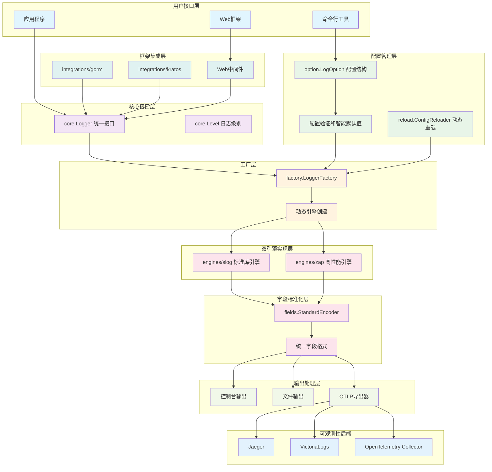
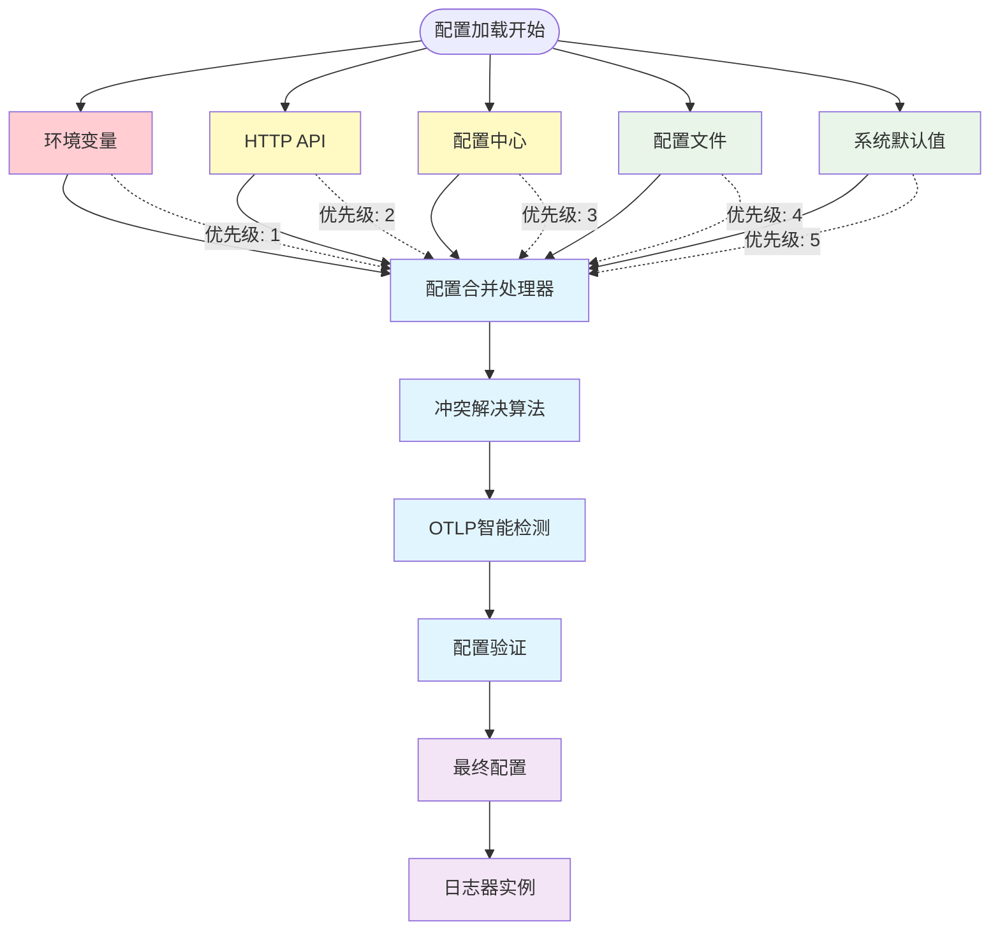
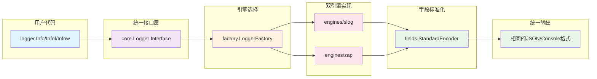

# Kart Logger

[](https://golang.org/)
[](LICENSE)
[](https://goreportcard.com/report/github.com/kart-io/logger)

高性能、统一接口的 Go 日志库，支持智能 OTLP 配置、多源配置管理，以及跨框架的统一日志记录。

## ✨ 核心特性

- 🚀 **双引擎架构**: 同时支持 Zap (高性能) 和 Slog (标准库)，统一接口，透明切换
- 📊 **字段标准化**: 确保不同引擎输出完全一致的日志格式和字段名
- 🔧 **智能 OTLP 配置**: 基于端点自动启用，消除冗余配置，支持多种后端
- ⚙️ **多源配置管理**: 环境变量、配置文件、API 配置的智能冲突处理
- 🔄 **动态配置重载**: 文件监控、信号处理、API 触发的运行时配置更新
- 🌐 **框架集成**: 开箱即用的 Gin、Echo、GORM、Kratos 等框架适配
- 🎯 **三种调用风格**: 支持简单参数、Printf 格式化、结构化键值对三种日志方式
- 📈 **性能优化**: Zap 引擎支持零分配高性能日志记录
- 🔍 **可观测性**: 完整的分布式追踪、上下文传递和 OpenTelemetry 集成

## 🚀 快速开始

### 安装

```bash
go get github.com/kart-io/logger
```

### 最简示例

```go
package main

import "github.com/kart-io/logger"

func main() {
    // 使用默认配置 (Slog 引擎, INFO 级别, JSON 格式)
    logger.Info("Hello, World!")

    // 结构化日志记录
    logger.Infow("用户登录成功",
        "user_id", "12345",
        "ip", "192.168.1.100",
        "duration", "200ms")
}
```

### 自定义配置

```go
package main

import (
    "github.com/kart-io/logger"
    "github.com/kart-io/logger/option"
)

func main() {
    // 创建高性能 Zap 日志器
    opt := &option.LogOption{
        Engine: "zap",           // 使用 Zap 引擎
        Level:  "debug",         // 调试级别
        Format: "json",          // JSON 格式
        OutputPaths: []string{
            "stdout",            // 控制台输出
            "/var/log/app.log",  // 文件输出
        },
        // 自动启用 OTLP (智能配置)
        OTLPEndpoint: "http://localhost:4317",
    }

    // 添加初始字段（会自动包含在每个日志条目中）
    opt.WithInitialFields(map[string]interface{}{
        "service.name":    "my-service",
        "service.version": "v1.0.0",
        "environment":     "production",
    }).AddInitialField("instance_id", "web-001")

    coreLogger, err := logger.New(opt)
    if err != nil {
        panic(err)
    }

    // 三种调用风格（所有日志都会包含上面设置的初始字段）
    coreLogger.Info("简单消息")
    coreLogger.Infof("格式化消息: %s", "hello")
    coreLogger.Infow("结构化消息", "key", "value")
}
```

## 📊 三种调用风格

### 1. 简单参数风格

```go
logger.Debug("调试消息", "额外信息")
logger.Info("信息消息")
logger.Warn("警告消息")
logger.Error("错误消息")
```

### 2. Printf 格式化风格

```go
logger.Debugf("用户 %s 执行 %s 操作", userName, action)
logger.Infof("处理了 %d 个请求，耗时 %v", count, duration)
logger.Errorf("连接 %s:%d 失败: %v", host, port, err)
```

### 3. 结构化风格 (推荐)

```go
logger.Debugw("API 请求开始",
    "method", "POST",
    "path", "/api/users",
    "user_id", userID)

logger.Infow("数据库查询完成",
    "table", "users",
    "duration", duration.Milliseconds(),
    "rows", count)

logger.Errorw("支付处理失败",
    "order_id", orderID,
    "error", err.Error(),
    "amount", 99.99)
```

## 🏷️ 初始字段管理 (InitialFields)

InitialFields 是一个强大的功能，允许你在创建日志器时设置一组字段，这些字段会自动包含在每个日志条目中，无需重复添加。

### 基础用法

```go
import "github.com/kart-io/logger/option"

// 创建配置并添加初始字段
opt := option.DefaultLogOption()

// 方法1: 批量添加字段
opt.WithInitialFields(map[string]interface{}{
    "service.name":    "user-api",
    "service.version": "v2.1.0",
    "environment":     "production",
})

// 方法2: 逐个添加字段（支持链式调用）
opt.AddInitialField("datacenter", "us-west-2").
    AddInitialField("instance_id", "web-003").
    AddInitialField("team", "platform")

// 方法3: 混合使用
opt.WithInitialFields(map[string]interface{}{
    "project": "e-commerce",
    "component": "payment",
}).AddInitialField("build_id", "build-12345")

logger, err := logger.New(opt)
```

### 自动包含示例

```go
// 设置初始字段
opt := option.DefaultLogOption()
opt.WithInitialFields(map[string]interface{}{
    "service.name": "payment-service",
    "version": "v1.0.0",
    "region": "us-east-1",
})

logger, _ := logger.New(opt)

// 所有日志都会自动包含初始字段
logger.Info("服务启动")
// 输出: {"time":"...", "level":"info", "msg":"服务启动", "service.name":"payment-service", "version":"v1.0.0", "region":"us-east-1", ...}

logger.Infow("处理支付请求", 
    "order_id", "ord-123", 
    "amount", 99.99)
// 输出: {"time":"...", "level":"info", "msg":"处理支付请求", "service.name":"payment-service", "version":"v1.0.0", "region":"us-east-1", "order_id":"ord-123", "amount":99.99, ...}
```

### 字段优先级

InitialFields 具有明确的优先级规则：

```go
opt := option.DefaultLogOption()
opt.WithInitialFields(map[string]interface{}{
    "service.name": "original-service",
    "environment": "production",
})

logger, _ := logger.New(opt)

// With() 方法的字段可以覆盖 InitialFields
childLogger := logger.With("service.name", "child-service")

// 当前日志调用的字段具有最高优先级
childLogger.Infow("测试优先级",
    "service.name", "current-call-service",
    "additional", "data")

// 最终优先级: 当前调用 > With() 方法 > InitialFields
// 输出中 service.name 将是 "current-call-service"
```

### 实用场景

**1. 微服务标识**
```go
opt.WithInitialFields(map[string]interface{}{
    "service.name":    "user-service",
    "service.version": "v1.2.3", 
    "service.instance": os.Getenv("HOSTNAME"),
})
```

**2. 部署环境信息**
```go
opt.WithInitialFields(map[string]interface{}{
    "environment": "production",
    "datacenter":  "us-west-2",
    "cluster":     "production-cluster",
    "namespace":   "default",
})
```

**3. 构建和版本信息**
```go
opt.WithInitialFields(map[string]interface{}{
    "build_date":   "2023-12-01T10:30:00Z",
    "git_commit":   "abc123def456",
    "git_branch":   "main",
    "build_number": "1234",
})
```

### 获取已配置字段

```go
// 获取所有初始字段（返回副本，安全访问）
fields := opt.GetInitialFields()
for key, value := range fields {
    fmt.Printf("%s: %v\n", key, value)
}
```

### ⚠️ 注意事项

1. **OTLP 兼容**: InitialFields 会自动传递给 OTLP 导出器，确保分布式追踪中的服务标识正确
2. **内存效率**: 字段在日志器创建时设置，不会在每次日志调用时复制
3. **类型安全**: 支持任意类型的值，会在输出时自动序列化
4. **不可变性**: `GetInitialFields()` 返回副本，防止意外修改

## 🏗️ 项目架构

### 包结构图

```
github.com/kart-io/logger/
├── core/           # 核心接口定义 (Logger, Level)
├── engines/        # 双引擎实现
│   ├── slog/       # Go 标准库 slog 引擎
│   └── zap/        # Uber Zap 高性能引擎
├── factory/        # 工厂模式，动态创建日志器
├── option/         # 配置选项和验证
├── fields/         # 字段标准化系统
├── otlp/           # OpenTelemetry 集成
├── reload/         # 动态配置重载
├── integrations/   # 框架集成适配器
│   ├── gorm/       # GORM ORM 集成
│   └── kratos/     # Kratos 微服务框架集成
├── errors/         # 错误处理和恢复
└── example/        # 12+ 完整使用示例
```

### 系统设计图



### 配置优先级流程图



## 🎯 核心概念

### 双引擎架构设计



| 引擎 | 适用场景 | 性能 | 特点 |
|------|----------|------|------|
| **Slog** | 通用应用，标准化 | 标准 | Go 1.21+ 标准库，兼容性好 |
| **Zap** | 高性能场景 | 极高 | 零分配，生产环境首选 |

**关键优势**: 相同的代码，不同的引擎，完全一致的输出格式！

### 字段标准化

确保不同引擎输出完全一致的字段名和格式：

```json
// Slog 和 Zap 引擎输出完全相同
{
  "timestamp": "2023-12-01T10:30:00.123456789Z",
  "level": "info",
  "message": "用户登录成功",
  "caller": "main.go:42",
  "user_id": "12345",
  "trace_id": "abc123def456"
}
```

### 智能 OTLP 配置

无需繁琐的 `enabled: true` 配置，有端点即自动启用：

```yaml
# 最简配置，自动启用 OTLP
otlp-endpoint: "http://localhost:4317"

# 高级配置
otlp:
  endpoint: "https://jaeger.company.com:4317"
  protocol: "grpc"
  timeout: "15s"
  headers:
    Authorization: "Bearer token123"
```

## 🛠️ 高级功能

### 动态配置重载

```go
import "github.com/kart-io/logger/reload"

// 文件监控 + 信号处理 + API 触发
reloadConfig := &reload.ReloadConfig{
    ConfigFile: "logger.yaml",
    Triggers:   reload.TriggerAll,
    Signals:    []os.Signal{syscall.SIGUSR1},
}

reloader, _ := reload.NewConfigReloader(reloadConfig, initialConfig, factory)
reloader.Start()

// 现在支持:
// 1. 修改 logger.yaml 文件自动重载
// 2. kill -USR1 <pid> 信号重载
// 3. HTTP API 调用重载
```

### Web 框架集成

```go
// Gin 集成
import "github.com/kart-io/logger/integrations"

router := gin.Default()
logger, _ := logger.NewWithDefaults()
router.Use(integrations.GinMiddleware(logger))

// Echo 集成
e := echo.New()
e.Use(integrations.EchoMiddleware(logger))

// GORM 集成
db, _ := gorm.Open(sqlite.Open("test.db"), &gorm.Config{
    Logger: integrations.NewGormLogger(logger),
})
```

### 上下文和追踪

```go
// 创建带上下文的日志器
ctx := context.WithValue(context.Background(), "request_id", "req-12345")
contextLogger := logger.WithCtx(ctx,
    "service", "user-api",
    "version", "v1.2.3")

// 分布式追踪
contextLogger.Infow("处理用户请求",
    "trace_id", "abc123def456",
    "span_id", "span789xyz",
    "user_id", userID,
    "operation", "get_profile")

// 创建子日志器
userLogger := logger.With(
    "user_id", userID,
    "session_id", sessionID)

// 所有后续日志都包含这些字段
userLogger.Info("用户进入页面")
userLogger.Warn("权限检查失败")
```

## 📖 使用示例

项目包含 13+ 个完整的使用示例，每个示例都是独立的 Go 模块：

- [📋 **comprehensive**](example/comprehensive/) - 完整功能演示
- [⚡ **performance**](example/performance/) - 性能对比测试
- [🔧 **configuration**](example/configuration/) - 配置管理示例
- [🏷️ **initial_fields**](example/initial_fields/) - InitialFields 方法使用演示
- [📡 **otlp**](example/otlp/) - OpenTelemetry 集成
- [🔄 **reload**](example/reload/) - 动态配置重载
- [🌐 **echo**](example/echo/) - Echo 框架集成
- [🌐 **gin**](example/gin/) - Gin 框架集成
- [⚙️ **integrations**](example/integrations/) - 框架集成演示

### 运行示例

```bash
# 综合功能演示
cd example/comprehensive && go run main.go

# InitialFields 使用演示
cd example/initial_fields && go run main.go

# Web 框架集成
cd example/echo && go run main.go    # http://localhost:8081
cd example/gin && go run main.go     # http://localhost:8080

# OTLP 集成测试
cd example/otlp && go run main.go

# 性能基准测试
cd example/performance && go run main.go
```

## 🔧 配置选项

### 基本配置

```yaml
engine: "zap"                    # 引擎选择: "zap" | "slog"
level: "info"                    # 日志级别: "debug" | "info" | "warn" | "error" | "fatal"
format: "json"                   # 输出格式: "json" | "console"
output-paths: ["stdout"]         # 输出路径: 控制台、文件路径
development: false               # 开发模式 (影响格式和堆栈跟踪)
```

### OTLP 配置

```yaml
# 扁平化配置 (常用)
otlp-endpoint: "http://localhost:4317"

# 嵌套配置 (高级)
otlp:
  enabled: true                  # 明确启用/禁用
  endpoint: "http://jaeger:4317" # OTLP 收集器端点
  protocol: "grpc"               # 协议: "grpc" | "http"
  timeout: "10s"                 # 连接超时
  headers:                       # 自定义请求头
    Authorization: "Bearer token"
    X-Tenant-ID: "tenant-123"
```

### 环境变量

```bash
export LOG_ENGINE="zap"
export LOG_LEVEL="debug"
export LOG_FORMAT="json"
export LOG_OTLP_ENDPOINT="http://localhost:4317"
export LOG_DEVELOPMENT="true"
```

## 🚦 OTLP 后端支持

### Jaeger

```yaml
# docker-compose.yml
services:
  jaeger:
    image: jaegertracing/all-in-one:latest
    ports:
      - "16686:16686"    # Web UI
      - "4317:4317"      # OTLP gRPC
      - "4318:4318"      # OTLP HTTP
```

### VictoriaLogs

```yaml
services:
  victorialogs:
    image: victoriametrics/victoria-logs:latest
    ports:
      - "9428:9428"      # HTTP API
      - "4317:4317"      # OTLP gRPC
```

### OpenTelemetry Collector

```yaml
# otel-collector.yaml
receivers:
  otlp:
    protocols:
      grpc:
        endpoint: 0.0.0.0:4317
      http:
        endpoint: 0.0.0.0:4318

exporters:
  logging:
  jaeger:
    endpoint: jaeger:14250
    tls:
      insecure: true

service:
  pipelines:
    logs:
      receivers: [otlp]
      exporters: [logging, jaeger]
```

## 🎛️ 命令行集成

```go
import (
    "github.com/spf13/pflag"
    "github.com/kart-io/logger/option"
)

func main() {
    opt := option.DefaultLogOption()

    // 自动添加所有日志配置标志
    fs := pflag.NewFlagSet("myapp", pflag.ExitOnError)
    opt.AddFlags(fs)
    fs.Parse(os.Args[1:])

    logger, _ := logger.New(opt)
}
```

```bash
# 命令行使用
./myapp --engine=zap \
        --level=debug \
        --format=console \
        --otlp-endpoint=http://localhost:4317 \
        --development
```

## 🏭 生产环境配置

### 高性能配置

```go
opt := &option.LogOption{
    Engine:      "zap",                      // 高性能引擎
    Level:       "info",                     // 生产级别
    Format:      "json",                     // 结构化输出
    OutputPaths: []string{"/var/log/app.log"}, // 文件输出
    Development: false,                      // 生产模式

    // OTLP 配置
    OTLPEndpoint: os.Getenv("OTLP_ENDPOINT"),
    OTLP: &option.OTLPOption{
        Protocol: "grpc",
        Timeout:  30 * time.Second,
        Headers: map[string]string{
            "Authorization": "Bearer " + os.Getenv("OTLP_TOKEN"),
        },
    },
}
```

### 多环境配置

```go
func createLogger(env string) (core.Logger, error) {
    var opt *option.LogOption

    switch env {
    case "production":
        opt = &option.LogOption{
            Engine: "zap",
            Level:  "info",
            Format: "json",
            OutputPaths: []string{"/var/log/app.log"},
            OTLPEndpoint: "https://otlp.company.com:4317",
        }
    case "development":
        opt = &option.LogOption{
            Engine: "slog",
            Level:  "debug",
            Format: "console",
            OutputPaths: []string{"stdout"},
            Development: true,
        }
    case "test":
        opt = &option.LogOption{
            Engine: "slog",
            Level:  "error",
            OutputPaths: []string{"stderr"},
        }
    }

    return logger.New(opt)
}
```

## 📊 性能基准

基于内置的 [performance example](example/performance/)：

```bash
cd example/performance && go run main.go
```

典型结果 (M1 Pro, 8 cores):

| 引擎 | 操作 | 速度 | 分配 |
|------|------|------|------|
| Zap | 结构化日志 | ~2M ops/sec | 0 allocs/op |
| Zap | 格式化日志 | ~1M ops/sec | 1 alloc/op |
| Slog | 结构化日志 | ~800K ops/sec | 3 allocs/op |
| Slog | 格式化日志 | ~600K ops/sec | 4 allocs/op |

## 🧪 测试

```bash
# 运行所有测试
go test ./...

# 运行基准测试
go test -bench=. ./...

# 查看覆盖率
go test -cover ./...

# 生成覆盖率报告
go test -coverprofile=coverage.out ./...
go tool cover -html=coverage.out
```

## 📚 文档

每个包都有详细的中文文档：

- [📘 **core**](core/README.md) - 核心接口和日志级别
- [📘 **engines/zap**](engines/zap/README.md) - Zap 引擎实现
- [📘 **engines/slog**](engines/slog/README.md) - Slog 引擎实现
- [📘 **factory**](factory/README.md) - 工厂模式和错误处理
- [📘 **option**](option/README.md) - 配置选项和验证
- [📘 **fields**](fields/README.md) - 字段标准化系统
- [📘 **otlp**](otlp/README.md) - OpenTelemetry 集成
- [📘 **reload**](reload/README.md) - 动态配置重载
- [📘 **integrations**](integrations/README.md) - 框架集成

## 🤝 贡献

我们欢迎各种形式的贡献！

1. Fork 本项目
2. 创建功能分支 (`git checkout -b feature/AmazingFeature`)
3. 提交更改 (`git commit -m 'Add some AmazingFeature'`)
4. 推送到分支 (`git push origin feature/AmazingFeature`)
5. 创建 Pull Request

### 开发指南

```bash
# 克隆项目
git clone https://github.com/kart-io/logger.git
cd logger

# 安装依赖
go mod tidy

# 运行测试
go test ./...

# 运行示例
cd example/comprehensive && go run main.go
```

## 🐛 问题反馈

如果您遇到问题或有建议，请：

1. 查看 [Issues](https://github.com/kart-io/logger/issues)
2. 查看 [文档](README.md) 和各包的 README
3. 运行相关 [示例](example/)
4. 提交新的 Issue

## 📄 许可证

本项目采用 [Apache 2.0](LICENSE) 许可证。

## 🙏 致谢

- [Uber Zap](https://github.com/uber-go/zap) - 高性能日志库
- [Go Slog](https://pkg.go.dev/log/slog) - Go 标准库日志
- [OpenTelemetry](https://opentelemetry.io/) - 可观测性标准
- [fsnotify](https://github.com/fsnotify/fsnotify) - 文件系统监控

---

**⭐ 如果这个项目对您有帮助，请给个 Star！** ⭐
