# Logger Package 需求文档

> **📖 阅读指南**：本文档涉及多个相互关联的概念，为避免理解误差，建议按以下顺序阅读：
>
> 1. **核心概念区分** - 理解配置处理和输出控制的区别（必读）
> 2. **配置冲突处理** - 了解功能开关的优先级规则
> 3. **智能输出控制** - 了解输出路径的选择策略
> 4. **系统架构总览** - 了解完整的数据流和组件关系
> 5. **使用场景** - 看具体的应用实例

本文档描述 Logger 包的用户需求、功能特性和使用场景。

## 🔍 核心概念区分

**为避免混淆，首先明确本文档中两个关键概念的区别**：

| 概念 | 作用阶段 | 处理内容 | 输入 | 输出 | 典型场景 |
|------|---------|----------|------|------|----------|
| **配置冲突处理** | 配置解析阶段 | 决定**功能是否启用** | 多源配置字段 | 功能开关状态 | `otlp.enabled=true` vs `otlp-endpoint=""` |
| **智能输出控制** | 输出路由阶段 | 决定**启用后输出到哪里** | 功能启用状态 | 输出目标列表 | OTLP启用后，输出到控制台+文件+OTLP |

**处理流程关系**：

```
配置文件/环境变量/API → [配置冲突处理] → 功能启用状态 → [智能输出控制] → 实际输出路径
```

**具体示例区分**：

```yaml
# 场景：用户同时配置了扁平化和嵌套式OTLP配置
log:
  otlp-endpoint: "127.0.0.1:4327"      # 扁平化配置
  otlp:
    enabled: false                      # 嵌套配置
    endpoint: "192.168.1.100:4317"     # 嵌套配置
  output-paths: ["stdout", "logs/app.log"]

# 第一层：配置冲突处理（决定功能是否启用）
# 处理问题：otlp.enabled=false 与 otlp-endpoint 非空的冲突
# 决策结果：OTLP 功能禁用（明确意图优先）

# 第二层：智能输出控制（决定启用功能的输出路径）
# 处理问题：已启用的功能应该输出到哪些目标
# 决策结果：由于 OTLP 被禁用，仅输出到 stdout + file
```

**⚠️ 重要提醒**：

- **配置冲突处理**：仅关心功能的开启/关闭状态，不涉及输出路径
- **智能输出控制**：仅关心已启用功能的输出目标，不涉及功能开关
- **两者顺序固定**：必须先解决配置冲突，再决定输出路径
- **相互独立**：两个处理过程使用不同的算法和规则

## 📝 术语统一说明

**为避免理解歧义，本文档中的状态术语有明确区分**：

| 术语 | 英文 | 语义 | 触发原因 | 用户意图 | 示例场景 |
|------|------|------|----------|----------|----------|
| **禁用** | `disabled` | 用户明确关闭功能 | 显式配置 `enabled: false` | 明确不要此功能 | `otlp: { enabled: false }` |
| **未启用** | `not enabled` | 因条件不足而未开启 | 缺少必要配置或自动判断 | 可能需要此功能但配置不完整 | `endpoint` 为空导致OTLP无法启用 |
| **自动禁用** | `auto disabled` | 系统智能判断后关闭 | 智能检测无需启用 | 用户未明确表态，系统代为决策 | 未配置任何OTLP相关字段 |

**状态转换逻辑**：
```
配置检查 → 用户明确设置?
├─ 是: enabled: false → "禁用"
├─ 是: enabled: true + 配置完整 → "启用"
├─ 是: enabled: true + 配置不完整 → "未启用" + 错误日志
└─ 否: 智能判断 → "自动禁用" 或 "智能启用"
```

**在代码和日志中的表达**：
- ✅ 正确：`OTLP disabled by user configuration (enabled: false)`
- ✅ 正确：`OTLP not enabled due to missing endpoint`
- ✅ 正确：`OTLP auto disabled (no configuration provided)`
- ❌ 避免：混用"禁用"和"未启用"来描述同一状态

## 🎯 核心需求

### 用户痛点

1. **配置复杂性**：现有日志配置需要设置多个字段，容易出错
2. **OTLP 启用冗余**：需要同时设置 `enabled: true` 和 `endpoint`，存在冗余
3. **环境适配困难**：不同环境（开发、生产、测试）需要大量配置调整
4. **上手门槛高**：新用户需要了解太多配置细节才能开始使用
5. **链路追踪缺失**：日志中缺少TraceID，无法快速定位分布式调用链路
6. **框架日志分散**：GORM、Kratos、中间件日志格式不统一，难以统一分析
7. **集成工作量大**：每个框架都需要单独适配，无法自动继承主配置
8. **动态调整困难**：生产环境问题排查时，无法不重启服务就调整日志级别，影响故障排查效率

### 目标用户

- **应用开发者**：需要快速集成日志功能，专注业务逻辑
- **DevOps 工程师**：需要灵活的配置方式，适应不同部署环境
- **运维人员**：需要统一的可观测性方案，简化日志收集，支持故障排查时的动态配置调整
- **SRE 工程师**：需要在生产环境故障时快速调整日志详细度，无需重启服务

## 💡 解决方案

### 智能配置检测

通过端点地址自动检测 OTLP 启用状态，消除配置冗余：

```
用户需求: 启用 OTLP 日志发送
传统方式: enabled: true + endpoint: "127.0.0.1:4327"  (2个字段)
智能方式: endpoint: "127.0.0.1:4327"                (1个字段，自动启用)
```

### 扁平化配置

将最常用的 OTLP 配置提升为顶级字段：

```
嵌套配置: log.otlp.endpoint (需要理解层级关系)
扁平配置: log.otlp-endpoint  (直观明了)
```

### 配置冲突处理

> **🔧 重要说明**：此处的"配置冲突处理"指的是**功能开关的优先级处理**，与上面的"智能输出控制"分别处理不同层面的问题

当扁平化配置与嵌套配置同时存在时的优先级规则：

```yaml
# 配置冲突示例
log:
  otlp-endpoint: "127.0.0.1:4327"    # 扁平化配置（简化写法）
  otlp:
    enabled: false                   # ⚠️ 冲突：嵌套配置（详细控制）
    endpoint: "192.168.1.100:4317"   # 嵌套配置（详细控制）
```

**🏆 优先级规则**：

1. **环境变量启动时读取**：启动时环境变量 `LOG_OTLP_ENABLED=false` 被读取一次并覆盖所有文件配置
2. **环境变量运行时处理**：运行时环境变量不会自动重读，变更后需通过重载机制（信号/API）主动触发重新读取
3. **明确意图优先**：用户明确设置 `otlp.enabled` 时，尊重用户选择
4. **扁平化智能启用**：仅当用户未明确设置 `otlp.enabled` 时，`otlp-endpoint` 才自动启用 OTLP
5. **智能合并**：扁平化配置仅覆盖对应字段，其他嵌套配置保持有效
6. **向后兼容**：仅使用嵌套配置时，完全按原有逻辑处理

**⚙️ 处理逻辑**：

```
// 第一层：环境变量检查（最高优先级）
// ⚠️ 重要说明：环境变量在启动时读取一次，运行时不会自动重读
// 运行时环境变量变更后，需通过重载机制（信号/API）重新读取才生效
if env.LOG_OTLP_ENABLED == "false" then
    OTLP.Enabled = false             // 🚫 环境变量强制禁用
    return "OTLP disabled by environment variable"
end if

// 第二层：明确意图检查
if otlp.enabled is explicitly set then
    OTLP.Enabled = otlp.enabled      // ✋ 尊重用户明确选择
    if otlp-endpoint != "" then
        OTLP.Endpoint = otlp-endpoint // 使用扁平化端点
    else
        OTLP.Endpoint = otlp.endpoint // 使用嵌套端点
    end if
else
    // 第三层：扁平化智能启用
    if otlp-endpoint != "" then
        OTLP.Enabled = true          // 🤖 智能启用（未明确设置时）
        OTLP.Endpoint = otlp-endpoint
    else
        // 完全使用嵌套配置 log.otlp.*
    end if
end if

// 其他字段从嵌套配置继承：protocol, timeout, headers等

// 第四层：应用智能输出控制（见上表）
// 此时 OTLP 功能已确定是否启用，现在决定输出路径
```

**💡 四层处理的关系**：

- **环境变量控制** → 启动时读取并应用最高优先级，运行时变更需重载机制才生效（环境控制层面）
- **明确意图处理** → 尊重用户显式配置（用户意图层面）
- **智能启用处理** → 基于端点配置的自动判断（智能推断层面）
- **智能输出控制** → 确定启用后的输出路径（输出策略层面）

#### 🚨 OTLP 启用边界情况处理

**核心边界情况覆盖**：

| 场景 | otlp.enabled | endpoint配置 | 处理逻辑 | 最终状态 |
|------|-------------|--------------|----------|----------|
| **配置不完整** | `true` | 空字符串 | ❌ 报错并禁用 | `disabled` + 错误日志 |
| **智能禁用** | 未设置 | 空字符串 | ✅ 自动禁用 | `disabled` |
| **强制启用** | `true` | 有效端点 | ✅ 启用 | `enabled` |
| **智能启用** | 未设置 | 有效端点 | ✅ 自动启用 | `enabled` |
| **明确禁用** | `false` | 有效端点 | ✅ 尊重用户 | `disabled` |

**边界处理详细算法**：

```javascript
function validateOTLPConfig(enabled, endpoint) {
    // 1. 明确启用但端点无效 → 配置错误
    if (enabled === true && isEmpty(endpoint)) {
        // ⚠️ 重要：错误日志必须明确指出缺少endpoint，避免用户误以为logger本身出错
        logError("OTLP configuration error: enabled=true but 'endpoint' is empty or missing")
        logError("Please provide a valid endpoint (e.g., 'otlp-endpoint: \"127.0.0.1:4327\"') or set 'enabled: false'")
        logInfo("OTLP will be disabled until valid endpoint is provided")

        return {
            status: "disabled",
            error: "missing_endpoint",
            userAction: "provide_valid_endpoint",
            suggestion: "otlp-endpoint: \"127.0.0.1:4327\""
        }
    }

    // 2. 明确禁用 → 尊重用户选择
    if (enabled === false) {
        return { status: "disabled", reason: "explicitly_disabled" }
    }

    // 3. 未明确设置 + 端点为空 → 自动禁用
    if (enabled === undefined && isEmpty(endpoint)) {
        return { status: "disabled", reason: "auto_disabled" }
    }

    // 4. 未明确设置 + 端点有效 → 智能启用
    if (enabled === undefined && !isEmpty(endpoint)) {
        return { status: "enabled", reason: "auto_enabled" }
    }

    // 5. 明确启用 + 端点有效 → 正常启用
    return { status: "enabled", reason: "explicitly_enabled" }
}
```

**多源优先级统一表**：

| 优先级 | 配置源 | enabled 字段 | endpoint 字段 | 覆盖规则 |
|--------|--------|--------------|---------------|----------|
| **1** | 环境变量 | `LOG_OTLP_ENABLED` | `LOG_OTLP_ENDPOINT` | 完全覆盖下层 |
| **2** | HTTP API | `otlp.enabled` | `otlp-endpoint` | 覆盖文件配置 |
| **3** | 配置文件 | `otlp.enabled` | `otlp-endpoint` | 基础配置 |

#### 🚨 动态优先级与用户预期冲突处理

**核心设计原则**（明确用户预期）：

| 优先级策略 | 设计预期 | 用户可能误解 | 实际行为 | 解决方案 |
|-----------|----------|--------------|----------|----------|
| **环境变量始终最高** | 部署级配置不可被运行时覆盖 | API配置"失效"了 | reload后环境变量强制覆盖API | 明确告知+日志记录 |
| **运行时需触发重载** | 环境变量变更不自动生效 | 环境变量修改无效 | 需要手动触发reload | 提供触发机制和提示 |
| **API配置临时性** | API配置仅在环境变量缺失时有效 | API是持久配置 | reload后可能被覆盖 | 配置来源透明化 |

**用户预期管理策略**：

```javascript
function handleConfigReload(apiConfig, envVars, fileConfig) {
    const beforeReload = getCurrentEffectiveConfig()

    // 1. 执行reload（环境变量优先级最高）
    const afterReload = applyPriorityRules(envVars, apiConfig, fileConfig)

    // 2. 检测API配置被环境变量覆盖的情况
    const apiOverridden = detectAPIConfigOverridden(beforeReload, afterReload, envVars)

    if (apiOverridden.length > 0) {
        // 3. 明确告知用户这是设计预期
        logWarn("🔄 Config reload completed - Environment variables override API settings")
        logInfo("This is expected behavior: Environment variables always have highest priority")

        for (const field of apiOverridden) {
            logWarn(`Field '${field}' API setting overridden by environment variable`)
            logInfo(`  API value: ${beforeReload[field]} → ENV value: ${afterReload[field]}`)
            logInfo(`  To persist API changes, remove ENV variable: unset ${getEnvVarName(field)}`)
        }
    }

    // 4. 提供解决方案提示
    logInfo("💡 To make API changes persistent across reloads:")
    logInfo("   1. Remove conflicting environment variables, OR")
    logInfo("   2. Update environment variables to match desired values")

    return afterReload
}
```

**冲突解决示例**：

```yaml
# 场景1：配置文件 + 环境变量冲突
# config.yaml
log:
  otlp:
    enabled: true
    endpoint: "127.0.0.1:4327"

# 环境变量
export LOG_OTLP_ENABLED="false"
export LOG_OTLP_ENDPOINT="remote.company:4317"

# 最终结果：OTLP禁用（环境变量优先级最高）
# enabled: false（环境变量覆盖）
# endpoint: "remote.company:4317"（保留但不使用）

# 场景2：API配置被环境变量覆盖（常见用户困惑）
# 1. 初始状态：仅配置文件
log.level = "info" (from config file)

# 2. 用户通过API调整
curl -X POST /admin/config -d '{"log.level": "debug"}'
# 当前生效：log.level = "debug" (from API)

# 3. 设置环境变量（用户可能忘记了这个设置）
export LOG_LEVEL="error"

# 4. 触发reload（例如SIGHUP信号）
kill -HUP $PID

# 5. 用户困惑：为什么API配置"失效"了？
# 当前生效：log.level = "error" (from ENV - 覆盖了API设置)
#
# 系统日志会记录：
# WARN: Config reload completed - Environment variables override API settings
# WARN: Field 'log.level' API setting overridden by environment variable
# INFO:   API value: debug → ENV value: error
# INFO:   To persist API changes, remove ENV variable: unset LOG_LEVEL
```

**预期管理最佳实践**：

1. **配置来源透明化**：在配置API响应中显示每个字段的实际来源
2. **冲突预警机制**：API设置时检测环境变量冲突并警告
3. **操作指导**：提供清晰的解决步骤和命令
4. **文档明确性**：在用户文档中突出优先级规则

### 动态配置监听

支持生产环境运行时配置调整，无需重启服务：

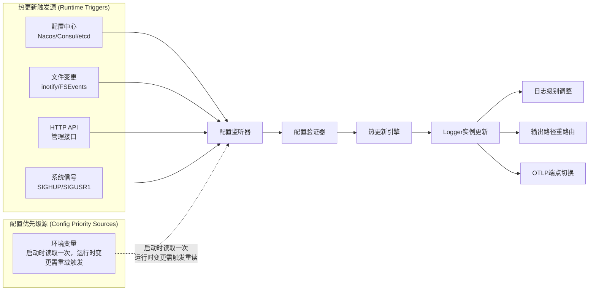

**核心能力**：

- **实时热更新触发**：支持配置中心订阅、文件监听、HTTP API、系统信号等多种实时触发方式
- **环境变量处理机制**：
  - **启动时**：环境变量被读取一次，作为最高优先级配置自动生效
  - **运行时**：环境变量不会自动重读，变更后需通过触发机制（信号/API）主动重新读取才生效
- **秒级生效**：配置变更3-5秒内生效，无需重启服务
- **安全验证**：配置变更前自动验证，避免无效配置导致服务异常
- **回滚机制**：配置更新失败时自动回滚到上一个有效配置
- **变更审计**：记录所有配置变更历史，支持故障排查和审计要求
- **智能回滚机制**：多层级回滚策略，确保配置安全和一致性

**🔧 技术实现说明**：

- **环境变量处理**：Go进程无法自动感知环境变量变更，需通过信号或API触发重新读取
- **容器环境**：Kubernetes `kubectl set env` 会触发Pod重启，属于冷更新范畴
- **触发机制**：环境变量变更后需要额外的触发步骤（如发送SIGHUP）来实现热更新

#### 🚨 动态配置多源冲突处理

**核心冲突场景覆盖**：

| 冲突场景 | 触发事件 | 决策策略 | 最终配置源 | 说明 |
|---------|-----------|-----------|-------------|------|
| **同时更新** | 环境变量 + API 同时变更 | **事件驱动优先** | 最后触发的事件 | 按时间戳排序，最新事件胜出 |
| **文件损坏** | 配置文件损坏 + 环境变量存在 | **环境变量兜底** | 环境变量 | 环境变量优先级最高，作为安全兜底 |
| **级联失效** | 多个配置源同时失效 | **级联回滚机制** | 系统默认配置 | 逐层回滚到最后可用配置 |
| **网络分区** | 配置中心连接断开 | **本地配置兜底** | 配置文件 | 网络问题时降级到本地配置 |

#### 🕐 时序处理机制

**关键问题**：API配置修改后几秒内文件监听也触发更新，最终以谁为准？

**时序冲突处理策略**：

| 场景 | 时间间隔 | 处理策略 | 决策依据 | 防抖机制 |
|------|----------|----------|----------|----------|
| **短时间连续更新** | < 3秒 | 以最后事件为准 | 时间戳最新 | 3秒防抖窗口 |
| **长时间间隔更新** | ≥ 3秒 | 正常优先级处理 | 配置源优先级 | 无防抖 |
| **完全同时更新** | 同一毫秒 | 按优先级顺序 | env > api > file | 优先级兜底 |

**防抖算法实现**：

```javascript
class ConfigUpdateDebouncer {
    constructor() {
        this.pendingUpdates = new Map()
        this.debounceWindow = 3000 // 3秒防抖窗口
        this.timers = new Map()
    }

    handleConfigUpdate(source, config, timestamp) {
        const key = this.getUpdateKey(config)

        // 1. 记录本次更新事件
        if (!this.pendingUpdates.has(key)) {
            this.pendingUpdates.set(key, [])
        }
        this.pendingUpdates.get(key).push({
            source, config, timestamp
        })

        // 2. 清除之前的防抖定时器
        if (this.timers.has(key)) {
            clearTimeout(this.timers.get(key))
        }

        // 3. 设置新的防抖定时器
        this.timers.set(key, setTimeout(() => {
            this.processQueuedUpdates(key)
        }, this.debounceWindow))

        logDebug(`Config update queued: ${source} at ${timestamp}, will process in ${this.debounceWindow}ms`)
    }

    processQueuedUpdates(key) {
        const events = this.pendingUpdates.get(key) || []
        if (events.length === 0) return

        logInfo(`Processing ${events.length} queued config updates for ${key}`)

        // 4. 按时间戳排序，以最后事件为准
        const sortedEvents = events.sort((a, b) => b.timestamp - a.timestamp)
        const winningEvent = sortedEvents[0]

        // 5. 检查是否需要优先级兜底（完全同时的情况）
        const sameTimestampEvents = events.filter(e => e.timestamp === winningEvent.timestamp)
        if (sameTimestampEvents.length > 1) {
            // 同一时间戳，按优先级排序
            const priorityOrder = { 'env': 3, 'api': 2, 'file': 1, 'config_center': 0 }
            const priorityWinner = sameTimestampEvents
                .sort((a, b) => (priorityOrder[b.source] || 0) - (priorityOrder[a.source] || 0))[0]

            logWarn(`Simultaneous updates detected, using priority-based winner: ${priorityWinner.source}`)
            this.applyConfig(priorityWinner)
        } else {
            logInfo(`Applying latest update: ${winningEvent.source} at ${winningEvent.timestamp}`)
            this.applyConfig(winningEvent)
        }

        // 6. 清理
        this.pendingUpdates.delete(key)
        this.timers.delete(key)
    }
}
```

**具体时序冲突示例**：

```bash
# 场景1：短时间连续更新（防抖生效）
14:30:00.100 - API配置更新: log.level = "debug"
14:30:01.200 - 文件监听触发: log.level = "info"
14:30:02.800 - 环境变量重载: LOG_LEVEL = "error"
# 决策：等待3秒防抖窗口，最终应用 LOG_LEVEL = "error"（最后+最高优先级）

# 场景2：长时间间隔更新（正常处理）
14:30:00.000 - API配置更新: log.level = "debug"
14:30:05.000 - 文件监听触发: log.level = "info"
# 决策：立即处理文件更新，应用 log.level = "info"

# 场景3：完全同时更新（优先级兜底）
14:30:00.123 - API: log.level = "debug"
14:30:00.123 - ENV: LOG_LEVEL = "error"
14:30:00.123 - FILE: log.level = "info"
# 决策：同一毫秒，按优先级 env > api > file，应用 LOG_LEVEL = "error"
```

**多源冲突决策算法**：

```javascript
function resolveMultiSourceConflict(events, currentTime) {
    // 1. 事件驱动优先：按时间戳排序
    const sortedEvents = events.sort((a, b) => b.timestamp - a.timestamp)
    const latestEvent = sortedEvents[0]

    logInfo(`Multi-source conflict detected: ${events.length} simultaneous events`)
    logInfo(`Latest event: ${latestEvent.source} at ${latestEvent.timestamp}`)

    // 2. 验证最新事件的配置源是否可用
    if (validateConfigSource(latestEvent.source, latestEvent.config)) {
        return {
            winner: latestEvent.source,
            config: latestEvent.config,
            reason: "event_driven_latest",
            timestamp: latestEvent.timestamp
        }
    }

    // 3. 最新配置源失效，按优先级查找可用源
    const priorityOrder = ['env', 'api', 'config_center', 'file', 'default']
    for (const source of priorityOrder) {
        const event = events.find(e => e.source === source)
        if (event && validateConfigSource(event.source, event.config)) {
            logWarn(`Fallback to ${source}: latest source ${latestEvent.source} invalid`)
            return {
                winner: event.source,
                config: event.config,
                reason: "fallback_to_valid_source",
                original_winner: latestEvent.source
            }
        }
    }

    // 4. 所有源都失效，启用安全默认配置
    return {
        winner: "default",
        config: getDefaultConfig(),
        reason: "all_sources_failed",
        failed_sources: events.map(e => e.source)
    }
}
```

**具体冲突解决示例**：

```bash
# 场景1：环境变量和API同时更新
timestamp: 2024-08-28T10:30:00Z - API: log.level = "error"
timestamp: 2024-08-28T10:30:01Z - ENV: LOG_LEVEL = "debug"

# 决策结果：环境变量胜出（事件时间更晚 + 优先级更高）
final_config: log.level = "debug"
reason: "event_driven_latest + env_priority"

# 场景2：配置文件损坏但环境变量存在
config_file_status: "corrupted"
env_var_LOG_LEVEL: "info"
env_var_LOG_FORMAT: "json"

# 回滚决策：环境变量作为安全兜底
rollback_chain:
  1. config_file: failed (corrupted)
  2. env_variables: success (available)
final_config: {level: "info", format: "json"}

# 场景3：配置中心网络分区
nacos_status: "connection_timeout"
file_config_available: true
env_override: {LOG_OTLP_ENABLED: "false"}

# 决策：本地配置 + 环境变量覆盖
effective_config:
  source_order: ["env_override", "local_file", "default"]
  final: {level: "info", otlp: {enabled: false}}
```

**冲突监控和审计**：

```json
{
  "timestamp": "2024-08-28T10:30:15Z",
  "event": "multi_source_conflict_resolved",
  "conflict_sources": ["env_var", "http_api"],
  "winner": "env_var",
  "reason": "event_driven_latest",
  "resolution_time_ms": 12,
  "config_before": {"log.level": "error"},
  "config_after": {"log.level": "debug"},
  "conflict_events": [
    {"source": "http_api", "timestamp": "2024-08-28T10:30:00Z"},
    {"source": "env_var", "timestamp": "2024-08-28T10:30:01Z"}
  ]
}
```

### 🔄 动态配置回滚机制

支持多层级智能回滚，确保配置变更的安全性和一致性：

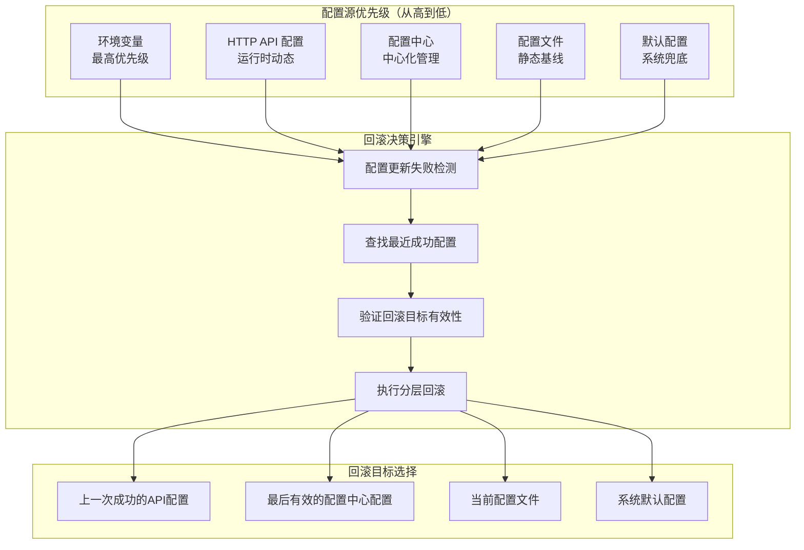

#### 回滚优先级规则

**🏆 回滚目标优先级（从高到低）**：

1. **上一次成功的 API 配置**：运行时通过 HTTP API 设置的有效配置
2. **最后有效的配置中心配置**：来自 Nacos/Consul/etcd 的中心化配置
3. **当前配置文件配置**：启动时读取的 YAML 配置文件
4. **系统默认配置**：代码中的安全默认值

**📋 回滚决策明确规则**：

- **API 配置失败** → 回滚到**上一次成功的 API 配置**，不是配置文件
- **配置中心失败** → 回滚到**最后有效的配置中心配置**，然后是配置文件
- **配置文件失败** → 回滚到**系统默认配置**
- **环境变量永远保持最高优先级**，即使在回滚状态下仍然覆盖回滚结果

**🎯 核心原则**：
- 回滚目标基于**失败的配置源**确定
- 回滚后**环境变量覆盖仍然生效**
- 如果目标配置源的历史记录也失效，则**级联向下查找**

#### 回滚决策逻辑

```
// 回滚决策算法
function rollback(failedConfig, rollbackType) {
    // 第一层：根据回滚类型和失败原因决策
    if rollbackType == "AUTO" {
        // 自动回滚：失败时立即回滚到上一个稳定配置
        target = findLastStableConfig()
    } else if rollbackType == "MANUAL" {
        // 手动回滚：用户指定时间点或版本
        target = findConfigByTimestamp(timestamp)
    }

    // 第二层：验证回滚目标有效性
    if !validateConfig(target) {
        // 目标配置无效，继续向下查找
        target = fallbackToNext(target)
    }

    // 第三层：环境变量覆盖检查
    if hasEnvironmentOverride() {
        // 环境变量仍然是最高优先级，即使在回滚时
        applyEnvironmentOverrides(target)
    }

    return target
}

function findLastStableConfig() {
    // 按优先级查找最近的稳定配置
    candidates = [
        getLastSuccessfulAPIConfig(),     // API 配置
        getLastValidCenterConfig(),       // 配置中心
        getCurrentFileConfig(),           // 配置文件
        getSystemDefaultConfig()          // 系统默认
    ]

    for config in candidates {
        if validateConfig(config) && !isFailedBefore(config) {
            return config
        }
    }

    return getSystemDefaultConfig()  // 最终兜底
}
```

#### 🚨 回滚触发标准与错误类型区分

**核心问题**：什么样的错误算"配置失败"需要触发回滚？

| 错误类型 | 典型场景 | 触发回滚 | 处理策略 | 理由 |
|---------|----------|----------|----------|------|
| **配置解析错误** | YAML语法错误、字段类型错误 | ✅ **立即回滚** | 回滚到上一稳定配置 | 配置本身不可用 |
| **配置验证错误** | 无效日志级别、端点格式错误 | ✅ **立即回滚** | 回滚+错误日志 | 配置逻辑错误 |
| **初始化失败** | 文件系统权限、端口占用 | ✅ **立即回滚** | 回滚到安全配置 | 系统环境问题 |
| **运行时连接错误** | OTLP端点DNS解析失败 | ❌ **不回滚** | 记录错误+重试 | 网络临时问题 |
| **运行时传输错误** | OTLP发送超时、网络断开 | ❌ **不回滚** | 降级+缓存+重试 | 外部服务问题 |
| **性能异常** | 文件写入慢、内存使用高 | ❌ **不回滚** | 监控告警+调整 | 需要人工决策 |

**详细错误检测算法**：

```javascript
function detectConfigFailureType(config, error) {
    // 1. 配置解析错误（立即回滚）
    if (error.type === 'PARSE_ERROR') {
        return {
            shouldRollback: true,
            severity: 'CRITICAL',
            reason: 'config_parse_failed',
            action: 'immediate_rollback',
            message: `Configuration parsing failed: ${error.message}`
        }
    }

    // 2. 配置验证错误（立即回滚）
    if (error.type === 'VALIDATION_ERROR') {
        return {
            shouldRollback: true,
            severity: 'HIGH',
            reason: 'config_validation_failed',
            action: 'immediate_rollback',
            message: `Invalid configuration: ${error.field} = ${error.value}`
        }
    }

    // 3. 系统初始化失败（立即回滚）
    if (error.type === 'INITIALIZATION_ERROR') {
        return {
            shouldRollback: true,
            severity: 'HIGH',
            reason: 'system_initialization_failed',
            action: 'rollback_to_safe_config',
            message: `System initialization failed: ${error.message}`
        }
    }

    // 4. 运行时连接错误（不回滚）
    if (error.type === 'CONNECTION_ERROR') {
        return {
            shouldRollback: false,
            severity: 'MEDIUM',
            reason: 'runtime_connection_failed',
            action: 'retry_with_backoff',
            message: `Connection failed, will retry: ${error.endpoint}`
        }
    }

    // 5. 运行时传输错误（不回滚）
    if (error.type === 'TRANSPORT_ERROR') {
        return {
            shouldRollback: false,
            severity: 'LOW',
            reason: 'transport_error',
            action: 'graceful_degradation',
            message: `Transport error, using fallback: ${error.message}`
        }
    }
}
```

**具体场景错误处理**：

```yaml
# 场景1：配置解析错误 → 立即回滚
# 错误配置
log:
  level: invalid_level    # ❌ 无效值
  otlp-endpoint: ":::"    # ❌ 无效URL格式

# 检测结果：
error_type: VALIDATION_ERROR
should_rollback: true
action: 回滚到上一次成功的配置

# 场景2：OTLP连接错误 → 不回滚，继续运行
log:
  level: "debug"           # ✅ 配置有效
  otlp-endpoint: "nonexistent.host:4327"  # ❌ DNS解析失败

# 检测结果：
error_type: CONNECTION_ERROR
should_rollback: false
action: 记录错误，定期重试，其他日志输出正常

# 场景3：文件权限错误 → 立即回滚
log:
  output-paths: ["/root/app.log"]  # ❌ 权限不足

# 检测结果：
error_type: INITIALIZATION_ERROR
should_rollback: true
action: 回滚到仅控制台输出的安全配置
```

**回滚决策流程图**：

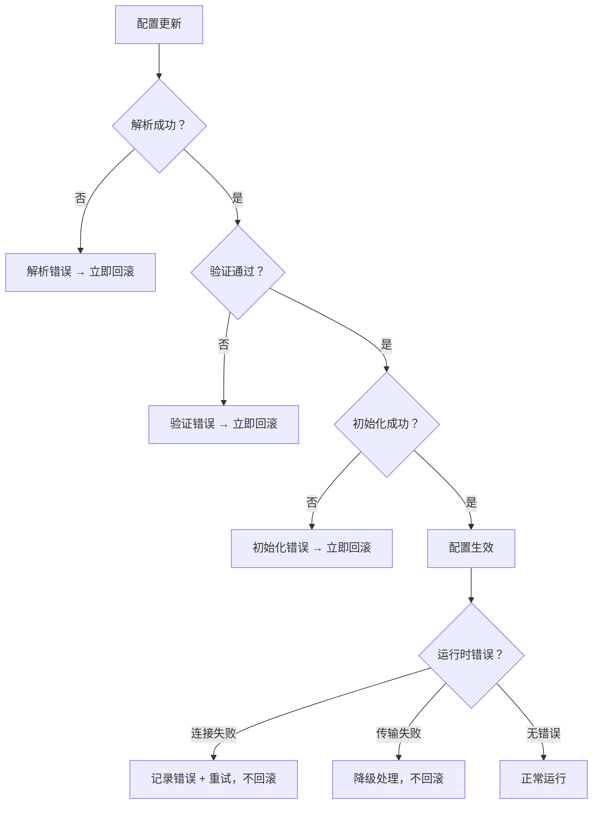

**错误恢复策略**：

| 恢复机制 | 适用错误类型 | 恢复时间 | 示例 |
|---------|-------------|----------|------|
| **立即回滚** | 解析/验证/初始化错误 | < 1秒 | 配置语法错误 → 回滚到上一版本 |
| **指数退避重试** | 连接错误 | 1s, 2s, 4s, 8s... | DNS解析失败 → 每隔一段时间重试 |
| **优雅降级** | 传输错误 | 立即 | OTLP发送失败 → 回退到文件日志 |
| **熔断机制** | 持续失败 | 5分钟内 | 连续失败5次 → 暂停该输出10分钟 |

#### 具体回滚场景

**场景1：API 配置失败回滚**

```bash
# 1. 初始状态：文件配置生效
log.level = "info" (from config.yaml)

# 2. API 动态调整
curl -X POST /admin/config -d '{"log.level": "debug"}'
# 成功：log.level = "debug" (from API)

# 3. API 再次调整（失败配置）
curl -X POST /admin/config -d '{"log.level": "invalid_level"}'
# 失败：配置验证不通过

# 4. 自动回滚结果
log.level = "debug"  # 回滚到上一次成功的API配置
```

**场景2：环境变量覆盖下的回滚**

```bash
# 1. 环境变量设置
export LOG_OTLP_ENABLED="false"

# 2. API 尝试启用 OTLP（冲突）
curl -X POST /admin/config -d '{"log.otlp-endpoint": "127.0.0.1:4327"}'

# 3. 回滚决策：环境变量优先级最高
# 回滚后仍然 OTLP disabled（环境变量覆盖）
OTLP.Enabled = false  # 环境变量始终最高优先级
```

**场景4：多层配置覆盖的回滚优先级**

```bash
# 初始状态层级：
# 1. 配置文件：log.level = "info"
# 2. API 配置：log.level = "debug"（成功）
# 3. 环境变量：LOG_LEVEL = "warn"（最高优先级覆盖）

# 当前生效配置：log.level = "warn"（环境变量）

# 新的 API 配置失败：
curl -X POST /admin/config -d '{"log.level": "invalid_level"}'

# 回滚决策逻辑：
# 1. 失败配置源：API
# 2. 查找上一次成功的 API 配置：log.level = "debug"
# 3. 应用环境变量覆盖：LOG_LEVEL = "warn"
# 4. 最终结果：log.level = "warn"

# 关键原则：
# - 回滚目标是上一次成功的 API 配置（debug）
# - 但环境变量覆盖仍然生效（warn）
# - 回滚不影响环境变量的优先级地位
```

**场景3：多层失效的级联回滚**

```bash
# 回滚链：API失败 → 配置中心失效 → 配置文件 → 默认配置
1. API配置失败：验证不通过
2. 尝试配置中心：连接超时
3. 尝试配置文件：损坏或缺失
4. 最终兜底：使用系统默认配置

# 结果：确保服务始终有有效配置运行
```

#### 回滚API接口

```bash
# 自动回滚（失败时立即触发）
# 系统自动执行，无需用户干预

# 手动回滚到指定时间点
curl -X POST http://app:8080/admin/config/rollback \
  -d '{"timestamp": "2024-08-28T14:29:00Z"}'

# 手动回滚到上一个稳定配置
curl -X POST http://app:8080/admin/config/rollback \
  -d '{"type": "last_stable"}'

# 回滚到特定配置源
curl -X POST http://app:8080/admin/config/rollback \
  -d '{"source": "file"}'  # 强制回滚到配置文件

# 查看可回滚的配置历史
curl -X GET http://app:8080/admin/config/history
```

#### 回滚审计和监控

**配置变更审计示例**：

```json
{
  "timestamp": "2024-08-28T14:30:00Z",
  "operation": "rollback",
  "trigger": "auto",
  "reason": "config_validation_failed",
  "source_before": "api",
  "source_after": "api_previous",
  "config_before": {"log.level": "invalid_level"},
  "config_after": {"log.level": "debug"},
  "operator": "system_auto",
  "success": true,
  "rollback_chain": [
    {"target": "api_previous", "status": "success"},
    {"target": "center_config", "status": "skipped"},
    {"target": "file_config", "status": "not_needed"}
  ]
}
```

**🎯 回滚机制核心价值**：

- **配置安全**：任何配置变更失败都有明确的回滚路径
- **服务连续性**：确保服务始终有有效配置运行
- **操作透明**：完整的回滚决策过程审计
- **灵活控制**：支持自动和手动回滚两种模式
- **优先级一致**：回滚后仍然遵循环境变量最高优先级规则

### 预设配置模式

针对不同使用场景提供预设配置：

```mermaid
graph TB
    A[用户场景] --> B[开发环境]
    A --> C[生产环境]
    A --> D[测试环境]
    A --> E[可观测性]

    B --> B1[控制台输出<br/>debug级别<br/>详细信息<br/>🔄 支持格式切换]
    C --> C1[JSON格式<br/>文件输出<br/>性能优化]
    D --> D1[简化输出<br/>仅错误级别<br/>无文件写入]
    E --> E1[结构化JSON<br/>OTLP优先<br/>服务信息自动注入]

    B1 --> B2[console-format: \"pretty\"<br/>彩色易读格式]
    B1 --> B3[console-format: \"json\"<br/>结构化可分析格式]
```

## 🎨 用户体验设计

### 配置方式分层

为不同技能水平的用户提供不同的配置复杂度：

```mermaid
pyramid
    title 配置复杂度金字塔
    "简单场景" : 70
    "中等场景" : 20
    "复杂场景" : 10
```

#### 🟢 简单场景（70% 用户）

**目标**：一行配置启用 OTLP

```yaml
log:
  otlp-endpoint: "127.0.0.1:4327"  # 一行搞定
```

**用户收益**：

- 零学习成本
- 配置不会出错
- 立即可用

#### 🟡 中等场景（20% 用户）

**目标**：预设 + 少量自定义

```yaml
# 基础场景：可观测性预设 + 自定义级别
log:
  preset: "observability"
  level: "debug"                     # 覆盖预设
  otlp-endpoint: "127.0.0.1:4327"

# 开发调试场景：开发预设 + 控制台格式切换
log:
  preset: "development"
  level: "debug"
  console-format: "json"             # 覆盖预设，使用JSON格式便于分析
  log-dir: "logs"                    # 同时保留文件输出
```

**用户收益**：

- 预设解决大部分需求
- 仅需调整关键参数
- 配置意图清晰
- **控制台格式灵活**：可在易读性和分析能力之间选择

#### 🔴 复杂场景（10% 用户）

**目标**：完全自定义控制，包括文件轮转策略

```yaml
log:
  type: "zap"
  level: "info"
  format: "json"
  log-dir: "/var/log/app"

  # 文件轮转策略配置
  file-rotation:
    max-size-mb: 100        # 单文件最大100MB
    max-backups: 7          # 最多保留7个历史文件
    max-age-days: 30        # 历史文件保留30天
    compress: true          # 自动压缩历史文件
    local-time: true        # 使用本地时区命名

  # OTLP 高级配置
  otlp:
    endpoint: "127.0.0.1:4327"
    protocol: "grpc"
    timeout: "10s"
    batch_size: 500
    headers:
      x-api-key: "secret"
      x-tenant-id: "production"
```

**用户收益**：

- 完全控制所有选项
- 满足特殊需求
- 企业级功能完整
- 生产级日志轮转和归档管理

#### 🚨 预设模式与自定义配置冲突处理

**核心冲突解决规则**（避免理解歧义）：

| 场景 | preset默认值 | 用户配置 | 最终结果 | 决策依据 | 说明 |
|------|-------------|----------|----------|----------|------|
| **显式覆盖** | `log-dir: "/var/log"` | `log-dir: "logs"` | `"logs"` | 用户意图优先 | 非空字符串视为显式覆盖 |
| **显式清空** | `log-dir: "/var/log"` | `log-dir: ""` | `""` (禁用文件输出) | 用户意图优先 | 空字符串视为显式禁用 |
| **未显式设置** | `log-dir: "/var/log"` | 配置中无此字段 | `"/var/log"` | preset默认值 | 未配置使用预设默认 |
| **null/undefined** | `log-dir: "/var/log"` | `log-dir: null` | `"/var/log"` | preset默认值 | null视为未配置 |

**详细处理算法**：

```javascript
function resolvePresetUserConflict(presetConfig, userConfig, fieldName) {
    const presetValue = presetConfig[fieldName]
    const userValue = userConfig[fieldName]

    // 1. 用户未设置此字段 → 使用preset默认值
    if (userValue === undefined || userValue === null) {
        return {
            value: presetValue,
            reason: "use_preset_default",
            source: "preset"
        }
    }

    // 2. 用户显式设置了值（包括空字符串）→ 用户意图优先
    if (typeof userValue === 'string' || typeof userValue !== 'undefined') {
        return {
            value: userValue,
            reason: userValue === "" ? "explicit_disable" : "explicit_override",
            source: "user_explicit"
        }
    }

    // 3. 兜底：使用preset默认值
    return {
        value: presetValue,
        reason: "fallback_to_preset",
        source: "preset"
    }
}
```

**具体冲突解决示例**：

```yaml
# 场景1：用户显式清空文件输出（明确意图：禁用文件输出）
preset: "production"  # 默认 log-dir: "/var/log/app"
log-dir: ""           # 用户显式清空
# 最终结果：禁用文件输出，仅输出到控制台/OTLP
# 决策：用户意图优先，空字符串 = 禁用文件输出

# 场景2：用户部分覆盖（明确意图：修改默认路径）
preset: "production"  # 默认 log-dir: "/var/log/app", console-format: "json"
log-dir: "logs/custom" # 用户自定义路径
# 未设置 console-format
# 最终结果：log-dir: "logs/custom", console-format: "json"
# 决策：显式设置的字段用用户值，未设置的用preset默认值

# 场景3：用户未设置目录（使用默认）
preset: "production"  # 默认 log-dir: "/var/log/app"
level: "debug"        # 仅覆盖级别
# 未设置 log-dir
# 最终结果：log-dir: "/var/log/app", level: "debug"
# 决策：未设置字段使用preset默认值
```

**字段级别覆盖优先级**：

| 优先级 | 配置源 | 适用场景 | 覆盖范围 |
|--------|--------|----------|----------|
| **1** | 环境变量 | 部署时覆盖 | 单个字段级别 |
| **2** | 用户显式配置 | 用户明确意图 | 单个字段级别 |
| **3** | preset默认值 | 场景化配置 | 完整配置模板 |
| **4** | 系统默认值 | 兜底保证 | 全局默认值 |

**特殊字段处理规则**：

```yaml
# 数组字段合并规则
preset_config:
  output-paths: ["stdout", "/var/log/app.log"]
user_config:
  output-paths: ["stderr"]  # 用户显式设置
# 结果：完全替换为 ["stderr"]，不进行合并

# 对象字段合并规则
preset_config:
  file-rotation:
    max-size-mb: 100
    max-age-days: 30
user_config:
  file-rotation:
    max-size-mb: 200  # 仅覆盖size，age保持preset值
# 结果：max-size-mb: 200, max-age-days: 30（字段级别合并）
```

### 配置发现路径

设计用户从简单到复杂的自然学习路径：

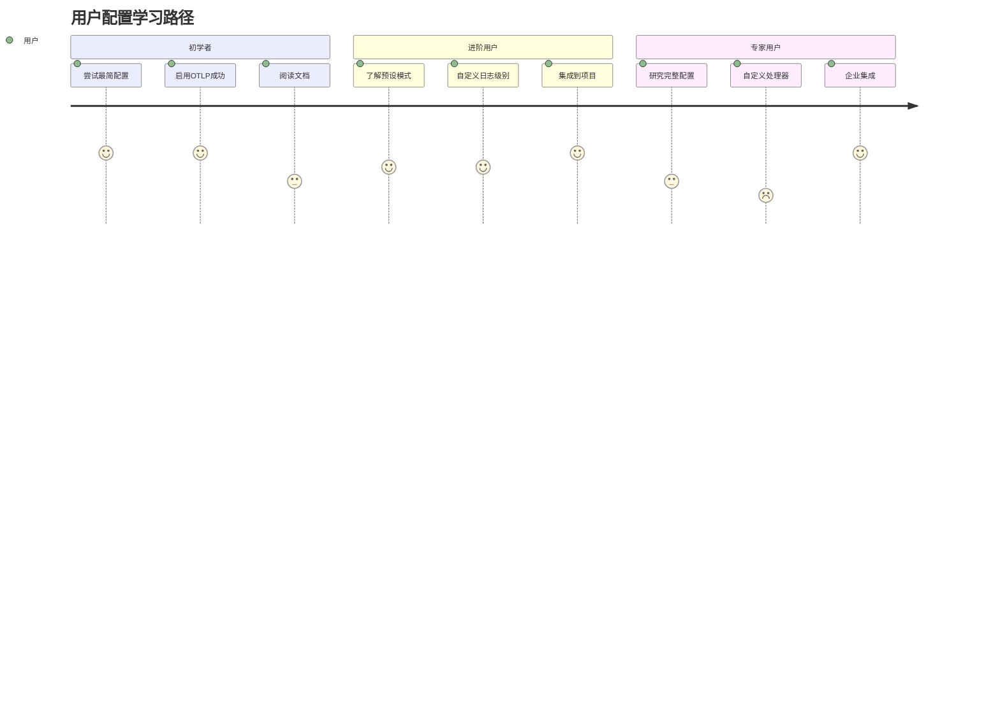

## 🏗️ 系统架构总览

> **📐 架构说明**：下图展示了 Logger 包的**完整数据处理流程**，从配置输入到最终日志输出的六层架构设计

### 整体架构图

Logger包的完整架构，展示从配置输入到日志输出的全流程：

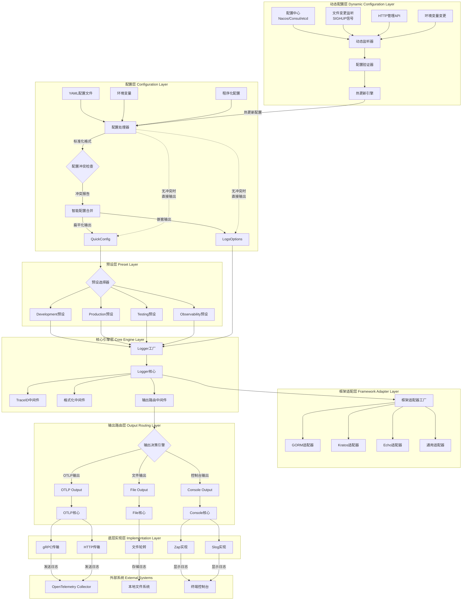

### 核心组件职责

#### 0. 动态配置层 (Dynamic Configuration Layer)

- **动态监听器**: 监听多种配置源的实时变更
  - 配置中心订阅（Nacos、Consul、etcd 等）
  - 文件系统监听（inotify、FSEvents）
  - HTTP API 接口调用
  - 系统信号处理（SIGHUP、SIGUSR1 等）
  - **环境变量重读机制**：响应信号或API触发，重新读取当前进程环境变量
- **配置验证器**: 对新配置进行完整性和正确性验证
  - 配置格式语法检查
  - 配置字段有效性验证（端点可达性、权限检查等）
  - 配置逻辑一致性检查（避免冲突配置）
  - 配置安全性验证（敏感信息检查、权限验证）
- **热更新引擎**: 管理配置的安全更新和回滚
  - 配置变更的原子性更新
  - 更新失败时的自动回滚机制
  - 配置变更历史记录和审计
  - 渐进式更新策略（蓝绿部署配置）

#### 1. 配置层 (Configuration Layer)

- **配置处理器**: 负责配置源的解析和标准化
  - 解析YAML配置文件
  - 解析环境变量
  - 接收程序化配置
  - 将所有配置统一为内部标准格式
- **配置冲突检查**: 检测配置项之间的语义冲突
  - 检测扁平化配置与嵌套配置的冲突
  - 标识互斥配置项
  - 生成冲突报告
- **智能配置合并**: 执行配置合并策略和优先级规则
  - 应用扁平化配置优先原则
  - 合并兼容的配置字段
  - 生成最终的统一配置对象

### 配置层处理流程

> **⚙️ 流程说明**：此图展示**配置层内部处理机制**，解释了配置冲突处理、智能输出控制等功能在架构中的具体位置

为了更清晰地展示配置层各组件的职责边界和数据流，下图详细说明了配置处理的完整流程：

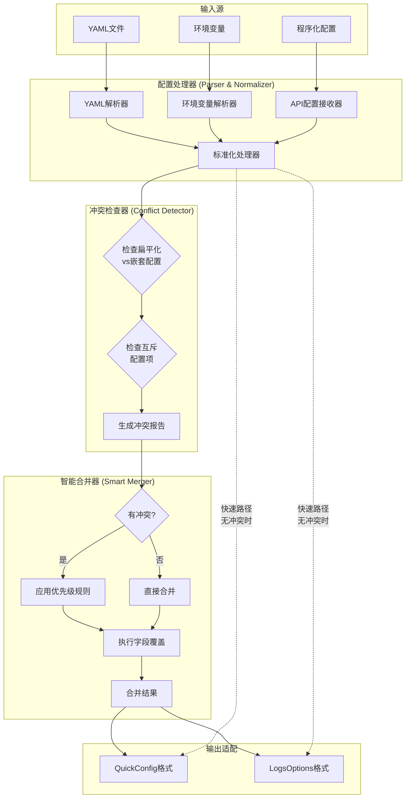

**职责边界说明**：

1. **配置处理器**: 纯粹的解析和标准化，不涉及业务逻辑
2. **冲突检查器**: 专注于检测，不做任何修改或合并
3. **智能合并器**: 专注于合并策略，基于冲突报告执行合并逻辑
4. **快速路径**: 无冲突时跳过合并步骤，提高性能

#### 2. 预设层 (Preset Layer)

- **预设选择器**: 根据preset字段选择对应的预定义配置
- **环境预设**: 为不同环境(开发/生产/测试/可观测性)提供最佳配置

#### 3. 核心引擎层 (Core Engine Layer)

- **Logger工厂**: 根据配置创建Logger实例
- **Logger核心**: 实现Logger接口，管理中间件链
- **中间件链**: TraceID注入、格式化、输出路由

#### 4. 框架适配层 (Framework Adapter Layer)

- **适配器工厂**: 创建框架特定的适配器
- **框架适配器**: 将Logger核心适配到各种Go框架接口

#### 5. 输出路由层 (Output Routing Layer)

- **输出决策引擎**: 根据配置智能决定输出路径
- **多路输出**: 支持控制台、文件、OTLP同时输出

#### 6. 底层实现层 (Implementation Layer)

- **日志引擎**: Zap、Slog等底层日志实现
- **传输协议**: gRPC、HTTP等网络传输
- **存储机制**: 文件轮转、缓冲等存储优化

### 数据流向

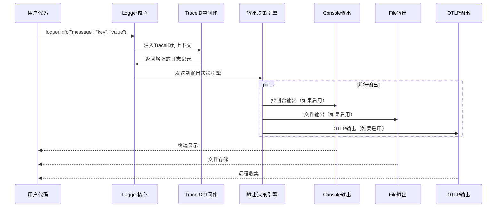

## 🚀 功能特性

### 核心特性

#### 1. 智能OTLP检测

- **自动启用**：设置端点地址即自动启用OTLP
- **默认优化**：自动设置协议、超时、批处理等默认值
- **服务信息注入**：自动注入服务名、版本、分支等信息

#### 2. 多种配置方式

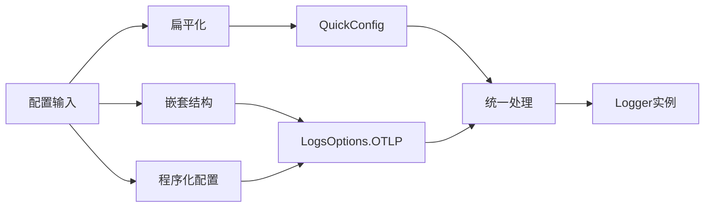

#### 3. 智能输出控制

> **🔍 重要说明**：此处的"智能控制"指的是**输出路径选择策略**，与后面的"配置冲突处理"属于不同处理层面

> **⚠️ 适用条件限制**：智能输出控制**仅适用于已经启用的功能**。如果某个功能（如OTLP）在配置冲突处理阶段被禁用，则该功能不会参与智能输出控制的路径选择，无论其端点配置如何。

基于配置智能决策输出路径，**尊重用户明确配置**：

| OTLP端点 | 日志目录 | 预设模式 | 输出策略 | 💡 说明 |
|----------|----------|----------|----------|---------|
| ✅ 已配置 | ✅ 已配置 | 非Testing | 控制台+文件+OTLP（全输出）| **用户意图优先** - 两者都配置则都启用 |
| ✅ 已配置 | ❌ 未配置 | 非Testing | 控制台+OTLP（OTLP优先） | 用户未设置文件输出，跳过文件写入 |
| ❌ 未配置 | ✅ 已配置 | 非Testing | 控制台+文件 | 传统文件日志模式 |
| ❌ 未配置 | ❌ 未配置 | 任意 | 仅控制台 | 最简配置 |
| 任意 | 任意 | Testing | 仅控制台（测试简化） | 测试模式强制简化输出 |

**🎯 设计原则**：

- **用户意图优先**：明确配置 `log-dir` 表示用户需要文件输出
- **不互斥**：OTLP 和文件输出可以同时启用
- **智能默认**：未配置时才应用智能规则
- **避免数据丢失**：不因启用某功能而丢失其他输出

**⚠️ 重要澄清**：上表**仅适用于功能已启用**的情况。如果用户在配置冲突处理阶段明确禁用某个功能（如`otlp.enabled: false`），则该功能完全不参与智能输出控制，系统会跳过该输出路径，无论其端点配置如何。

**处理流程顺序**：
```
1. [配置冲突处理] 首先决定每个功能是否启用 (enabled: false → OTLP禁用)
2. [智能输出控制] 然后仅针对已启用的功能决定输出路径
   注意：被禁用的功能不会进入此阶段，无论其配置如何
```

**易混淆场景示例**：
```yaml
# 配置示例：用户明确禁用OTLP
log:
  otlp:
    enabled: false              # ❌ 明确禁用
    endpoint: "127.0.0.1:4327"  # ✅ 有端点配置
  log-dir: "logs"              # ✅ 有文件配置

# 处理过程：
# 第1层 [配置冲突处理]: OTLP功能禁用 (enabled: false优先)
# 第2层 [智能输出控制]: 仅处理已启用功能 → 控制台+文件
# 最终输出: 控制台+文件 (OTLP被跳过，尽管有endpoint配置)
```

#### 4. 链路跟踪集成

自动提取并记录分布式链路跟踪信息：


**核心特性**：

- **零配置启用**：默认自动启用，无需任何配置
- **智能检测**：自动检测多种 TraceID 格式（OpenTelemetry, Jaeger, Zipkin 等）
- **自动提取**：从 HTTP Header (`traceparent`, `x-trace-id`) 和 gRPC Metadata 自动提取
- **默认字段**：使用标准字段名 `trace_id`, `span_id`（可选配置覆盖）
- **上下文传递**：通过 context.Context 在整个请求生命周期传递
- **性能优化**：零拷贝的 TraceID 注入机制

#### 5. 动态配置管理

支持生产环境运行时配置热更新，提供企业级的配置管理能力：

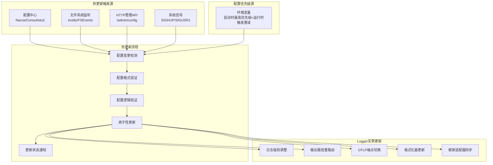

**核心特性**：

- **实时触发源**：支持配置中心、文件系统、HTTP API、系统信号等多种配置变更触发方式
- **环境变量处理机制**：
  - **启动时**：环境变量被读取一次，作为最高优先级配置生效
  - **运行时**：环境变量不会自动重读，变更后需通过信号/API主动触发重新读取（非自动检测）
- **秒级生效**：配置变更3-5秒内生效，无需重启服务
- **安全验证**：配置变更前进行格式、逻辑、安全性的多层验证
- **原子更新**：确保配置更新的原子性，避免中间状态
- **自动回滚**：配置更新失败时自动回滚到上一个稳定版本
- **变更审计**：记录所有配置变更的时间、操作者、变更内容和原因
- **渐进更新**：支持蓝绿部署模式的配置更新策略
- **全局同步**：所有Logger实例和框架适配器自动同步最新配置
- **智能回滚**：多层级回滚优先级，环境变量覆盖在回滚时仍然生效

**🔧 环境变量热更新机制**：

由于Go进程无法自动感知外部环境变量变更，实现需要结合触发机制：

```bash
# 1. 容器环境：修改环境变量后发送信号
export NEW_LOG_LEVEL="debug"
kill -HUP $PID    # 触发配置重载，此时读取新的环境变量

# 2. HTTP API触发：修改环境变量后调用API
export NEW_LOG_LEVEL="debug"
curl -X POST http://app:8080/admin/config/reload  # 触发重读环境变量

# 3. Kubernetes环境：ConfigMap/Secret变更 + 信号
kubectl create configmap app-config --from-literal=LOG_LEVEL=debug
kubectl rollout restart deployment/app  # 或发送信号给Pod
```

#### 6. 文件轮转管理

提供企业级的日志文件轮转和归档管理功能，自动处理大容量生产日志：

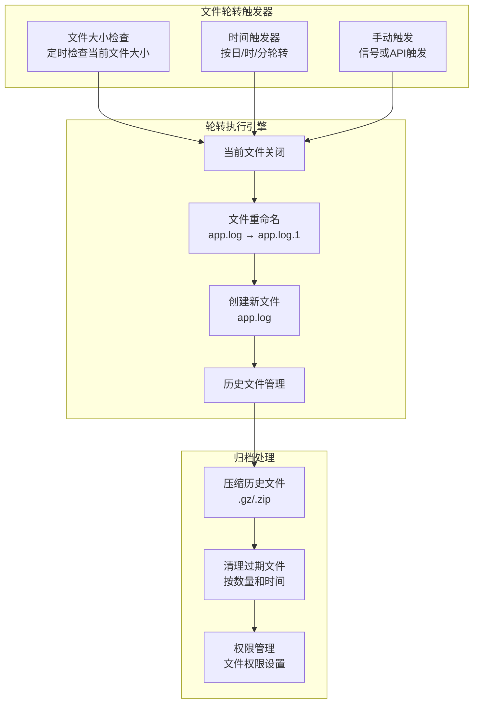

**核心特性**：

- **多触发方式**：支持按文件大小、时间间隔、手动触发等多种轮转方式
- **智能命名**：自动生成带时间戳或序号的历史文件名
- **无缝切换**：轮转过程中日志写入零中断，保证服务连续性
- **压缩归档**：历史文件自动压缩，节省存储空间
- **清理策略**：支持按文件数量和保存天数的自动清理策略
- **权限管理**：自动设置合理的文件权限，确保安全性
- **跨平台**：兼容Linux、macOS、Windows等操作系统
- **动态调整**：支持运行时动态修改轮转策略

**配置灵活性**：

#### 📋 文件轮转语义明确定义

**关键边界值语义**（避免理解歧义）：

| 配置字段 | 值 | 语义 | 行为 | 使用场景 |
|----------|----|----|------|----------|
| `max-size-mb` | `> 0` | 按大小轮转 | 大于等于阈值即轮转 | 标准轮转 |
| `max-size-mb` | `0` | 禁用大小轮转 | 永远不按大小轮转 | 仅按时间轮转 |
| `max-backups` | `> 0` | 限制备份数量 | 保留指定数量的备份文件 | 标准清理 |
| `max-backups` | `0` | 不限制数量 | 永远不按数量清理 | 仅按时间清理 |
| `max-age-days` | `> 0` | 按时间清理 | 超过天数的文件被清理 | 标准清理 |
| `max-age-days` | `0` | 立即清理 | 启动时清理所有历史文件 | 测试环境/快速清理 |
| `max-age-days` | `-1` | 禁用时间清理 | 永远不按时间清理 | 长期归档 |

**⚠️ 关键语义澄清**：

| 字段 | 值=0的含义 | ⚠️ 常见误解 | ✅ 正确理解 | 示例行为 |
|------|-----------|------------|------------|----------|
| `max-backups: 0` | **不限制备份数量** | 禁用备份 | 允许无限备份文件 | 可能产生 app.log.1, app.log.2, ... app.log.999 等无数文件 |
| `max-age-days: 0` | **立即清理历史** | 禁用时间清理 | 启动时删除所有`.log.*`历史文件 | 启动后仅保留当前活动日志文件 |
| `max-size-mb: 0` | **禁用大小轮转** | 不限制大小 | 永远不因文件大小触发轮转 | 文件可能增长到GB级别 |

**多条件触发规则**：

| 大小条件 | 时间条件 | 数量条件 | 触发规则 | 说明 |
|---------|---------|---------|---------|------|
| 启用 | 启用 | 启用 | **任一条件满足即触发** | 最严格策略，任何限制达到都轮转 |
| 启用 | 禁用 | 启用 | 大小或数量满足即触发 | 忽略时间因素 |
| 禁用 | 启用 | 禁用 | 仅时间满足触发 | 定期轮转，不考虑大小 |
| 禁用 | 禁用 | 禁用 | **永不轮转** | ⚠️ 危险配置，文件无限增长 |

**边界值组合示例**：

```yaml
# 示例1：仅按时间清理，不限制数量和大小（常用于日志归档）
file-rotation:
  max-size-mb: 0      # 禁用大小轮转
  max-backups: 0      # 不限制备份数量（可能产生大量文件）
  max-age-days: 30    # 30天后自动清理
# 行为：文件可能很大，可能有很多个，但30天后会被清理

# 示例2：仅按数量清理，不限制大小和时间（常用于测试环境）
file-rotation:
  max-size-mb: 0      # 禁用大小轮转
  max-backups: 5      # 最多保留5个备份
  max-age-days: -1    # 禁用时间清理
# 行为：保持最新的5个文件，旧文件被删除，但文件可能很大

# 示例3：立即清理模式（常用于临时环境）
file-rotation:
  max-size-mb: 100    # 100MB轮转
  max-backups: 1      # 最多1个备份
  max-age-days: 0     # 立即清理历史文件
# 行为：启动时删除所有历史文件，运行时保持当前+最新1个备份
```

```yaml
# 基础轮转配置
file-rotation:
  max-size-mb: 100          # 按大小轮转（推荐生产环境）
  max-backups: 10           # 保留文件数量
  max-age-days: 30          # 保留天数（任一条件满足即触发）
  compress: true            # 启用压缩

# 高级轮转配置
file-rotation:
  max-size-mb: 500          # 大文件轮转
  max-backups: 0            # 不限制备份数量（仅按时间清理）
  max-age-days: 365         # 保留一年
  compress: true
  local-time: false         # 使用UTC时区
  compress-level: 6         # 压缩级别 (1-9)
  filename-pattern: "app-%Y%m%d-%H%M%S.log"  # 自定义文件名模式

# 特殊配置示例
file-rotation:
  max-size-mb: 0            # 禁用大小轮转
  max-backups: 0            # 不限制数量
  max-age-days: 7           # 仅按7天清理（仅时间条件）

file-rotation:
  max-size-mb: 100          # 按大小轮转
  max-backups: 5            # 最多5个备份
  max-age-days: -1          # 禁用时间清理（永久保留，直到数量超限）
```

#### 🚨 文件轮转边界情况处理

**核心边界情况覆盖**：

| 场景 | 配置值 | 触发条件 | 处理逻辑 | 行为说明 |
|------|--------|----------|----------|----------|
| **大小阈值边界** | `max-size-mb: 100` | 文件大小 = 100MB | **大于等于即轮转** | 到达阈值立即轮转，避免超限 |
| **禁用时间清理** | `max-age-days: 0` | 启动/定时检查 | **立即清理所有历史文件** | 0表示不保留任何历史 |
| **仅大小轮转** | `max-age-days: -1` | 忽略时间条件 | **仅按大小轮转** | -1表示禁用时间清理 |
| **多进程冲突** | 多进程同时写入 | 文件锁竞争 | **⚠️ 默认不安全** | 内置轮转默认不支持多进程，需要协调机制或外部管理 |

**边界处理详细算法**：

```javascript
function handleRotationBoundary(currentSize, maxSizeMB, maxAgeDays, fileCreatedTime) {
    // 1. 大小边界检查（大于等于即轮转）
    if (currentSize >= (maxSizeMB * 1024 * 1024)) {
        logInfo(`File rotation triggered: size ${currentSize}B >= ${maxSizeMB}MB`)
        return { action: "rotate", reason: "size_limit_reached" }
    }

    // 2. 时间边界检查
    if (maxAgeDays === 0) {
        // 0 = 立即清理所有历史文件
        logInfo("Immediate cleanup triggered: max-age-days=0")
        return { action: "cleanup_all", reason: "immediate_cleanup" }
    }

    if (maxAgeDays > 0) {
        const ageDays = calculateFileAgeDays(fileCreatedTime, maxAgeDays)
        if (ageDays >= maxAgeDays) {
            logInfo(`File cleanup triggered: age ${ageDays}d >= ${maxAgeDays}d`)
            return { action: "cleanup", reason: "age_limit_reached" }
        }
    }

    // maxAgeDays < 0 = 禁用时间清理
    return { action: "continue", reason: "within_limits" }
}

#### 🕐 文件轮转时间边界精确定义

**核心问题**：文件创建于23:59，当天是否算1天？跨天临界点如何计算？

**时间计算策略**（推荐：精确小时计算）：

| 计算方式 | 优势 | 劣势 | 适用场景 | 示例 |
|---------|------|------|----------|------|
| **精确小时计算** | 精确、可预测 | 实现稍复杂 | **生产环境推荐** | 创建时间 + 24小时 × N天 |
| **自然日计算** | 简单、直观 | 不可预测的删除时间 | 人工管理场景 | 跨越自然日边界即算1天 |

**精确小时计算实现**：

```javascript
function calculateFileAgeDays(fileCreatedTime, maxAgeDays) {
    const now = Date.now()
    const ageMilliseconds = now - fileCreatedTime
    const ageDays = ageMilliseconds / (24 * 60 * 60 * 1000) // 精确到小时级别

    // 详细计算日志（便于调试）
    const createdDate = new Date(fileCreatedTime)
    const currentDate = new Date(now)

    logDebug(`File age calculation:`)
    logDebug(`  Created: ${createdDate.toISOString()}`)
    logDebug(`  Current: ${currentDate.toISOString()}`)
    logDebug(`  Age: ${ageDays.toFixed(2)} days (${(ageMilliseconds/3600000).toFixed(1)}h)`)

    return ageDays
}

// 自然日计算实现（备选方案）
function calculateFileAgeNaturalDays(fileCreatedTime, maxAgeDays) {
    const createdDate = new Date(fileCreatedTime)
    const currentDate = new Date()

    // 归零到当天开始时间进行比较
    const createdDay = new Date(createdDate.getFullYear(), createdDate.getMonth(), createdDate.getDate())
    const currentDay = new Date(currentDate.getFullYear(), currentDate.getMonth(), currentDate.getDate())

    const ageDays = (currentDay - createdDay) / (24 * 60 * 60 * 1000)

    logDebug(`Natural day calculation:`)
    logDebug(`  Created day: ${createdDay.toDateString()}`)
    logDebug(`  Current day: ${currentDay.toDateString()}`)
    logDebug(`  Age: ${ageDays} natural days`)

    return ageDays
}
```

**具体边界情况处理**：

```bash
# 场景1：跨天临界点（精确小时计算）
文件创建时间: 2024-08-27 23:59:00
当前时间: 2024-08-28 00:30:00
精确计算年龄: 0.52小时 = 0.021天
max-age-days: 1
# 结果：未达到1天，不清理

文件创建时间: 2024-08-27 23:59:00
当前时间: 2024-08-28 23:59:01
精确计算年龄: 24.0003小时 = 1.0001天
max-age-days: 1
# 结果：超过1天，触发清理

# 场景2：自然日边界（自然日计算）
文件创建时间: 2024-08-27 23:59:00
当前时间: 2024-08-28 00:01:00
自然日年龄: 跨越了一个自然日边界 = 1天
max-age-days: 1
# 结果：达到1天，触发清理（仅2分钟后）

# 场景3：配置不当的风险
max-age-days: 1 + 自然日计算
# 风险：23:59创建的文件可能在1分钟后就被清理
# 推荐：使用精确小时计算避免意外删除
```

**边界配置推荐**：

```yaml
# 生产环境推荐配置（精确小时）
file-rotation:
  max-age-days: 7           # 精确168小时后清理
  time-calculation: "exact" # 明确指定精确小时计算
  cleanup-check-interval: "1h"  # 每小时检查一次（避免频繁计算）

# 开发环境配置（快速清理测试）
file-rotation:
  max-age-days: 0.25        # 6小时后清理（支持小数）
  time-calculation: "exact"
  cleanup-check-interval: "30m"

# 人工管理场景（自然日）
file-rotation:
  max-age-days: 7
  time-calculation: "natural_day"  # 按自然日计算
  cleanup-time: "02:00"           # 凌晨2点执行清理
```

**时间边界测试用例**：

```bash
# 测试1：精确边界计算
创建时间: 2024-08-27 15:30:00
测试时间: 2024-08-28 15:29:59 (23小时59分59秒后)
预期: ageDays = 0.9999天，不清理

测试时间: 2024-08-28 15:30:01 (24小时1秒后)
预期: ageDays = 1.0000天，触发清理

# 测试2：闰年边界
创建时间: 2024-02-28 12:00:00 (闰年)
测试时间: 2024-03-01 12:00:01 (跨越2月29日)
预期: 正确计算48小时 = 2天

# 测试3：时区变化边界
创建时间: 夏令时开始前1小时
测试时间: 夏令时开始后24小时
预期: 实际时长23小时，ageDays < 1天
```

function validateMultiProcessSafety() {
    // ⚠️ 多进程写入警告
    logWarn("File rotation is not guaranteed to be safe with multiple processes")
    logWarn("Recommendation: Use single process manager or external log collector")

    return {
        safe: false,
        recommendation: "single_process_management",
        alternatives: ["rsyslog", "filebeat", "fluentd"]
    }
}
```

**🚨 多进程文件轮转风险警告**

**核心警告**：**多进程写入同一日志文件时，不保证轮转一致性，需要外部 logrotate 或其他工具管理。**

| 风险类型 | 具体问题 | 可能后果 | 风险等级 |
|---------|----------|----------|----------|
| **轮转时机冲突** | 多进程同时检测到大小超限 | 同时创建 app.log.1，数据丢失 | 🔴 高 |
| **文件句柄竞争** | 轮转过程中其他进程继续写入 | 写入已轮转的文件，日志错乱 | 🔴 高 |
| **备份文件覆盖** | 多进程同时备份到相同文件名 | 备份文件相互覆盖，历史丢失 | 🟡 中 |
| **清理逻辑冲突** | 多进程同时执行清理任务 | 重复清理或清理失败 | 🟡 中 |

**不安全配置示例**：

```yaml
# ❌ 危险配置：多进程写同一文件
# 进程A、B、C 都写入 app.log，各自独立轮转
log:
  output-paths: ["logs/app.log"]    # ⚠️ 共享文件
  file-rotation:
    max-size-mb: 100               # ⚠️ 多进程同时检测大小
    max-backups: 5                 # ⚠️ 多进程同时管理备份

# 可能的问题场景：
# 1. 进程A发现文件100MB，开始轮转 app.log → app.log.1
# 2. 同时进程B也发现100MB，尝试轮转 app.log → app.log.1 (冲突!)
# 3. 进程C仍在写入，但文件已被A轮转，写入位置错误
```

#### 🎯 多进程安全解决方案

**内置轮转的多进程安全性说明**：

1. **默认情况**：内置轮转功能默认不支持多进程安全，存在文件竞争风险
2. **协调机制**：可通过进程协调机制（如文件锁）实现多进程安全，但实现复杂
3. **推荐方案**：对于多进程环境，推荐关闭内置轮转，使用外部 logrotate 管理

**推荐配置**：

```yaml
# ✅ 推荐：关闭内置轮转，使用外部管理
log:
  output-paths: ["logs/app.log"]    # 多进程写同一文件
  file-rotation:
    enabled: false                  # 🔑 关键：关闭内置轮转
    # 或者完全不配置 file-rotation 字段

# 然后配置系统 logrotate
# /etc/logrotate.d/myapp:
# /path/to/logs/app.log {
#     daily
#     rotate 7
#     compress
#     missingok
#     postrotate
#         systemctl reload myapp || true
#     endscript
# }
```

**对比分析**：

| 方案 | 内置轮转 | 外部logrotate | 协调机制 | 多进程安全 | 复杂度 | 推荐度 |
|------|----------|---------------|----------|------------|--------|--------|
| **内置轮转（默认）** | ✅ 启用 | ❌ 不使用 | ❌ 无 | 🔴 不安全 | 低 | ❌ 单进程可用 |
| **内置轮转+协调** | ✅ 启用 | ❌ 不使用 | ✅ 文件锁 | ✅ 安全 | 高 | ⚠️ 高级场景 |
| **外部管理** | ❌ 禁用 | ✅ 使用 | ❌ 无需 | ✅ 安全 | 中 | ✅ **强烈推荐** |
| **混合使用** | ✅ 启用 | ✅ 使用 | ❌ 无 | ⚠️ 冲突风险 | 高 | ❌ 避免 |

**外部logrotate配置示例**：

```bash
# /etc/logrotate.d/myapp
/var/log/myapp/*.log {
    daily                    # 每天轮转
    rotate 30               # 保留30个文件
    compress                # 压缩旧文件
    delaycompress           # 延迟压缩（避免进程仍在写入）
    missingok               # 文件不存在不报错
    notifempty              # 空文件不轮转
    sharedscripts           # 多文件共享脚本
    postrotate
        # 通知应用重新打开日志文件
        systemctl reload myapp >/dev/null 2>&1 || true
        # 或发送USR1信号: pkill -USR1 myapp
    endscript
}
```

**多进程场景处理策略**：

```yaml
# 策略1：单进程管理（推荐）
log:
  output-paths: ["stdout"]           # 进程仅输出到控制台
  # 由容器编排器或systemd收集stdout并管理文件轮转
  # ✅ 优点：无竞争，轮转一致，外部工具成熟
  # ❌ 缺点：依赖外部基础设施

# 策略2：按进程分文件
log:
  output-paths: ["logs/app-${PID}.log"]  # 每进程独立文件
  file-rotation:                         # 各进程独立轮转
    max-size-mb: 50
  # ✅ 优点：无文件冲突，各进程独立管理
  # ❌ 缺点：文件数量多，日志分散

# 策略3：外部日志收集器
log:
  output-paths: ["stdout"]           # 输出到stdout
  # + rsyslog/filebeat/fluentd 负责收集和轮转
  # ✅ 优点：统一收集，专业轮转，支持远程
  # ❌ 缺点：架构复杂，额外组件依赖

# 策略4：进程协调机制（高级方案）
# ⚠️ 重要说明：此策略解决多进程安全问题，但实现复杂度高
log:
  output-paths: ["logs/app.log"]
  file-rotation:
    max-size-mb: 100
    coordination:                      # 进程间协调
      type: "file_lock"                # 文件锁协调
      lock_file: "/tmp/app-log.lock"   # 轮转锁文件
      timeout: "30s"                   # 锁超时时间
  # ✅ 优点：单文件输出，协调轮转，解决多进程安全问题
  # ❌ 缺点：实现复杂，锁竞争开销，错误处理复杂
```

**推荐生产部署模式**：

```bash
# Docker/Kubernetes 环境（推荐）
# 应用仅输出到 stdout，由容器日志驱动管理轮转
docker run -d --log-driver=json-file \
  --log-opt max-size=100m \
  --log-opt max-file=5 \
  myapp

# 系统服务环境
# 使用 logrotate 管理应用日志文件
# /etc/logrotate.d/myapp:
/var/log/myapp/*.log {
    daily
    rotate 7
    compress
    missingok
    postrotate
        systemctl reload myapp
    endscript
}
```

**边界情况测试用例**：

```bash
# 测试1：大小边界（100MB准确触发）
echo "Testing size boundary: exactly 100MB"
# 预期：到达100MB时立即轮转，不等到100.1MB

# 测试2：时间清理=0（立即清理）
max-age-days: 0
# 预期：启动时删除所有 *.log.* 历史文件

# 测试3：仅大小轮转（禁用时间清理）
max-age-days: -1
# 预期：永远不按时间清理，仅按大小和数量

# 测试4：多进程竞争检测
# 启动2个进程写同一文件
# 预期：日志中出现竞争警告
```

#### 7. 框架集成插件

提供零配置的框架适配器，自动继承主日志配置，支持主流Go框架的日志统一：

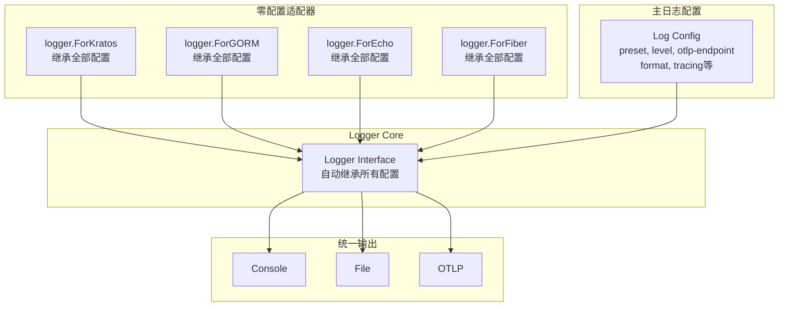

## 📊 使用场景

### 场景1：微服务开发

**需求**：快速集成日志，发送到可观测性平台

```yaml
# 最简配置
log:
  preset: "observability"
  otlp-endpoint: "otelcol.observability:4317"
```

**收益**：

- 30秒完成集成
- 自动结构化日志
- 服务信息自动识别

### 场景2：本地开发调试

**需求**：彩色输出，详细信息，本地文件备份

```yaml
# 开发友好
log:
  preset: "development"
  level: "debug"
  log-dir: "logs"
```

**收益**：

- 易读的控制台输出
- 完整调试信息
- 本地日志文件备份

### 场景2.1：开发环境结构化日志分析

> **🔍 灵活性增强**：展示开发环境中控制台输出格式的灵活切换能力

**需求**：开发调试时需要用 `jq`、`grep` 等工具分析结构化日志，但又不想完全失去开发环境的便利性

#### 默认易读格式（适合日常开发）

```yaml
# 开发环境默认：易读的彩色输出
log:
  preset: "development"
  level: "debug"
  console-format: "pretty"    # 默认值：彩色易读格式
```

**控制台输出效果**：

```bash
2024-08-28T10:25:16+08:00  DEBUG  [apiserver] Starting HTTP server    addr=:8080 version=v2.0.0
2024-08-28T10:25:16+08:00  INFO   [apiserver] Database connected      host=localhost port=3306
2024-08-28T10:25:17+08:00  ERROR  [apiserver] Failed to process user  user_id=12345 error="validation failed"
```

#### 分析模式（适合日志分析）

```yaml
# 开发环境切换到结构化输出
log:
  preset: "development"
  level: "debug"
  console-format: "json"      # 切换为结构化JSON输出
```

**控制台输出效果**：

```json
{"ts":"2024-08-28T10:25:16+08:00","level":"debug","service":"apiserver","msg":"Starting HTTP server","addr":":8080","version":"v2.0.0"}
{"ts":"2024-08-28T10:25:16+08:00","level":"info","service":"apiserver","msg":"Database connected","host":"localhost","port":3306}
{"ts":"2024-08-28T10:25:17+08:00","level":"error","service":"apiserver","msg":"Failed to process user","user_id":"12345","error":"validation failed"}
```

#### 一键切换工作流

**🚀 开发者典型工作流**：

```bash
# 1. 日常开发：使用易读格式
make run-api
# 控制台显示彩色易读的日志

# 2. 发现问题，需要分析日志：动态切换到JSON格式
curl -X POST http://localhost:8080/admin/config \
  -d '{"log.console-format": "json"}'
# 3秒后控制台开始输出JSON格式日志

# 3. 使用工具分析（实时分析正在运行的服务）
make run-api | jq 'select(.level == "error")'
make run-api | jq 'select(.user_id == "12345")'
make run-api | grep -E '"error":|"warn":'

# 4. 分析完毕，切回易读格式继续开发
curl -X POST http://localhost:8080/admin/config \
  -d '{"log.console-format": "pretty"}'
```

#### 环境变量快速控制

```bash
# 启动时直接指定格式
export LOG_CONSOLE_FORMAT="json"
make run-api

# 或在配置文件中使用环境变量
# log.console-format: "${LOG_CONSOLE_FORMAT:-pretty}"
```

**🎯 格式对比**：

| 特性 | `console-format: "pretty"` | `console-format: "json"` |
|------|----------------------------|--------------------------|
| **可读性** | ✅ 优秀（彩色、对齐） | ⚠️ 较差（单行JSON） |
| **分析能力** | ❌ 难以用工具处理 | ✅ 完美支持jq/grep |
| **开发体验** | ✅ 视觉友好，信息清晰 | ❌ 信息密集，难以快速浏览 |
| **工具集成** | ❌ 需要额外解析 | ✅ 直接可用 |
| **性能** | 一般（格式化开销） | 好（直接JSON序列化） |

#### 🚨 控制台格式互斥性规则

**核心规则**：**`console-format` 字段为单选配置，pretty 和 JSON 格式互斥，不能同时启用。**

| 配置场景 | `console-format` 值 | 控制台输出格式 | 互斥性 | 说明 |
|---------|-------------------|---------------|--------|------|
| **Pretty格式** | `"pretty"` | 彩色、对齐、多行 | ✅ 单一格式 | 仅输出易读格式 |
| **JSON格式** | `"json"` | 单行JSON结构化 | ✅ 单一格式 | 仅输出JSON格式 |
| **无效配置** | `["pretty", "json"]` | ❌ 配置错误 | ⚠️ 不支持 | 数组配置无效，应为字符串 |
| **未设置** | `undefined` | 使用preset默认 | ✅ 单一格式 | 继承预设的默认格式 |

**互斥性实现**：

```javascript
function validateConsoleFormat(format, preset) {
    // 1. 检查格式类型
    if (Array.isArray(format)) {
        logError("console-format must be a string, not an array")
        logError("Invalid: console-format: ['pretty', 'json']")
        logError("Correct: console-format: 'pretty' OR console-format: 'json'")
        return { valid: false, error: "array_format_not_supported" }
    }

    // 2. 检查有效值
    const validFormats = ['pretty', 'json']
    if (format && !validFormats.includes(format)) {
        logError(`Invalid console-format: '${format}'. Must be one of: ${validFormats.join(', ')}`)
        return { valid: false, error: "invalid_format_value" }
    }

    // 3. 应用默认值
    const finalFormat = format || getPresetConsoleFormat(preset)
    logInfo(`Console format: ${finalFormat} (${format ? 'user-specified' : 'from-preset'})`)

    return {
        valid: true,
        format: finalFormat,
        source: format ? 'user' : 'preset'
    }
}
```

**常见配置误区**：

```yaml
# ❌ 错误：尝试同时启用两种格式
log:
  console-format: ["pretty", "json"]  # 无效配置，不支持数组

# ❌ 错误：无效的格式值
log:
  console-format: "colored"           # 无效值，仅支持 "pretty" 或 "json"

# ✅ 正确：单一格式配置
log:
  console-format: "pretty"            # 仅彩色格式

# ✅ 正确：单一格式配置
log:
  console-format: "json"              # 仅JSON格式

# ✅ 正确：使用默认格式
log:
  # 未设置 console-format，使用preset默认值
  preset: "development"               # 默认为 "pretty"
```

**动态切换示例**：

```bash
# 当前格式：pretty
# 切换到JSON格式（完全替换，不是追加）
curl -X POST /admin/config -d '{"console-format": "json"}'
# 结果：控制台输出变为JSON格式，pretty格式停止

# 切换回pretty格式
curl -X POST /admin/config -d '{"console-format": "pretty"}'
# 结果：控制台输出变为彩色格式，JSON格式停止
```

**收益**：

- **灵活性**：同一预设下支持两种输出模式，适应不同开发任务
- **无缝切换**：无需重启服务，动态切换输出格式
- **最佳平衡**：日常开发用易读格式，问题分析用结构化格式
- **配置清晰**：单一字段控制，避免格式冲突和混乱
- **工具兼容**：JSON模式完美支持现有的日志分析工具链
- **学习曲线平滑**：新开发者默认看到易读格式，有需要时再切换

### 场景3：生产环境部署

**需求**：高性能，结构化，自动文件轮转和归档

```yaml
# 生产优化配置
log:
  preset: "production"
  log-dir: "/var/log/app"
  otlp-endpoint: "${OTLP_ENDPOINT}"  # 环境变量

  # 生产级文件轮转策略
  file-rotation:
    max-size-mb: 100        # 单文件100MB，避免过大影响处理
    max-backups: 14         # 保留2周的日志文件
    max-age-days: 30        # 保留30天，满足审计要求
    compress: true          # 压缩历史文件，节省存储
    local-time: true        # 使用本地时区，便于运维
```

**🔄 自动轮转行为**：

```bash
# 轮转前的文件结构
/var/log/app/
├── app.log                    # 当前活跃日志（正在写入）

# 达到100MB后自动轮转，文件结构变为：
/var/log/app/
├── app.log                    # 新的活跃文件（重新开始写入）
├── app.log.1                  # 刚轮转的文件（未压缩）
├── app.log.2.gz              # 压缩的历史文件
├── app.log.3.gz              # 更早的历史文件
└── ...                       # 最多保留14个备份文件
```

**收益**：

- 生产级性能优化（JSON格式，异步写入）
- 自动日志轮转和压缩，无需人工干预
- 环境变量灵活配置，支持多环境部署
- 存储空间优化，历史文件自动压缩
- 符合企业审计要求的日志保留策略
- 零维护成本的日志文件管理

### 场景4：测试环境

**需求**：简化输出，仅关键错误，无文件写入

```yaml
# 测试简化
log:
  preset: "testing"
```

**收益**：

- 减少测试噪音
- 仅记录错误
- 无磁盘I/O开销

### 场景5：分布式链路跟踪

**需求**：微服务间调用链路完整记录，便于问题定位

```yaml
# 链路跟踪集成（零配置自动启用）
log:
  preset: "observability"
  otlp-endpoint: "127.0.0.1:4327"
  # TraceID/SpanID 自动提取，默认字段名：trace_id, span_id
  # 支持 OpenTelemetry, Jaeger, Zipkin 等标准格式
```

**零配置自动功能**：

- **自动检测**：检测到 HTTP Header 中的 `traceparent`, `trace-id`, `x-trace-id` 等
- **自动提取**：从 gRPC Metadata 中提取 `grpc-trace-bin`, `x-trace-id` 等
- **自动字段**：默认使用 `trace_id`, `span_id` 字段名
- **自动格式**：智能识别并适配多种追踪系统格式

**收益**：

- 完全零配置，开箱即用
- 自动提取TraceID/SpanID
- 日志与链路自动关联
- 分布式问题快速定位
- 支持多种追踪系统格式

### 场景6：本地开发 + 远程监控

> **💡 典型场景**：此场景演示了**配置冲突处理**和**智能输出控制**协同工作的实例

**需求**：本地开发时既要文件备份，又要发送到远程监控系统

```yaml
# 本地开发 + 远程监控（双输出）
log:
  preset: "development"
  level: "debug"
  log-dir: "logs"                    # 🎯 明确配置文件输出
  otlp-endpoint: "127.0.0.1:4327"    # 🎯 明确配置远程输出
```

**📋 智能处理过程**：

1. **配置冲突处理**：`otlp-endpoint` 非空 → 自动启用 OTLP 功能
2. **智能输出控制**：两个输出都配置 → 应用"控制台+文件+OTLP（全输出）"策略

**🔄 智能输出行为**：

- **控制台输出**：彩色调试友好格式
- **文件输出**：结构化JSON格式，便于分析
- **OTLP输出**：实时发送到监控系统

**收益**：

- 本地调试时有彩色控制台输出
- 本地文件备份，断网时也能查看日志
- 实时监控，团队成员可远程观察
- 三路输出互不干扰，满足不同需求

### 场景7：配置迁移和兼容

**需求**：从复杂嵌套配置迁移到简化扁平配置，保持企业级功能

```yaml
# 企业级配置：简化 + 高级功能并存
log:
  # 简化配置（扁平化端点）
  otlp-endpoint: "otel-gateway.company:4317"    # 生产环境端点

  # 高级配置（嵌套详细配置）
  otlp:
    enabled: false        # 🎯 明确禁用，优先级高于智能启用
    protocol: "grpc"      # 继承：使用 gRPC 协议
    timeout: "30s"        # 继承：生产环境长超时
    batch_size: 1000      # 继承：大批次提升性能
    headers:              # 继承：企业认证头
      authorization: "Bearer ${OTEL_TOKEN}"
      x-tenant-id: "production"
```

**智能处理结果**：

- **OTLP状态**：禁用（尊重明确意图 enabled: false，端点配置仅保留不使用）
- **端点地址**：`otel-gateway.company:4317`（扁平化配置已保存，但不启用）
- **其他设置**：协议、超时、批次、认证头配置保留，等待 enabled 为 true 时生效

**收益**：

- 保留端点配置，通过 enabled 字段精确控制启用状态
- 保留企业级高级功能配置，避免配置丢失
- 向后兼容现有复杂配置，尊重用户明确意图
- 支持 DevOps "保留配置但临时禁用" 的实际需求场景

### 场景8：框架统一日志

**需求**：GORM、Kratos、中间件日志统一输出格式

```yaml
# 框架集成（直接继承主配置）
log:
  preset: "production"
  log-dir: "/var/log/app"            # 文件输出
  otlp-endpoint: "127.0.0.1:4327"    # OTLP输出
  # 框架自动继承所有配置：级别、格式、OTLP、TraceID、文件输出等
```

```go
// 代码中零配置集成
logger := GetDefaultLogger()

// GORM - 自动继承所有日志配置（包括文件+OTLP双输出）
gormLogger := logger.ForGORM()
db, err := gorm.Open(mysql.Open(dsn), &gorm.Config{
    Logger: gormLogger, // 自动继承级别、格式、OTLP、TraceID、文件输出
})

// Kratos - 自动继承所有日志配置
kratosLogger := logger.ForKratos()
app := kratos.New(
    kratos.Logger(kratosLogger), // 自动继承所有配置
)
```

**收益**：

- 零配置复杂度，直接继承主配置
- 统一的日志格式和字段
- 框架日志自动包含TraceID
- 完全零侵入式集成

### 场景9：环境变量灵活控制

> **🎯 关键场景**：展示新的四层优先级机制如何解决"保留配置但临时禁用"的实际需求

**需求**：在不同环境中通过环境变量灵活控制 OTLP 功能，无需修改配置文件

```yaml
# 通用配置模板（config.yaml）
log:
  preset: "production"
  log-dir: "/var/log/app"
  otlp-endpoint: "otel-collector.company:4317"    # 保留端点配置
  otlp:
    enabled: false                                # 默认禁用
    protocol: "grpc"
    timeout: "10s"
    headers:
      authorization: "Bearer ${OTEL_TOKEN}"
```

**不同环境的环境变量控制**：

```bash
# 生产环境 - 启用 OTLP
export LOG_OTLP_ENABLED="true"      # 环境变量覆盖 enabled: false

# 开发环境 - 临时禁用 OTLP（您的场景）
export LOG_OTLP_ENABLED="false"     # 环境变量强制禁用，即使有端点配置

# 测试环境 - 使用文件配置
# 不设置环境变量，使用 enabled: false（禁用状态）
```

**📋 决策过程演示**：

**生产环境**：

1. **环境变量检查**: `LOG_OTLP_ENABLED="true"` → 跳过禁用检查
2. **明确意图检查**: `otlp.enabled: false` 存在 → 但被环境变量覆盖
3. **最终结果**: OTLP 启用，使用 `otel-collector.company:4317`

**开发环境（您的场景）**：

1. **环境变量检查**: `LOG_OTLP_ENABLED="false"` → 🚫 **强制禁用**
2. **提前返回**: 不再检查其他配置
3. **最终结果**: OTLP 禁用，保留端点配置但不使用

**测试环境**：

1. **环境变量检查**: 无 `LOG_OTLP_ENABLED` → 继续检查
2. **明确意图检查**: `otlp.enabled: false` 存在 → ✋ **尊重用户选择**
3. **最终结果**: OTLP 禁用，按用户明确意图

**🎛️ 配置矩阵对比**：

| 环境 | LOG_OTLP_ENABLED | otlp.enabled | otlp-endpoint | 最终状态 | 决策原因 |
|------|------------------|--------------|---------------|----------|----------|
| 生产 | "true" | false | 已配置 | ✅ 启用 | 环境变量最高优先级 |
| 开发 | "false" | false | 已配置 | ❌ 禁用 | 环境变量强制禁用 |
| 测试 | 未设置 | false | 已配置 | ❌ 禁用 | 尊重明确意图 |
| 快速原型 | 未设置 | 未设置 | 已配置 | ✅ 启用 | 扁平化智能启用 |

**🚀 解决的问题**：

- ✅ **保留配置不删除**：端点配置始终保存在文件中
- ✅ **环境变量临时控制**：通过环境变量 + 触发机制灵活开关功能
- ✅ **明确意图得到尊重**：用户显式设置 `enabled` 时被尊重
- ✅ **智能默认仍然有效**：新用户只设置端点仍可自动启用
- ✅ **不同环境差异化**：同一配置文件适应多环境部署

**🔧 环境变量热更新实现**：

```bash
# 场景1：容器环境动态调整
export LOG_OTLP_ENABLED="false"  # 修改环境变量
kill -HUP $APP_PID               # 发送信号触发重载
# 结果：3秒内 OTLP 被禁用，无需重启服务

# 场景2：Kubernetes ConfigMap更新
kubectl patch configmap app-env -p '{"data":{"LOG_OTLP_ENABLED":"false"}}'
kubectl exec deployment/app -- kill -HUP 1  # 向容器发送信号
# 结果：配置热更新生效，Pod无需重启

# 场景3：Docker Compose环境
export LOG_OTLP_ENABLED="false"
docker-compose exec app kill -HUP 1
# 结果：容器内服务热更新配置
```

**收益**：

- 解决了配置模板化部署的实际需求
- 平衡了智能默认和用户控制
- 支持 DevOps 最佳实践（环境变量控制）
- **技术实现可行性明确**：明确了环境变量需要触发机制，避免技术误导
- 保持了向后兼容性和新用户友好性

### 场景10：高并发日志轮转

> **📈 高负载场景**：展示文件轮转在高并发、大流量生产环境中的自动管理能力

**需求**：电商平台在双11期间日志量激增，需要可靠的日志文件管理，确保不影响系统性能

**高并发配置**：

```yaml
# 大流量日志管理配置
log:
  preset: "production"
  level: "info"
  log-dir: "/data/logs/ecommerce"

  # 高频轮转策略
  file-rotation:
    max-size-mb: 50             # 较小文件，更频繁轮转
    max-backups: 100            # 大量备份文件
    max-age-days: 7             # 高频清理，节省存储
    compress: true              # 必须压缩，节省空间
    local-time: true
    compress-level: 9           # 最高压缩率

  # 高性能OTLP配置
  otlp-endpoint: "otel-cluster.company:4317"
  otlp:
    batch_size: 1000            # 大批次，减少网络开销
    batch_timeout: "2s"         # 适中超时，保证实时性
    max_queue_size: 10000       # 大队列，应对流量峰值
```

**📊 实际运行效果展示**：

**负载情况**：

- **日志写入速率**：平均 10,000 条/秒，峰值 50,000 条/秒
- **单日日志量**：约 100GB 原始数据
- **轮转频率**：每小时轮转 1-3 次

**文件结构演化**：

```bash
# 09:00 - 业务高峰开始
/data/logs/ecommerce/
├── app.log                     # 45MB (正在快速增长)
├── app.log.1.gz               # 48MB → 12MB (压缩后)
├── app.log.2.gz               # 49MB → 13MB
└── app.log.3.gz               # 51MB → 14MB

# 09:15 - 第一次轮转触发 (达到50MB)
/data/logs/ecommerce/
├── app.log                     # 8MB (新文件，重新开始)
├── app.log.1                   # 50MB (刚轮转，待压缩)
├── app.log.2.gz               # 48MB → 12MB
├── app.log.3.gz               # 49MB → 13MB
└── app.log.4.gz               # 51MB → 14MB

# 09:16 - 后台压缩完成
/data/logs/ecommerce/
├── app.log                     # 12MB
├── app.log.1.gz               # 50MB → 13MB (压缩完成)
├── app.log.2.gz               # 48MB → 12MB
├── app.log.3.gz               # 49MB → 13MB
└── app.log.4.gz               # 51MB → 14MB
```

**🎯 轮转性能指标**：

| 指标 | 轮转前 | 轮转中 | 轮转后 |
|------|--------|--------|--------|
| **日志写入延迟** | 1-3ms | 1-5ms | 1-3ms |
| **CPU 使用率** | 15% | 18% | 15% |
| **磁盘写入速率** | 50MB/s | 45MB/s | 50MB/s |
| **文件操作耗时** | - | 200ms | - |
| **服务响应影响** | 无 | 无 | 无 |

**🔧 动态调整示例**：

```bash
# 流量高峰期 - 调整为更小的轮转大小
curl -X POST http://app:8080/admin/config \
  -d '{"file-rotation.max-size-mb": 20}'  # 20MB轮转，减少单文件处理时间

# 流量低峰期 - 恢复正常轮转大小
curl -X POST http://app:8080/admin/config \
  -d '{"file-rotation.max-size-mb": 50}'  # 恢复50MB轮转

# 存储空间告急 - 临时调整保留策略
curl -X POST http://app:8080/admin/config \
  -d '{"file-rotation.max-age-days": 3}'  # 临时调整为3天保留
```

**收益**：

- **零性能影响**：轮转过程不影响业务写入性能
- **存储优化**：自动压缩节省 70%+ 存储空间
- **运维自动化**：无需人工清理历史文件
- **动态适应**：根据业务流量动态调整轮转策略
- **故障恢复**：历史日志完整保留，支持问题回溯
- **成本控制**：自动清理过期文件，控制存储成本

### 场景11：生产故障动态调试

> **🚨 紧急场景**：展示动态配置能力如何在生产环境故障排查中发挥关键作用

**需求**：生产环境某微服务出现异常，运维需要立即提高日志详细度排查问题，故障解决后快速恢复正常级别

**初始生产配置**：

```yaml
# 生产环境配置（config.yaml）
log:
  preset: "production"
  level: "info"                               # 正常运行时的级别
  log-dir: "/var/log/app"
  otlp-endpoint: "otel-collector.company:4317"
  otlp:
    batch_size: 1000
    timeout: "10s"
```

**🚨 故障发现阶段**（14:30:00）：

```bash
# SRE 通过配置中心紧急调整（无需重启服务）
# 方式1：配置中心控制台
nacos_api_update log.level=debug

# 方式2：命令行工具
consul kv put service/app/log/level debug

# 方式3：HTTP 管理接口
curl -X POST http://app-instance:8080/admin/config \
  -d '{"log.level": "debug"}'

# 方式4：信号触发文件重载
echo "log.level: debug" > /etc/app/config-override.yaml
kill -HUP $(pidof app)
```

**📋 系统自动处理过程**：

1. **配置变更检测**：动态监听器检测到 `log.level` 变更为 `debug`
2. **配置验证**：验证器确认 `debug` 是有效的日志级别
3. **热更新执行**：热更新引擎将所有 Logger 实例级别调整为 `debug`
4. **变更审计**：记录变更时间、操作者、变更原因到审计日志
5. **生效确认**：系统开始输出 `debug` 级别日志，便于问题分析

**🔍 故障分析阶段**（14:30:05 - 14:45:00）：

```bash
# 运维人员立即看到详细的调试信息
tail -f /var/log/app/app.log | grep -E "(ERROR|DEBUG)"

# 或通过 OTLP 实时查看
curl "http://jaeger.company/api/traces?service=app&lookback=15m"
```

**✅ 问题解决阶段**（14:45:00）：

```bash
# 问题定位并修复后，快速恢复正常日志级别
nacos_api_update log.level=info

# 或使用批量恢复配置
curl -X POST http://app-instance:8080/admin/config/rollback \
  -d '{"timestamp": "2024-08-28T14:29:00Z"}'  # 回滚到故障前配置
```

**📊 动态配置效果对比**：

| 时间阶段 | 配置方式 | 日志级别 | 生效时间 | 服务状态 | 影响范围 |
|----------|----------|----------|----------|----------|----------|
| 14:29:00 | 静态配置 | info | 启动时 | ✅ 正常运行 | 全服务 |
| 14:30:00 | 动态调整 | debug | **3秒内** | ✅ 持续服务 | 零影响 |
| 14:45:00 | 动态恢复 | info | **3秒内** | ✅ 持续服务 | 零影响 |

**传统方式 vs 动态配置对比**：

| 处理方式 | 配置生效时间 | 服务可用性 | 故障窗口 | 操作复杂度 |
|----------|--------------|------------|----------|------------|
| **传统重启** | 重启耗时 30-60s | ❌ 服务中断 | 扩大故障影响 | 需要滚动发布 |
| **动态配置** | ✅ 3-5s 生效 | ✅ 零中断 | 最小化影响 | 一行命令搞定 |

**🎯 动态配置的核心价值**：

- ✅ **MTTR 缩短**：平均故障恢复时间从分钟级降低到秒级
- ✅ **零服务中断**：配置调整过程中服务持续可用
- ✅ **实时响应**：故障发现后立即提升日志详细度
- ✅ **安全回滚**：一键恢复到故障前的稳定配置
- ✅ **变更追踪**：完整的配置变更审计链路

**收益**：

- 生产故障的 MTTR（平均恢复时间）显著缩短
- 避免因重启服务造成的业务中断和级联故障
- 提升 SRE 团队的故障响应效率和用户体验
- 支持渐进式问题排查，避免过度日志对性能的影响

## 📈 成功指标

### 用户体验指标

- **配置时间**：从5分钟降低到30秒
- **错误率**：配置错误率从15%降低到2%
- **学习曲线**：新用户上手时间从2小时降低到15分钟

### 技术指标

- **配置行数**：简单场景从5行减少到1行
- **文档复杂度**：必读文档从3页减少到1页
- **支持渠道压力**：配置相关问题减少80%

## 🏎️ 性能设计理念

### 开箱即用的高性能

Logger包采用**高性能默认配置**，让用户无需关心性能细节就能获得优秀表现：

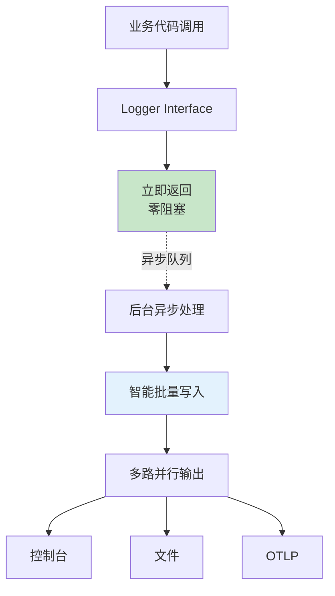

### 核心性能原则

**🚀 用户体验第一**：

- **零阻塞**：业务代码调用立即返回（< 100ns）
- **零配置**：预设模式自动启用性能优化
- **零学习成本**：无需了解内部实现细节

**⚡ 智能优化**：

- **异步处理**：默认异步输出，不阻塞业务逻辑
- **批量写入**：自动批处理，提升I/O效率
- **内存池化**：对象复用，减少GC压力
- **并行输出**：多路输出互不阻塞

### 性能表现预期

| 使用场景 | 预期性能 | 资源使用 | 配置复杂度 |
|----------|----------|----------|------------|
| **日常开发** | 1,000+ 条/秒 | 极低 | ✅ 零配置 |
| **生产环境** | 100,000+ 条/秒 | 合理 | ✅ 预设即可 |
| **高负载** | 500,000+ 条/秒 | 可控 | ⚙️ 需要调优 |

### 预设模式性能优化

每个预设模式都包含优化的性能配置：

```yaml
# 开发环境：平衡性能与可读性
log:
  preset: "development"
  # 内置：异步输出，适中缓冲，彩色格式

# 生产环境：最大化性能
log:
  preset: "production"
  # 内置：异步输出，大缓冲，JSON格式，文件轮转

# 可观测性：优化传输性能
log:
  preset: "observability"
  # 内置：异步输出，批量OTLP，结构化字段
```

### 性能监控

系统自动提供性能监控指标，无需额外配置：

**📊 内置监控**：

- 日志吞吐量和延迟统计
- 缓冲队列使用率监控
- 内存使用和GC影响分析
- 输出错误率和重试统计

**🔍 快速诊断**：

```bash
# 查看性能统计（如果启用了管理接口）
curl http://localhost:8080/admin/logger/stats

# 典型输出
{
  "throughput": "45,230 logs/sec",
  "latency_p99": "156μs",
  "queue_utilization": "23.4%",
  "memory_efficiency": "94.2%"
}
```

### 性能问题排查

遇到性能问题时的简单排查步骤：

1. **检查预设模式**：确认使用了适合的预设
2. **查看监控指标**：通过内置统计定位瓶颈
3. **调整输出路径**：评估是否需要所有输出路径
4. **考虑采样**：高频场景可启用日志采样

### 高级性能调优

> **📚 专家指南**：对于需要极致性能优化的专家用户，我们提供了详细的性能调优指南，包括：
>
> - 内存分配优化（对象池、零拷贝）
> - I/O优化策略（缓冲、批量写入、直接I/O）
> - 并发控制（无锁队列、背压策略）
> - 特殊场景优化（高频采样、启动关闭优化）
>
> 详细内容请参考：[PERFORMANCE_TUNING.md](./PERFORMANCE_TUNING.md)

**🎯 设计哲学**：

> *"99%的用户应该能够通过简单的预设获得优秀的性能，1%需要极致调优的专家用户有专门的指南支持"*

## 🎯 验收标准

### 功能验收

1. **一行配置启用OTLP** ✅

   ```yaml
   log:
     otlp-endpoint: "127.0.0.1:4327"
   ```

2. **预设模式工作正常** ✅

   ```yaml
   log:
     preset: "observability"  # 自动应用最佳配置
   ```

3. **智能输出控制** ✅
   - 用户明确配置 `log-dir` 时，始终启用文件输出（尊重用户意图）
   - OTLP 和文件输出可以同时启用（控制台+文件+OTLP）
   - 仅当 `log-dir` 为空时，才不创建文件
   - 测试模式始终不写入文件（简化测试环境）

4. **四层优先级配置处理** ✅

   **环境变量最高优先级（启动时）**：

   ```bash
   export LOG_OTLP_ENABLED="false"    # 启动时最高优先级，强制禁用
   ```

   ```yaml
   log:
     otlp-endpoint: "127.0.0.1:4327"  # 有端点但被环境变量禁用
   ```

   结果：OTLP 禁用（环境变量控制）

   **明确意图优先**：

   ```yaml
   log:
     otlp-endpoint: "127.0.0.1:4327"  # 扁平化配置
     otlp:
       enabled: false                 # 明确禁用，被尊重
       protocol: "grpc"               # 继承有效
   ```

   结果：OTLP 禁用（尊重明确意图）

   **扁平化智能启用**：

   ```yaml
   log:
     otlp-endpoint: "127.0.0.1:4327"  # 扁平化配置
     otlp:
       # enabled 未设置，智能启用
       protocol: "grpc"               # 继承有效
   ```

   结果：OTLP 启用（智能启用）

   - **启动时**：环境变量 `LOG_OTLP_ENABLED` 自动覆盖所有文件配置
   - **运行时**：环境变量变更后需触发机制（信号/API）重新读取才生效
   - 用户明确设置 `otlp.enabled` 时，尊重用户选择
   - 仅当用户未明确设置时，扁平化配置才自动启用
   - 支持"保留配置但临时禁用"的 DevOps 场景

5. **向后兼容** ✅
   - 现有LogsOptions配置不变
   - 现有程序化配置API不变

6. **链路跟踪支持** ✅

   ```yaml
   log:
     preset: "observability"
     otlp-endpoint: "127.0.0.1:4327"
     # TraceID 零配置自动提取和注入
   ```

7. **动态配置管理** ✅

   **基础热更新能力**：

   ```bash
   # 配置中心方式
   nacos_api_update log.level=debug
   consul kv put service/app/log/level debug

   # HTTP API 方式
   curl -X POST http://app:8080/admin/config -d '{"log.level": "debug"}'

   # 文件监听方式
   echo "log.level: debug" > /etc/app/config-override.yaml
   kill -HUP $(pidof app)

   # 环境变量方式（容器平台）
   kubectl set env deployment/app LOG_LEVEL=debug
   ```

   **验证标准**：
   - 配置变更3-5秒内生效，无需重启服务
   - 支持日志级别、输出路径、OTLP端点的动态调整
   - 配置更新失败时自动回滚到上一稳定版本
   - 所有 Logger 实例和框架适配器同步更新
   - 完整的配置变更审计日志记录

   **故障场景验证**：

   ```bash
   # 生产故障时快速调整到 debug 级别
   curl -X POST http://app:8080/admin/config -d '{"log.level": "debug"}'
   # 验证：3秒内开始输出 debug 级别日志

   # 故障解决后一键恢复
   curl -X POST http://app:8080/admin/config/rollback -d '{"timestamp": "2024-08-28T14:29:00Z"}'
   # 验证：3秒内恢复到 info 级别
   ```

8. **文件轮转管理** ✅

   **基础轮转能力**：

   ```yaml
   log:
     log-dir: "/var/log/app"
     file-rotation:
       max-size-mb: 100        # 文件大小触发轮转
       max-backups: 10         # 备份文件数量限制
       max-age-days: 30        # 文件保留时间限制
       compress: true          # 历史文件压缩
   ```

   **验证标准**：
   - 日志文件达到设定大小时自动轮转
   - 轮转过程中日志写入零中断
   - 历史文件按配置自动压缩（.gz格式）
   - 超出保留数量或时间的文件自动清理
   - 轮转操作不影响应用性能（延迟增加<5ms）
   - 支持运行时动态调整轮转策略

   **高并发场景验证**：

   ```bash
   # 模拟高并发写入测试
   # 验证：50,000条/秒写入时轮转性能影响<5%

   # 动态调整轮转策略
   curl -X POST http://app:8080/admin/config \
     -d '{"file-rotation.max-size-mb": 20}'
   # 验证：3秒内新的轮转策略生效

   # 压缩效果验证
   # 验证：压缩率达到70%以上，压缩时间不影响写入
   ```

9. **框架插件集成** ✅

   ```go
   // GORM集成
   logger := GetDefaultLogger()
   gormLogger := logger.ForGORM()
   db, err := gorm.Open(mysql.Open(dsn), &gorm.Config{
       Logger: gormLogger,
   })

   // Kratos集成
   kratosLogger := logger.ForKratos()
   app := kratos.New(
       kratos.Logger(kratosLogger),
   )
   ```

10. **控制台格式切换** ✅

    **开发环境灵活格式支持**：

    ```yaml
    # 默认易读格式
    log:
      preset: "development"
      console-format: "pretty"    # 彩色易读，适合日常开发

    # 切换到分析格式
    log:
      preset: "development"
      console-format: "json"      # 结构化JSON，适合工具分析
    ```

    **验证标准**：
    - `console-format: "pretty"` 输出彩色格式化的易读日志
    - `console-format: "json"` 输出单行JSON结构化日志
    - 支持运行时动态切换格式，无需重启服务
    - JSON格式完全兼容 `jq`、`grep`、`awk` 等分析工具
    - 格式切换不影响文件输出和OTLP输出（仅影响控制台）
    - 环境变量 `LOG_CONSOLE_FORMAT` 可覆盖配置文件设置

    **工具集成验证**：

    ```bash
    # 验证JSON格式工具兼容性
    make run-api | jq 'select(.level == "error")'          # jq过滤
    make run-api | grep '"error"'                          # grep查找
    make run-api | awk -F'"' '/error/ {print $4}'         # awk提取

    # 验证动态切换
    curl -X POST http://localhost:8080/admin/config \
      -d '{"log.console-format": "json"}'                  # 切换到JSON
    # 验证：3秒内控制台开始输出JSON格式

    curl -X POST http://localhost:8080/admin/config \
      -d '{"log.console-format": "pretty"}'                # 切换回易读格式
    # 验证：3秒内控制台恢复彩色易读格式
    ```

    **性能验证**：
    - `pretty` 格式：控制台输出延迟 < 5ms，适合开发调试
    - `json` 格式：控制台输出延迟 < 2ms，适合高频日志分析
    - 格式切换操作耗时 < 100ms，不影响日志输出连续性

### 体验验收

1. **新用户友好**：无需阅读文档即可完成基础配置
2. **配置明确**：配置意图一目了然，不存在歧义
3. **错误友好**：配置错误时提供清晰的错误信息和建议
4. **渐进增强**：用户可以从简单配置逐步过渡到复杂配置
5. **链路完整**：所有日志零配置自动包含TraceID，实现分布式链路关联
6. **框架无缝**：GORM、Kratos等框架日志自动统一格式和输出

### 架构验收

7. **分层清晰** ✅
   - 配置层、预设层、核心引擎层、适配层、输出层、实现层职责分明
   - 每层组件单一职责，低耦合高内聚
   - 依赖关系清晰，无循环依赖

8. **配置层组件边界清晰** ✅
   - 配置处理器：仅负责解析和标准化，不涉及合并逻辑
   - 冲突检查器：仅负责检测冲突，不修改配置
   - 智能合并器：仅负责合并策略，基于冲突报告工作
   - 快速路径：无冲突时跳过冲突检查和合并步骤

9. **扩展性强** ✅
   - 新增框架适配器不影响现有功能
   - 新增输出方式（如数据库、消息队列）只需扩展输出层
   - 新增日志引擎（如logrus）只需扩展实现层

10. **性能优化** ✅

- 并行输出机制，多路输出互不阻塞
- 中间件链式处理，避免重复计算
- 配置预处理，运行时零配置解析开销

## 🔮 未来规划

### 短期增强

- **配置验证器**：提供配置正确性检查工具
- **配置生成器**：根据使用场景生成推荐配置
- **最佳实践指南**：针对不同场景的配置建议
- **链路跟踪插件**：完整的TraceID/SpanID提取和注入机制
- **框架适配器**：GORM、Kratos、Echo、Gin等主流框架适配器
- **控制台格式切换** ✅：开发环境支持 `console-format: "pretty|json"` 灵活切换，平衡易读性与分析能力
- **架构监控**：组件间调用链路监控和性能分析
- **中间件扩展**：支持用户自定义中间件插入到处理链中
- **动态配置基础设施**：配置中心集成、文件监听、HTTP API、信号处理
- **配置变更审计**：完整的配置变更历史记录和审计能力
- **文件轮转核心功能**：基于大小和时间的轮转策略，自动压缩和清理
- **轮转性能优化**：高并发环境下的零中断轮转机制

### 中期目标

- **可视化配置管理**：Web界面的动态配置管理面板
- **智能推荐**：基于项目特征推荐配置
- **配置模板市场**：常见框架和部署环境的配置模板库
- **高级链路功能**：采样策略、链路过滤、性能优化
- **配置策略引擎**：基于时间、负载、错误率等条件的自动配置调整
- **多环境配置同步**：开发、测试、生产环境配置的统一管理和同步
- **配置影响分析**：配置变更对系统性能和稳定性影响的预测分析
- **A/B 测试配置**：支持配置的灰度发布和 A/B 测试
- **高级文件轮转**：基于时间的轮转（每小时/每天），自定义文件命名模式
- **轮转存储优化**：支持远程存储（S3/OSS）的历史日志自动上传和归档
- **轮转监控告警**：轮转失败、存储空间不足等异常情况的智能告警
- **插件生态系统**：第三方框架和工具的插件市场
- **分布式架构**：支持日志聚合节点，分布式日志收集
- **微服务优化**：服务间日志关联，调用链完整性保证

### 长期愿景

- **AI辅助配置**：基于使用模式智能优化配置
- **自适应配置**：根据运行时负载自动调整参数
- **配置即代码**：完整的配置生命周期管理
- **全链路可观测**：日志、指标、链路、错误的完全统一
- **零配置理念**：基于约定优于配置的完全自动化体验

---

*这个需求文档确保Logger包不仅在技术上先进，更在用户体验上优秀，真正做到"简单的事情简单做，复杂的事情也能做"。*
