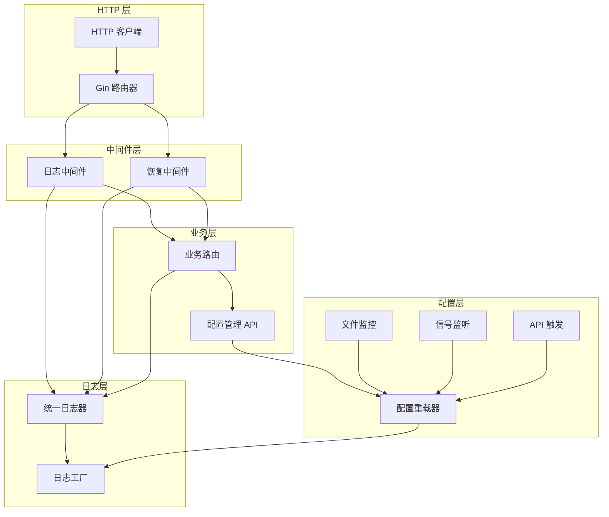

# Gin + Dynamic Config Reload Example

这个示例展示了如何在 Gin Web 框架中集成 Kart Logger 的动态配置重载功能。

## ✨ 核心特性

- 🌐 **Gin Web 框架集成**：自定义中间件实现统一日志记录
- 🔄 **动态配置重载**：支持文件监控、信号处理和 HTTP API 三种触发方式
- 📊 **结构化日志**：HTTP 请求、错误和性能指标的结构化记录
- 🛡️ **错误恢复**：Panic 恢复中间件与日志记录
- 🔧 **配置管理 API**：通过 REST API 管理日志器配置
- 📈 **性能监控**：自动记录请求延迟和状态码

## 🚀 快速开始

### 运行示例

```bash
cd example/gin-reload
go mod tidy
go run main.go
```

服务器将在 `:8080` 端口启动，包含以下功能：

### 📡 API 端点

| 端点 | 方法 | 描述 |
|------|------|------|
| `/` | GET | 欢迎页面 + 当前配置信息 |
| `/users/:id` | GET | 获取用户信息 (带参数验证) |
| `/users` | POST | 创建用户 (JSON 验证) |
| `/health` | GET | 健康检查 |
| `/slow` | GET | 慢请求测试 (3秒延迟) |
| `/error` | GET | 错误测试端点 |
| `/panic` | GET | Panic 恢复测试 |

### 🔧 配置管理端点

| 端点 | 方法 | 描述 |
|------|------|------|
| `/config/current` | GET | 获取当前配置 |
| `/config/reload` | POST | 通过 API 重载配置 |
| `/config/rollback` | POST | 回滚到上一个配置 |
| `/config/backups` | GET | 查看备份配置列表 |

## 🔄 动态配置重载

### 1. 文件监控重载

编辑 `logger-config.yaml` 文件，配置会自动重载：

```yaml
# 切换到 Zap 引擎 + DEBUG 级别
engine: "zap"
level: "DEBUG"
format: "console"
development: true
```

### 2. 信号重载

```bash
# 发送 SIGUSR1 信号触发重载
kill -USR1 $(pgrep -f gin-reload)

# 或者使用 SIGHUP
kill -HUP $(pgrep -f gin-reload)
```

### 3. HTTP API 重载

```bash
# 通过 API 重载配置
curl -X POST http://localhost:8080/config/reload \
  -H "Content-Type: application/json" \
  -d '{
    "engine": "zap",
    "level": "DEBUG", 
    "format": "console",
    "development": true
  }'

# 回滚到上一个配置
curl -X POST http://localhost:8080/config/rollback
```

## 🧪 测试脚本

运行自动化测试脚本：

```bash
./test-reload.sh
```

该脚本会：
1. 验证服务器运行状态
2. 测试所有 API 端点
3. 演示配置重载功能
4. 验证回滚机制
5. 测试错误处理

## 📊 日志输出示例

### 正常请求日志

```json
{
  "timestamp": "2023-12-01T10:30:15.123Z",
  "level": "info",
  "message": "GET /users/123",
  "component": "gin",
  "method": "GET",
  "path": "/users/123",
  "status_code": 200,
  "latency_ms": 52.4,
  "client_ip": "127.0.0.1",
  "user_agent": "curl/7.68.0",
  "user_id": "123"
}
```

### 错误请求日志

```json
{
  "timestamp": "2023-12-01T10:30:20.456Z",
  "level": "warn",
  "message": "GET /users/invalid",
  "component": "gin",
  "method": "GET",
  "path": "/users/invalid",
  "status_code": 400,
  "latency_ms": 1.2,
  "client_ip": "127.0.0.1",
  "validation": "failed"
}
```

### 配置重载日志

```json
{
  "timestamp": "2023-12-01T10:31:00.789Z",
  "level": "info", 
  "message": "Configuration reload completed successfully",
  "component": "reloader"
}
```

## 🏗️ 架构说明



## 🎯 使用场景

1. **生产环境监控**：实时调整日志级别，无需重启服务
2. **故障排查**：临时启用 DEBUG 级别进行问题诊断
3. **性能优化**：动态切换日志引擎和输出格式
4. **A/B 测试**：不同配置的日志记录对比
5. **运维自动化**：通过 API 自动化配置管理

## 🔧 配置示例

在 `config-examples/` 目录中提供了三种预设配置：

- `development.yaml` - 开发环境 (Slog + DEBUG + Console)
- `production.yaml` - 生产环境 (Zap + INFO + JSON + OTLP)
- `debug.yaml` - 调试模式 (Zap + DEBUG + Console)

## 📝 注意事项

1. **配置验证**：所有配置变更都会进行验证，无效配置会被拒绝
2. **备份机制**：每次配置变更都会备份当前配置，支持回滚
3. **优雅关闭**：Ctrl+C 触发优雅关闭，确保日志完整性
4. **并发安全**：配置重载器支持并发访问和配置变更
5. **错误恢复**：配置重载失败时自动回滚到稳定状态

## 🛠️ 扩展功能

- 添加配置热重载的 WebSocket 通知
- 集成配置中心 (Nacos/Consul)
- 添加配置变更审计日志
- 实现配置模板和预设管理